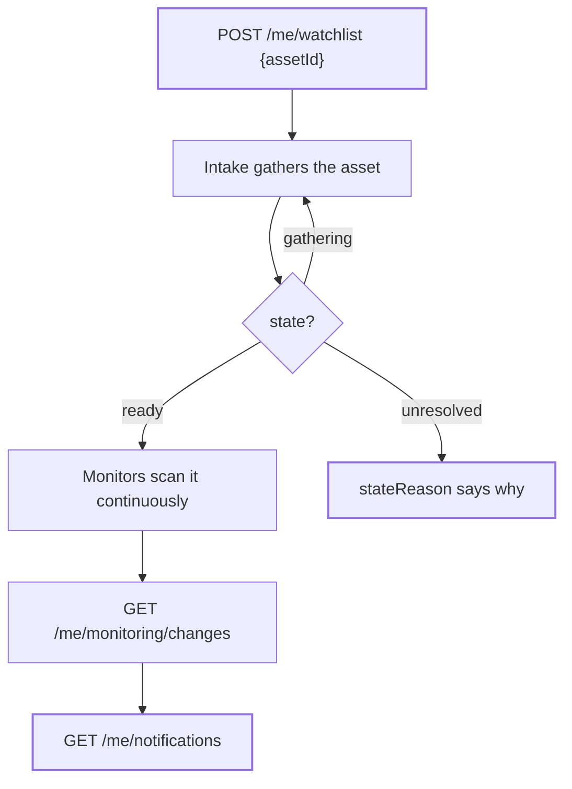

The monitoring routes let an exchange key run its own watchlist against the registry: watch an asset, read the changes Bluprynt detects on it, and poll the notification inbox those changes generate.

## Key concepts

| Term | Meaning |
|---|---|
| Watch | One registry asset on your key's watchlist. Counts against your per-key limit (default 50). |
| Change | A detected difference on a watched asset — a disclosure field edit, a register move, a sanctions listing, a source drifting. |
| Notification | An inbox row per notable change — what `/me/notifications` returns. |
| Intake state | `ready` (watching), `gathering` (intake running), `unresolved` (intake couldn't add it). |

## How it works



## Watchlist routes

### `GET /me/watchlist` — `monitoring:read`

```json Illustrative
{
  "items": [
    {
      "id": "5f3c…",
      "asset": {
        "id": "a91e…", "name": "USD Coin", "symbol": "USDC",
        "issuerName": "Circle", "chain": "eip155:1",
        "chainId": 1, "contractAddress": "0xA0b8…"
      },
      "state": "ready",
      "stateReason": null,
      "intakeStatus": null,
      "monitoringEnabled": true,
      "note": "Listed 2024-Q1",
      "addedAt": "2026-01-04T09:00:00.000Z"
    }
  ],
  "limit": 50,
  "used": 1
}
```

Asset fields are null while `state` is `gathering` — intake hasn't resolved the asset yet. `addedAt` persists across remove/re-add.

### `POST /me/watchlist` — `watchlist:write`

```bash
curl -s -X POST "https://explorer-api.bluprynt.com/me/watchlist" \
  -H "Authorization: Bearer bx_live_…" \
  -H "Content-Type: application/json" \
  -d '{"assetId": "<registry asset uuid>"}'
```

`201` with the new watchlist item. `409 watchlist_limit_reached` when your key is at its cap; `404` when the asset id isn't in the public registry.

### `PATCH /me/watchlist/{id}` — `watchlist:write`

```json
{"monitoringEnabled": false, "note": "paused pending review"}
```

`monitoringEnabled: false` pauses monitoring on that asset; `note` is private to you (max 500 chars; `null` clears it).

### `DELETE /me/watchlist/{id}` — `watchlist:write`

`204`. Stops watching; later re-adds keep the original `addedAt`.

## Monitoring changes

`GET /me/monitoring/changes` — `monitoring:read`. Every change detected on your watchlist in the window, newest first.

| Parameter | Values | Notes |
|---|---|---|
| `days` | 1–365 | Window length, default 90. Out-of-range values fall back to the default. |
| `category` | `disclosure_field`, `source_drift`, `register`, `sanctions`, `party_edge`, `collateral_isin` | Comma-separated; all when omitted. |
| `item` | watchlist item uuids | Up to 25 per request. |
| `materiality` | `material`, `clarification`, `editorial` | Disclosure-change materiality. |
| `newOnly` | `true`/`false` | Only changes newer than your last seen marker. |
| `showAll` | `true`/`false` | Include `lowSignal` entries (uncomparable document revisions — never notified). |
| `sort` | `recent`, `impact` | Feed ordering; default `recent`. |

Unknown categories, materialities or filters are `400`s — the feed never silently widens.

Each item:

```json Illustrative — trimmed
{
  "id": "disclosure_field:8841",
  "category": "disclosure_field",
  "watchlistItemId": "5f3c…",
  "asset": { "name": "…", "symbol": "…", "chain": "eip155:1", "contractAddress": "0x…" },
  "detectedAt": "2026-10-02T14:11:09.000Z",
  "title": "Custodian statement changed",
  "detail": "…",
  "materiality": "material",
  "sourceUrl": "https://issuer.example/reserves.pdf",
  "href": "/assets/…/changes/8841",
  "isNew": true,
  "confirmed": true,
  "changeKind": "changed",
  "before": "…", "after": "…",
  "quote": "…", "priorQuote": "…",
  "sourceHash": "sha256:…",
  "impact": "One factual line on what this bears on — never a score.",
  "explanation": { "kind": "…", "headline": "…", "what": "…", "why": "…" }
}
```

- `confirmed: false` rows are drafts/candidates — never notified; treat as provisional.
- `lowSignal` rows only appear under `showAll=true`; they're never new and never notified.
- `explanation` carries the same what/why the asset's change detail shows, so list rows and detail agree.
- Responses cap at 200 items; `truncated: true` means narrow the window (see [Pagination](/api/explorer/pagination)).

## Notifications

`GET /me/notifications` — `monitoring:read`. The inbox those changes generate; `unread=true` for unread only.

```json Illustrative
{
  "items": [
    {
      "id": "…",
      "kind": "disclosure_change",
      "title": "Custodian statement changed",
      "body": "…",
      "href": "/assets/…",
      "assetName": "USD Coin",
      "headline": "What changed, in the same words as the change detail",
      "impact": "The one-line why",
      "changeHref": "/assets/…/changes/8841",
      "createdAt": "2026-10-02T14:11:09.000Z",
      "readAt": null
    }
  ],
  "unread": 3
}
```

Notification kinds: intake outcomes (`intake_ready`, `intake_partial`, `intake_unresolved`), change notices (`disclosure_change`, `register_change`, `party_edge_change`, `tokenomics_change`, `tokenomics_disagreement`), and obligation alerts (`obligation_verdict_change`, `obligation_not_evidenced`, `obligation_regime_added`). Marking read happens in the explorer UI, not via key.

## Worked example

```bash The full flow
# 1. Watch the asset
curl -s -X POST …/me/watchlist -d '{"assetId":"a91e…"}' …

# 2. Poll for it to go ready
curl -s "…/me/watchlist" | jq '.items[] | select(.asset.id=="a91e…") | .state'

# 3. Read material changes in the last 7 days
curl -s "…/me/monitoring/changes?days=7&materiality=material" …

# 4. Pull unread notifications
curl -s "…/me/notifications?unread=true" …
```

## Errors

| Status | `code` | Cause |
|---|---|---|
| `400` | `invalid_parameter` | Unknown `category`/`materiality`/`sort`, bad `item` ids, non-boolean `newOnly`/`showAll`. |
| `401` | `api_key_invalid` | Bad or revoked key. |
| `403` | `api_key_scope_missing` | Missing `monitoring:read` or `watchlist:write`. |
| `404` | `not_found` | Watchlist item or asset id not found (or not yours). |
| `409` | `watchlist_limit_reached` | At your per-key cap. |

## FAQ

<AccordionGroup>
  <Accordion title="What if intake can't resolve an asset?">
    `state: unresolved` with `stateReason` explaining why. The watch stays (counting against your limit) but no changes accrue until it's ready.
  </Accordion>
  <Accordion title="Does pausing a watch stop notifications?">
    `monitoringEnabled: false` stops new monitoring on that asset — no new changes or notifications for it while paused.
  </Accordion>
  <Accordion title="Can I get changes for a specific asset only?">
    Yes — `item` takes up to 25 watchlist item ids per call, so filter per listing page or per asset group.
  </Accordion>
</AccordionGroup>

## Related

- [Polling guidance](/api/explorer/webhooks-polling) — reading this feed efficiently
- [Authentication](/api/explorer/authentication) — the scopes each route needs
- [Disclosure Monitoring](/tools/disclosure-monitoring) — the product this API mirrors
