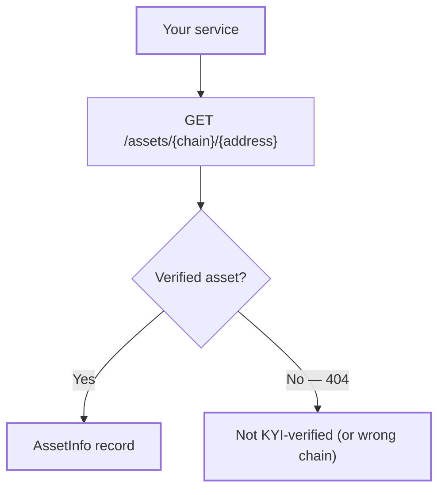

Asset lookups return the KYI-verified record for a token: its identity, its issuer, and the on-chain wallets that can control it. Use them when you already know a token's address and want the verification state behind it.

## Key concepts

| Term | Meaning |
|---|---|
| `account_id` | The asset's CAIP-10 identifier: `{namespace}:{reference}:{address}`, for example `eip155:98866:0xdddD…`. |
| Chain name | A short slug like `solana`, `ethereum`, `base`, `plume`, `sepolia` or `avalanche`. |
| CAIP-2 chain ID | A `{namespace}/{reference}` pair like `eip155/1` or `solana/5eykt4UsFv8P8NJdTREpY1vzqKqZKvdp`. Covers chains with no short name. |
| Authority | An on-chain wallet with power over the asset — mint, freeze, owner, and so on. |
| Verified page | The public, human-readable record at `verified.bluprynt.com` that the API row points to. |

## How it works



A `404` is a meaningful answer: the token is not KYI-verified — or it's verified on a different chain. The same address can exist on several chains, so always include the chain.

## Look up one asset

<CodeGroup>
```bash curl
curl -s "https://integrations.bluprynt.com/assets/solana/EPjFWdd5AufqSSqeM2qN1xzybapC8G4wEGGkZwyTDt1v" \
  -H "Authorization: $BLUPRYNT_API_KEY"
```
```ts TypeScript
const res = await fetch(
  `https://integrations.bluprynt.com/assets/${chain}/${address}`,
  { headers: { Authorization: process.env.BLUPRYNT_API_KEY! } },
)
if (!res.ok) return null
const asset = await res.json()
```
```python Python
import os, requests

res = requests.get(
    f"https://integrations.bluprynt.com/assets/{chain}/{address}",
    headers={"Authorization": os.environ["BLUPRYNT_API_KEY"]},
)
asset = res.json() if res.ok else None
```
</CodeGroup>

## Look up by CAIP-10

Replace the `:` separators with `/`. This form covers chains without a short name:

```bash
curl -s "https://integrations.bluprynt.com/assets/eip155/98866/0xdddD73F5Df1F0DC31373357beAC77545dC5A6f3F" \
  -H "Authorization: $BLUPRYNT_API_KEY"
```

Both forms return the same record.

## Response reference

```json Real response (Plume USD, trimmed)
{
  "token_details": {
    "account_id": "eip155:98866:0xdddD73F5Df1F0DC31373357beAC77545dC5A6f3F",
    "token_name": "Plume USD",
    "token_ticker": "pUSD",
    "token_image": "https://production-bluprynt.s3.us-west-2.amazonaws.com/...&X-Amz-Expires=3600&...",
    "authorities": [
      {
        "authority_type": "owner",
        "address": "0xa08A0Dc480BD60d1d56C8Eec6c722125eAfEa982",
        "verified": true,
        "account_type": "multisig",
        "multisig_signers": ["0x98bE74D3d5604904D0686eEf9b4267F681F9520a", "…"]
      }
    ],
    "copyright_confirmed": true
  },
  "business_details": {
    "business_verified": true,
    "business_name": "KIMBER DIGITAL ASSETS BERMUDA ISAC LTD",
    "business_description": "Plume USD is a stable, liquid token that acts as the capital layer of the Plume ecosystem…"
  },
  "website_url": "https://pusd.plume.org/",
  "whitepaper_url": "",
  "asset_url": "https://verified.bluprynt.com/verified-assets/0xdddD73F5Df1F0DC31373357beAC77545dC5A6f3F/plume"
}
```

### `token_details`

| Field | Type | Meaning |
|---|---|---|
| `account_id` | string | CAIP-10 identifier of the asset. |
| `asset_did` | string \| null | DID of the asset, when one exists. |
| `token_name` | string | Display name, e.g. `USD Coin`. |
| `token_ticker` | string | Symbol, e.g. `USDC`. |
| `token_image` | string \| null | Signed URL for the token image. |
| `authorities` | array | Wallets that can control the asset. See below. |
| `copyright_confirmed` | boolean | The issuer confirmed rights to the asset's branding. |

### `authorities[]`

| Field | Type | Meaning |
|---|---|---|
| `asset_authority_id` | string | Internal ID of this authority record. |
| `authority_type` | string | The power this wallet holds — `owner`, `mint_authority`, `freeze_authority`, or another observed type. The set is open: new chains can add new types. |
| `address` | string | The wallet address. |
| `verified` | boolean | `true` when the holder proved control of this wallet to Bluprynt. |
| `account_type` | string | `regular` for a single-key wallet, `multisig` for a multi-signature account. |
| `multisig_signers` | array | The signer addresses behind a multisig. |

### `business_details`

| Field | Type | Meaning |
|---|---|---|
| `issuer_did` | string \| null | DID of the issuer, when one exists. |
| `business_verified` | boolean | `true` when the issuer passed KYI verification (KYB of the issuing organization). |
| `business_name` | string | Legal name of the verified issuer. |
| `business_description` | string | Issuer-provided description. |

### Top level

| Field | Type | Meaning |
|---|---|---|
| `website_url` | string | The asset's verified website. |
| `whitepaper_url` | string | The asset's whitepaper or documentation. Empty when none was provided. |
| `asset_url` | string | The public verified page — link this from your UI so users can check the record. |

<Warning>
`token_image` is a signed S3 URL with `X-Amz-Expires=3600` — it expires one hour after the response. Fetch the asset again instead of caching the URL.
</Warning>

<Frame caption="The page behind `asset_url` for USD Coin on Solana.">
  
</Frame>

## List every verified asset

`GET /assets` returns the full set, paged:

```bash
curl -s "https://integrations.bluprynt.com/assets?page_size=50&page_number=2" \
  -H "Authorization: $BLUPRYNT_API_KEY"
```

```json Response shape
{
  "data": [ { "token_details": { … }, "business_details": { … } } ],
  "meta": { "total": 5, "page_size": 2, "page_number": 1 }
}
```

| Parameter | Default | Meaning |
|---|---|---|
| `page_size` | `20` | Items per page. |
| `page_number` | `1` | 1-based page index. |

`meta.total` is the full verified count, so loop until `page_number` covers it.

## Errors

| Status | Body | Cause |
|---|---|---|
| `401` | `{"message":"Unauthorized","statusCode":401}` | Missing key, wrong key, or a `Bearer` prefix. |
| `404` | `{"message":"Asset not found","error":"Not Found","statusCode":404}` | No verified asset at that address — or on that chain. |
| `404` | `{"message":"Assets not found","error":"Not Found","statusCode":404}` | The list query found nothing (for example an invalid `page_size`). |

See [Errors](/api/public/errors) for the full table.

## FAQ

<AccordionGroup>
  <Accordion title="What does a 404 mean for a token I know exists?">
    The token exists on-chain but isn't KYI-verified, or you asked on the wrong chain. Token addresses repeat across chains — check the same address on other chains before concluding it isn't verified.
  </Accordion>
  <Accordion title="Which chains can I pass as {chain}?">
    The spec lists `solana`, `ethereum`, `base`, `plume`, `sepolia` and `avalanche`. For anything else use the CAIP-2 form, which accepts any namespace and reference.
  </Accordion>
  <Accordion title="Is the data real-time?">
    The record is the current verified state. Values change when an issuer updates their disclosure or when a verification is renewed or revoked — fetch at display time rather than caching.
  </Accordion>
</AccordionGroup>

## Related

- [Token KYI lookup](/api/public/token-lookup) — address or CAIP-19 lookup with per-authority proof detail
- [Badges](/api/public/badges) — render the verification state as an image
- [Recipe: KYI badge](/api/public/badge-recipe) — the end-to-end exchange-UI walkthrough
