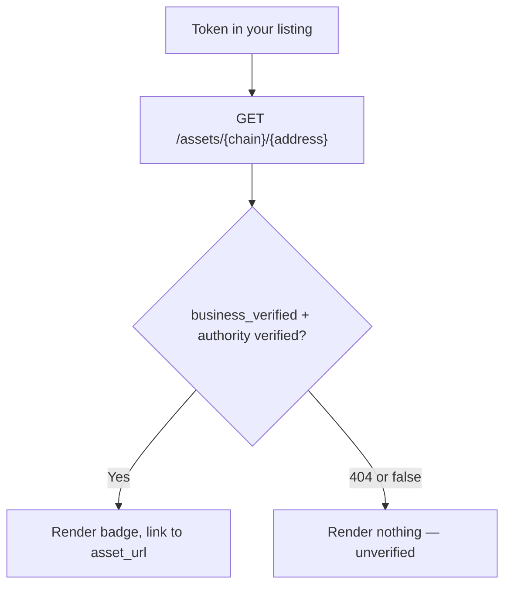

This recipe walks through adding a KYI badge next to a token in your UI — the way an exchange or wallet shows "this issuer is verified" for a listed asset. It needs the Public API key for the lookup; the badge image itself is public.

## Key concepts

| Term | Meaning |
|---|---|
| Verified record | The API row behind a token: issuer identity, authorities, verification flags. |
| `asset_url` | The public verified page the badge should link to. |
| Badge | A hosted image from `/api/v1/badges/{credential_type}`. |

## How it works



The badge is a claim, not a check. Gate it on the live record: show it only when the lookup confirms verification, so a revoked asset never keeps a stale badge.

## Steps

<Steps>
  <Step title="Look up the asset">
    For each listed token, call the [asset lookup](/api/public/asset-lookup) with its chain and address:

    ```bash
    curl -s "https://integrations.bluprynt.com/assets/solana/EPjFWdd5AufqSSqeM2qN1xzybapC8G4wEGGkZwyTDt1v" \
      -H "Authorization: $BLUPRYNT_API_KEY"
    ```
  </Step>
  <Step title="Check the verification flags">
    A KYI-verified asset has `business_details.business_verified: true` and `verified: true` on each authority. `404` means not verified — show nothing.

    <Frame caption="The verified page the badge links to — the KYI VERIFIED status (1) and the credential record behind it (2).">
      
    </Frame>
  </Step>
  <Step title="Render the badge">
    Use `asset_url` as the link and the [badges endpoint](/api/public/badges) as the image:

    ```html
    <a href="https://verified.bluprynt.com/verified-assets/<address>/<chain>">
      
    </a>
    ```
  </Step>
  <Step title="Refresh on a schedule">
    Re-run the lookup when you refresh listing data. Verification can be revoked — a cached badge becomes a false claim.
  </Step>
</Steps>

## Worked example

```ts TypeScript — server-side, per listed token
const res = await fetch(
  `https://integrations.bluprynt.com/assets/${token.chain}/${token.address}`,
  { headers: { Authorization: process.env.BLUPRYNT_API_KEY! } },
)

const asset = res.ok ? await res.json() : null
const kyi =
  asset?.business_details?.business_verified === true &&
  asset.token_details.authorities.every((a) => a.verified)

// Pass { kyi, assetUrl: asset?.asset_url } to your template:
// kyi ? <Badge url={asset.asset_url} /> : null
```

```html Template
{{#if kyi}}
<a href="{{assetUrl}}">
  
</a>
{{/if}}
```

## Troubleshooting

| Symptom | Cause | Fix |
|---|---|---|
| `401` on the lookup | `Bearer` prefix on the key | Send the raw key — see [Authentication](/api/public/authentication). |
| `404` for a token you listed | Not verified, or wrong chain | Check the same address on other chains; show unverified. |
| Badge is a broken image | Invalid parameter combination | Check [Badges](/api/public/badges) — `webp` returns `415`, `size=64` serves 32 px. |
| Badge doesn't update | It's a static image | That's correct — re-check the lookup and drop the badge when verification lapses. |

## FAQ

<AccordionGroup>
  <Accordion title="Should I check every authority or just business_verified?">
    `business_verified` is the headline KYI state. For a stricter display, require every authority to be `verified` too — the worked example does both.
  </Accordion>
  <Accordion title="Can I show the badge without linking it?">
    You can, but linking to `asset_url` is the point — it lets your users verify the claim instead of trusting the image. The image alone proves nothing.
  </Accordion>
</AccordionGroup>

## Related

- [Badges](/api/public/badges) — every variant, theme, format and size
- [Asset lookup](/api/public/asset-lookup) — the record behind the check
- [Token KYI lookup](/api/public/token-lookup) — the per-chain verdict with proof detail
