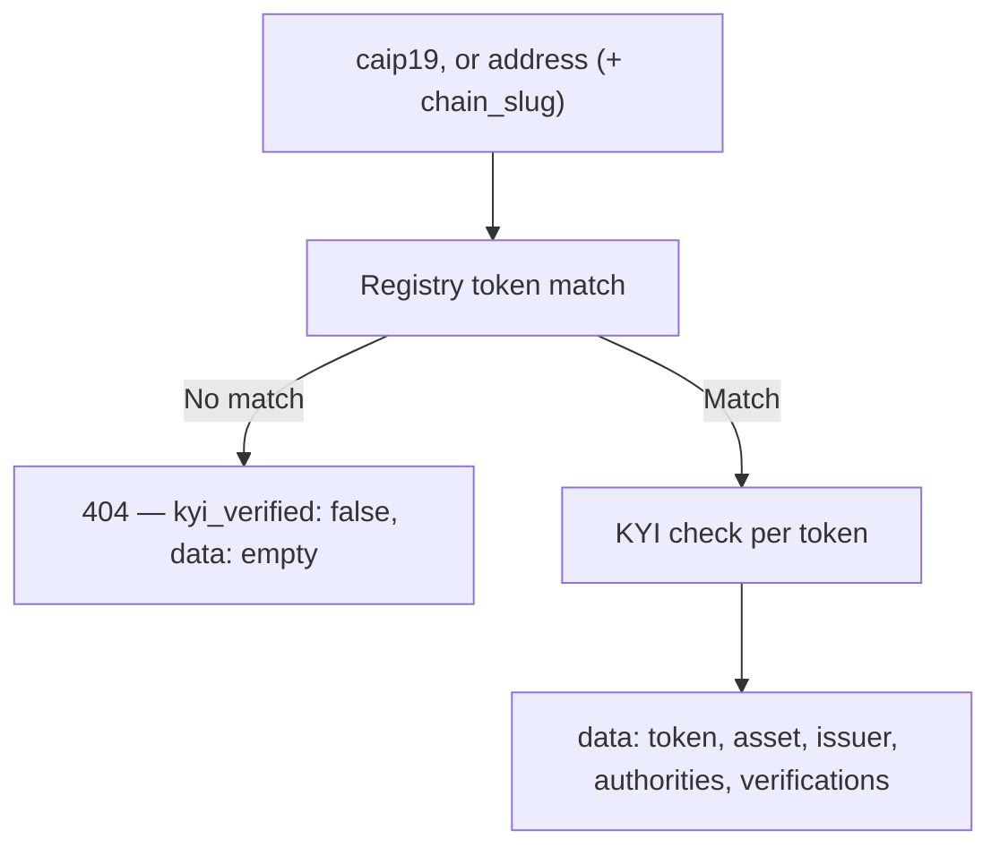

`GET /kyi/v1/tokens` answers "is this token KYI-verified?" for a token you identify by CAIP-19 or by address. Unlike the asset lookups it also returns each authority's wallet-proof verification — how Bluprynt confirmed the holder controls the wallet.

## Key concepts

| Term | Meaning |
|---|---|
| CAIP-19 | An asset-type identifier like `eip155:1/erc20:0xa0b8…`. Namespaces include `erc20`, `erc721` and `slip44`. |
| `chain_slug` | Optional chain filter for address lookups, e.g. `ethereum`. |
| `kyi_verified` | `true` when the token's issuer is KYI-verified. Appears on the response and per item. |
| Verification | One wallet-proof record: when it was made, which authority it backs, and the method used. |
| Method | The proof type — a signature (`eip191`, `eip712`, `solana_raw`, `solana_offchain_v0`, `xrpl`), a contract signature (`eip1271`), an on-chain transfer (amount or memo), or `admin_manual` (out of the public trust model). |

## How it works



An address-only lookup can match several deployments — the same contract address on different chains — so the response is always a list. Add `chain_slug` to narrow it.

## Query parameters

Send exactly one of the two forms:

| Parameter | Form | Meaning |
|---|---|---|
| `caip19` | CAIP-19 | The full asset ID, e.g. `eip155:98866/erc20:0xdddd…`. URL-encode it. |
| `address` | Address | The token contract address. |
| `chain_slug` | Address | Optional chain filter used with `address`. |

Mixing the forms is a `400`, as is `chain_slug` without `address`.

<CodeGroup>
```bash curl
# By CAIP-19
curl -s "https://integrations.bluprynt.com/kyi/v1/tokens?caip19=eip155%3A98866%2Ferc20%3A0xdddd73f5df1f0dc31373357beac77545dc5a6f3f" \
  -H "Authorization: $BLUPRYNT_API_KEY"

# By address + chain
curl -s "https://integrations.bluprynt.com/kyi/v1/tokens?address=0xdddD73F5Df1F0DC31373357beAC77545dC5A6f3F&chain_slug=plume" \
  -H "Authorization: $BLUPRYNT_API_KEY"
```
```ts TypeScript
const params = new URLSearchParams({
  address: '0xdddD73F5Df1F0DC31373357beAC77545dC5A6f3F',
  chain_slug: 'plume',
})
const res = await fetch(`https://integrations.bluprynt.com/kyi/v1/tokens?${params}`, {
  headers: { Authorization: process.env.BLUPRYNT_API_KEY! },
})
const { kyi_verified, data } = await res.json()
```
```python Python
import os, requests

res = requests.get(
    "https://integrations.bluprynt.com/kyi/v1/tokens",
    params={"address": "0xdddD73F5Df1F0DC31373357beAC77545dC5A6f3F", "chain_slug": "plume"},
    headers={"Authorization": os.environ["BLUPRYNT_API_KEY"]},
)
if res.status_code == 404:
    print("Not in the registry")
else:
    print(res.json()["kyi_verified"])
```
</CodeGroup>

## Response reference

```json Real response (Plume USD on Plume, trimmed)
{
  "kyi_verified": true,
  "data": [
    {
      "kyi_verified": true,
      "token": {
        "caip19": "eip155:98866/erc20:0xdddd73f5df1f0dc31373357beac77545dc5a6f3f",
        "caip2": "eip155:98866",
        "chain_slug": "plume",
        "address": "0xdddD73F5Df1F0DC31373357beAC77545dC5A6f3F",
        "standard": "erc20",
        "verified_at": "2026-04-23T16:51:18.045Z"
      },
      "asset": {
        "name": "Plume USD",
        "symbol": "pUSD",
        "website_url": "https://pusd.plume.org/"
      },
      "issuer": {
        "name": "KIMBER DIGITAL ASSETS BERMUDA ISAC LTD",
        "kyb_verified": true
      },
      "authorities": [
        {
          "type": "owner",
          "address": "0xa08A0Dc480BD60d1d56C8Eec6c722125eAfEa982",
          "account_type": "multisig",
          "signers": ["0x98bE74D3d5604904D0686eEf9b4267F681F9520a", "…"],
          "threshold": null,
          "observed_at": "2026-04-23T15:07:28.555Z"
        }
      ],
      "verifications": []
    }
  ]
}
```

### Per item

| Field | Type | Meaning |
|---|---|---|
| `kyi_verified` | boolean | `true` when this token's issuer passed KYI. The top-level flag is the aggregate across `data`. |
| `token` | object | Registry identity: `caip19`, `caip2`, `chain_slug`, `address`, `standard`, `decimals`, `verified_at`. |
| `asset` | object | Display metadata: `slug`, `name`, `symbol`, `description`, `website_url`, `whitepaper_url`. |
| `issuer` | object \| null | The issuing organization: `name` and `kyb_verified`. `null` when no issuer is linked. |
| `authorities` | array | Wallets with control over the token. |
| `verifications` | array | Wallet proofs backing the authorities. Empty when none are held. |

### `authorities[]`

| Field | Type | Meaning |
|---|---|---|
| `type` | string | Authority kind — `owner`, `mint_authority`, `freeze_authority`, or another observed type. Open set. |
| `address` | string | The wallet address. |
| `account_type` | `regular` \| `multisig` | Single-key or multi-signature. |
| `signers` | array | Signer addresses behind a multisig. |
| `threshold` | number \| null | Multisig approval threshold when known. |
| `observed_at` | string \| null | When the authority was observed on-chain. |

### `verifications[].method`

Every verification carries a `method` object describing the proof:

| `type` | Scheme | How the wallet proved control |
|---|---|---|
| `signature` | `eip191`, `eip712`, `solana_raw`, `solana_offchain_v0`, `xrpl` | Signed a message. XRPL proofs carry `signer_public_key`. |
| `contract_signature` | `eip1271` | A contract wallet signed via EIP-1271, with an inner `eip191`/`eip712` scheme, `caip2` and `block_number`. |
| `transfer` (`kind: amount`) | — | Sent a specific amount on-chain; carries `transaction_hash`, `sender`, `asset`, `amount`. |
| `transfer` (`kind: memo`) | — | Sent a transaction carrying a `memo`. |
| `admin_manual` | — | Recorded by an operator; not part of the public trust model. |

## Errors

| Status | Body | Cause |
|---|---|---|
| `400` | `{"message":"Provide caip19, or address with optional chain_slug",…}` | No query parameters. |
| `400` | `{"message":"Use either caip19, or address with optional chain_slug, not both",…}` | Mixed both forms. |
| `400` | `{"message":"chain_slug requires address",…}` | `chain_slug` alone. |
| `400` | `{"message":"caip19 must be a valid CAIP-19 identifier",…}` | Malformed CAIP-19. |
| `401` | `{"message":"Unauthorized","statusCode":401}` | Missing or invalid key. |
| `404` | `{"kyi_verified":false,"data":[]}` | No indexed token matches the query. Note the body is the normal response shape, not an error envelope. |
| `502` | Nest error body | An upstream service is unavailable. Retry with backoff. |

## FAQ

<AccordionGroup>
  <Accordion title="Why is kyi_verified false for a token I expected to be verified?">
    The lookup answers two things: whether the registry knows the token, and whether it's verified. A `404` means no indexed token matched at all; a `200` with `kyi_verified: false` means the token is indexed but the issuer hasn't completed KYI.
  </Accordion>
  <Accordion title="Why does an address lookup return more than one item?">
    Contract addresses aren't unique across chains. The same address can be a token on Ethereum and on Plume. Filter with `chain_slug`, or inspect each item's `token.caip2`.
  </Accordion>
  <Accordion title="When do I use this instead of /assets/{chain}/{address}?">
    Use `/assets` when you want the full verified record for display (issuer description, links, public page). Use `/kyi/v1/tokens` when you want the verification verdict itself — per-chain, with the authority and proof detail behind it.
  </Accordion>
</AccordionGroup>

## Related

- [Asset lookup](/api/public/asset-lookup) — the full verified record for one asset
- [Authentication](/api/public/authentication) — key handling
- [Errors](/api/public/errors) — the full status table
