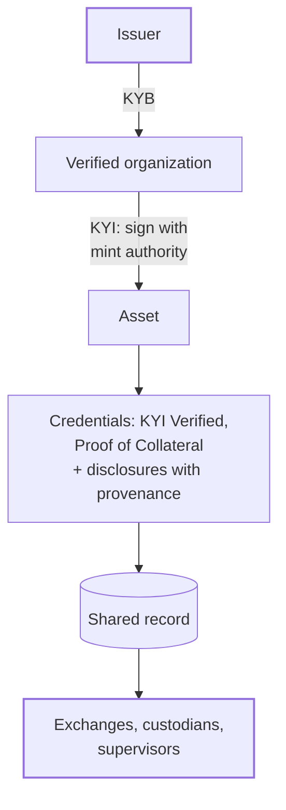

| Term | What it means |
|---|---|
| **Issuer** | The legal entity behind a token. Bluprynt links it to registry identifiers such as an LEI where one exists. |
| **Asset** | A token on a specific chain and address. One asset can be deployed on many chains. |
| **Organization** | Your company's space in Bluprynt Passport or Bluprynt Proof. Members belong to an organization. |
| **KYB** | Know Your Business. The one-time business check an issuer completes before verifying its first asset. |
| **KYI** | Know Your Issuer. Binds a KYB-verified issuer and the wallets that control a token to that token. See [Know Your Issuer](/tools/kyi). |
| **Mint authority** | A wallet with authority over a token, such as the owner or proxy admin. KYI asks the issuer to sign with each one. |
| **Attestation** | A signed statement about an issuer or asset that anyone can check. |
| **Credential** | A kind of attestation that Bluprynt issues after a review, such as **KYI Verified** or **Proof of Collateral**. |
| **Disclosure** | A fact an issuer has published about an asset, such as a reserve report, a license or a white paper. A **Smart Disclosure** is one drafted and published through [Bluprynt Passport](/passport/disclosures). |
| **Provenance** | Where a fact came from: the source document, its quote and when it was read. Bluprynt shows provenance with every disclosed fact. |
| **Not disclosed** | Bluprynt shows a missing fact as missing. It never fills a gap with zero or a default. |

## How they fit together

