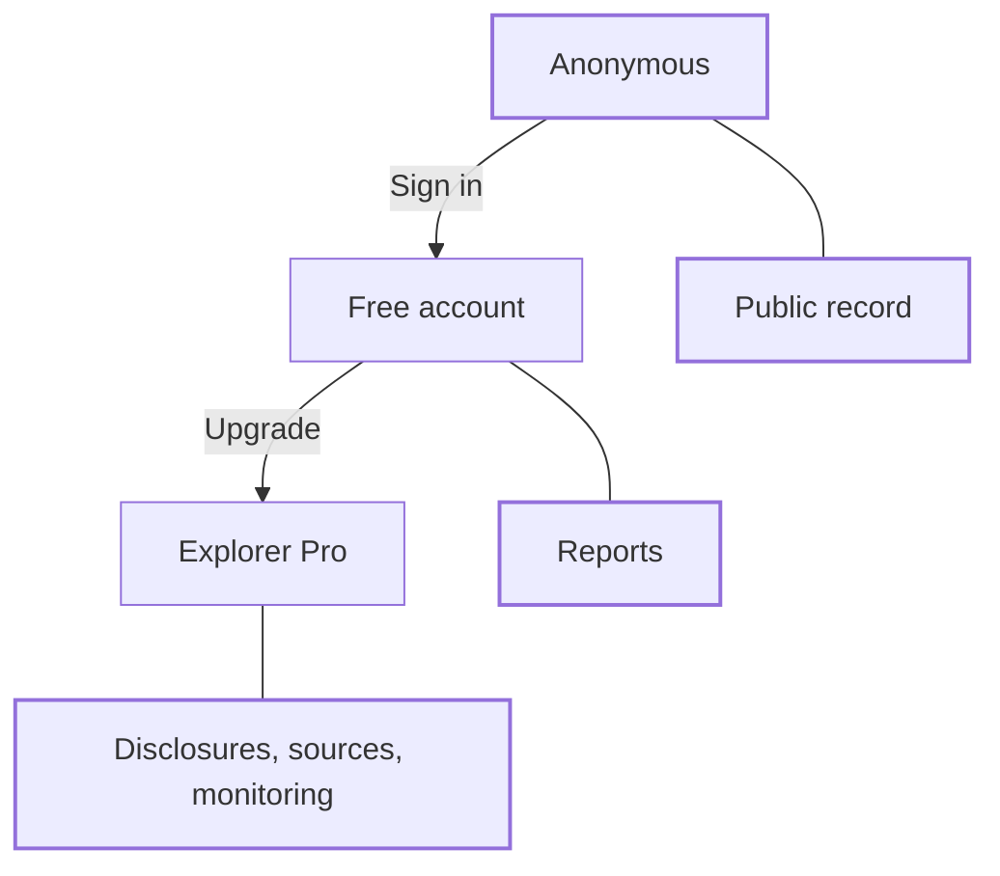

Most of Compliance Explorer is open to anyone. Some views need a free account, and the deepest evidence needs Explorer Pro. This page lists what each level sees, how to tell how current a value is, and how to trace any value back to its source.

## Key concepts

| Term | Meaning |
| --- | --- |
| Anonymous | You browse without signing in. You see every public record field. |
| Free account | You sign in with a researcher account. You can generate reports. |
| Explorer Pro | The paid tier. It opens source documents, the full disclosure record and [Disclosure Monitoring](/tools/disclosure-monitoring). |
| Gate | The card shown in place of gated content. It names what is gated and offers **Create a free account**, **Book a demo** and **Sign in**. |
| Freshness | When a value was last read from its source. |
| Provenance | The source, quote and basis behind a value. |

## Access levels

| Surface | Anonymous | Free account | Explorer Pro |
| --- | --- | --- | --- |
| Search and directories | Yes | Yes | Yes |
| Asset, issuer, regulator and protocol pages | Yes | Yes | Yes |
| **Overview**, **Markets**, **Governance & Control** tabs | Yes | Yes | Yes |
| **Reports** tab (generate PDFs) | Sign-in card | Yes | Yes |
| **Disclosures** tab (verbatim quotes, provenance, entity graph) | Pro gate | Pro gate | Yes |
| **Documentation & sources** | Pro gate | Pro gate | Yes |
| [Disclosure Monitoring](/tools/disclosure-monitoring) | Pro gate | Pro gate | Yes |

You upgrade to Pro from your account page after you create a free account.

## Reach a gated view

<Steps>
  <Step title="Open a Pro view">
    Click **Disclosures** on any asset, issuer or protocol page. The lock on the tab (1) marks it as gated. The gate (2) says the view is part of Explorer Pro and offers **Create a free account**, **Book a demo** and **Sign in**.

    <Frame caption="The Explorer Pro gate on the Disclosures tab.">
      
    </Frame>
  </Step>
  <Step title="Open a sign-in view">
    Click **Reports**. As an anonymous visitor you see a sign-in card (2). Any free account can generate reports.

    <Frame caption="The sign-in card on the Reports tab.">
      
    </Frame>
  </Step>
</Steps>

## Freshness

Every page says how current its data is. Look for these markers.

| Marker | Where | Meaning |
| --- | --- | --- |
| **Last checked** | Asset **At a glance** | When Bluprynt last re-read the asset's source documents |
| Reserve attestation date and **Next due** | Asset evidence strip | Date of the latest reserve attestation and when the next is expected |
| **Registry record updated** | Issuer compliance profile | When the issuer record last changed |
| **fetched** / **checked** and cadence | Regulator **Registers & sources** | When the register was last fetched and checked, and how often, such as `P7D` (every 7 days) |
| **Snapshot · date** | Issuer **Concentration & exposure** | The date the figures were taken |
| **Registry snapshot, not live** | Asset **Primary liquidity pool** | A stored figure, not a live feed |
| Last trade (for example `21m ago`) | Asset **Markets** | Live market data at page load |
| **Last updated** | Protocol **Registry record** | When the protocol record last changed |

## Provenance

Each value keeps where it came from.

| Marker | What it tells you |
| --- | --- |
| **Source:** link | The page, document or register the value was read from |
| **Basis** | Why the registry reads the source that way |
| **Confidence** | How confident the extraction is, as a percentage |
| **View source** | Opens the regulator register entry behind a licence |
| **Registry ID** | The external record a protocol comes from, such as `defillama:usdt0` |
| LEI | The legal entity identifier from GLEIF, shown under the issuer name |
| Content hash | Shown on each generated report, so you can check a PDF wasn't altered |
| **Analyst-reviewed** / **automated** | Whether the registry grade was reviewed by an analyst |

## Worked example: trace a control fact

1. Open an asset and click **Governance & Control**.
2. Under **Smart contract & operational integrity**, find **Who can control the token**.
3. Read the **Basis** for the reasoning and the **Confidence** score.
4. Click the **Source** link to read the original page yourself.
5. Back on **Overview**, read **Last checked** to see when that source was last re-read.

## Troubleshooting

| Problem | What to do |
| --- | --- |
| You're signed in but **Disclosures** is still locked | Free accounts don't include Pro surfaces. Upgrade from your account page. |
| A date looks old | The source may not have changed. Watch the asset with [Disclosure Monitoring](/tools/disclosure-monitoring) to be told when it does. |

## Related pages

<CardGroup cols={2}>
  <Card title="The asset page" icon="coins" href="/explorer/asset-page">Every field and its evidence.</Card>
  <Card title="Disclosure Monitoring" icon="bell" href="/tools/disclosure-monitoring">Get told when a source changes.</Card>
</CardGroup>
