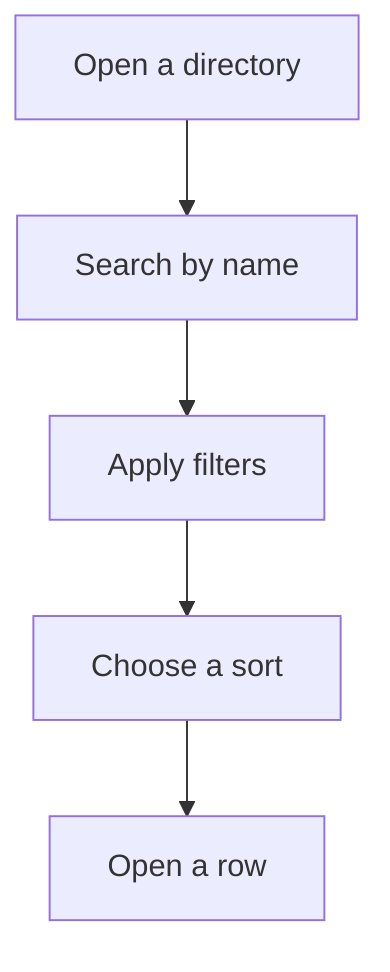

Each record type in Compliance Explorer has its own directory. A directory lists every record of that type with its headline facts, so you can compare records side by side before you open one. Use them to build a shortlist, for example every stablecoin on a given chain, or every regulator in one jurisdiction.

## Key concepts

| Term | Meaning |
| --- | --- |
| Directory | A list page for one record type: [assets](https://explorer.bluprynt.com/assets), [issuers](https://explorer.bluprynt.com/issuers), [regulators](https://explorer.bluprynt.com/regulators) or [protocols](https://explorer.bluprynt.com/protocols). |
| Summary cards | The four counts at the top of a directory, such as **Assets on record**. They describe the whole directory, or the filtered set where a card says so. |
| Filter | A dropdown that narrows the list, such as **All classifications**. Each option shows how many records match. |
| Sort | The order of the list, such as **Sort: Market cap**. |
| Row | One record. Click it to open the record page. |

## How directories work

Filters and sort are stored in the page URL. Copy the URL to share a filtered view or to come back to it later.

## Browse a directory

<Steps>
  <Step title="Open the assets directory">
    Go to [explorer.bluprynt.com/assets](https://explorer.bluprynt.com/assets), or click **Open the Explorer** on the home page. Search by asset name or ticker (1). The summary cards (2) count assets on record, classifications, chains covered and the 48 checklist items tracked per asset. Use the filters and sort (3) to narrow the list. Each row (4) shows the issuer, chains, market cap and disclosure checklist score. **Claim this profile** (5) is the entry point for the issuer to verify the record.

    <Frame caption="The digital assets directory.">
      
    </Frame>
  </Step>
  <Step title="Filter by classification or chain">
    Click **All classifications** (1). Each option (2) shows how many assets carry that classification. Pick one to filter the list. **All chains** works the same way for deployments.

    <Frame caption="The classification filter, with a count next to each classification.">
      
    </Frame>
  </Step>
  <Step title="Browse issuers">
    Go to [explorer.bluprynt.com/issuers](https://explorer.bluprynt.com/issuers). Search by legal entity name (1). The summary cards (2) show issuers on record, issuers with live assets, issuers with an LEI or register record and issuers that have been sanctions-screened. Filter by jurisdiction, asset count, coverage, screening and verification (3). Each row (4) shows the jurisdiction, assets on record and checklist coverage, plus status tags such as **Sanctions clear** (5).

    <Frame caption="The issuer directory.">
      
    </Frame>
  </Step>
  <Step title="Browse regulators">
    Go to [explorer.bluprynt.com/regulators](https://explorer.bluprynt.com/regulators). Search by regulator name or code (1). The summary cards (2) count regulators and jurisdictions, and split regulators into financial supervisors (securities, banking, payments and VASP) and company registers (GLEIF registration authorities). Filter by jurisdiction, type and evidence (3). Each row (4) shows the regulator type, jurisdiction, entities regulated and assets governed. The chips underneath name the registers Bluprynt reads. The tags on the right (5) show the kinds of evidence it holds, such as **Regulator register**, **Filings** or **Asset disclosure**, and how the regulator entered the registry, such as **Curated catalogue**.

    <Frame caption="The regulator directory.">
      
    </Frame>
  </Step>
  <Step title="Browse protocols">
    Go to [explorer.bluprynt.com/protocols](https://explorer.bluprynt.com/protocols). Search by protocol name (1). The summary cards (2) count protocols and categories. **Value locked tracked** and **With audit record** count the protocols on the current page. Filter by category and sort by value locked, name or recency (3). Each row (4) shows the category, description, value locked, chains, contracts and audits.

    <Frame caption="The protocol monitor directory.">
      
    </Frame>
  </Step>
</Steps>

## Reference

### Filters and sort options

| Directory | Filters | Sort options |
| --- | --- | --- |
| Assets | Classification, Chain | Market cap (default), Name, Recently updated |
| Issuers | Jurisdiction, Asset count, Coverage, Screening, Verification | Name (A–Z) (default), Most live tokens, Highest checklist coverage |
| Regulators | Jurisdiction, Type, Evidence | Most entities (default), Most assets, Name A–Z, Jurisdiction |
| Protocols | Category | Value locked (default), Name, Recently updated |

### Row fields

| Directory | Field | Meaning |
| --- | --- | --- |
| Assets | Issuer | The linked issuer's legal name, or **Not linked** when no issuer is resolved. |
| Assets | Chain | The primary chain, plus the number of other chains the asset is deployed on. |
| Assets | Market cap | From market data providers. Blank when no provider prices the asset. |
| Assets | Disclosure % | Checklist items on record out of 48. |
| Issuers | Jurisdiction | Where the entity is incorporated or domiciled, or **Not disclosed**. |
| Issuers | Assets on record | Assets linked to this issuer, or **None linked**. |
| Issuers | Checklist on record | The issuer's disclosure coverage across its live assets, or **No live assets**. |
| Issuers | Tags | Entity type (for example **Issuer**), **Active**, and sanctions status: **Sanctions clear**, **Sanctions match** or **Screening inconclusive**. |
| Regulators | Type | For example **Securities regulator**, **Payments regulator** or **Banking supervisor**. |
| Regulators | Entities regulated | Entities on this authority's registers or licence lists, as published by the register itself. One row per entity. |
| Regulators | Assets governed | Assets the registry links to this authority. |
| Protocols | Value locked | Total value locked as reported by DeFiLlama, where tracked. |
| Protocols | Contracts, Audits | Contracts and audits on record, or **None recorded** / **No record**. |

## Worked example: shortlist stablecoins on one chain

1. Open the [assets directory](https://explorer.bluprynt.com/assets).
2. Click **All classifications** and choose **Stablecoin**.
3. Click **All chains** and choose the chain you care about.
4. Keep **Sort: Market cap** to see the largest first.
5. Compare the **Disclosure %** bars. Open the rows you want to review in detail, then read [the asset page](/explorer/asset-page).

## Troubleshooting

| Problem | What to do |
| --- | --- |
| A filter returns nothing | Clear one filter at a time. The option counts show how many records each choice matches before you pick it. |
| Market cap is blank | No market data provider prices the asset. The rest of the record is unaffected. |
| A protocol count says "on this page" | That card counts only the protocols shown on the current page, not the whole directory. |

## FAQ

<AccordionGroup>
  <Accordion title="Why does an asset say 'Not linked' for its issuer?">
    The registry has not resolved which legal entity issues the asset. The asset page then reads **Issuer not disclosed**. The issuer can claim the profile to fix this.
  </Accordion>
  <Accordion title="How is 'Entities regulated' counted?">
    It counts one row per entity on the registers or licence lists that authority publishes. The regulator page names each register and when it was last fetched.
  </Accordion>
</AccordionGroup>

## Related pages

<CardGroup cols={2}>
  <Card title="The asset page" icon="coins" href="/explorer/asset-page">Every asset field and its evidence.</Card>
  <Card title="Issuer, regulator and protocol pages" icon="landmark" href="/explorer/profiles">What each profile page shows.</Card>
</CardGroup>
