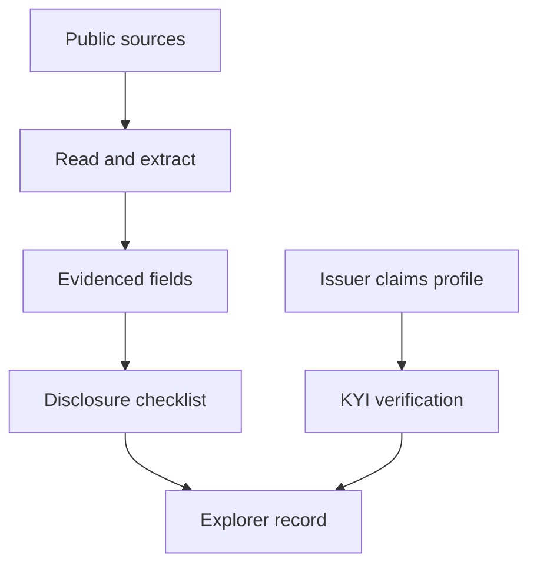

Compliance Explorer is Bluprynt's public registry of tokenized assets. It shows what each asset, issuer, regulator and protocol has disclosed, where each fact comes from, and what is still missing. Compliance teams, analysts, allocators and supervisors use it to check an asset before they list, hold or underwrite it. Issuers use it to see how their record reads and to claim it.

<Frame caption="An asset record in Compliance Explorer: identity, disclosure score, venues and chain deployments.">
  
</Frame>

Open it at [explorer.bluprynt.com](https://explorer.bluprynt.com). You can browse public records without an account.

## What you can do

<CardGroup cols={2}>
  <Card title="Search and browse" icon="magnifying-glass" href="/explorer/search">
    Find any asset, issuer or contract address from the home page or the header search.
  </Card>
  <Card title="Directories" icon="list" href="/explorer/directories">
    Filter and sort every asset, issuer, regulator and protocol on record.
  </Card>
  <Card title="The asset page" icon="coins" href="/explorer/asset-page">
    Read an asset tab by tab, and see where each field's evidence comes from.
  </Card>
  <Card title="Issuer, regulator and protocol pages" icon="building-columns" href="/explorer/profiles">
    See an issuer's compliance profile, a regulator's register and a protocol's footprint.
  </Card>
  <Card title="Status tags and the disclosure checklist" icon="list-check" href="/explorer/disclosure-checklist">
    Understand the 48-item checklist, "Not disclosed", status tags and **Claim this profile**.
  </Card>
  <Card title="Access, freshness and provenance" icon="lock-open" href="/explorer/access-and-provenance">
    Learn what is open, what needs an account or Explorer Pro, and how current each record is.
  </Card>
</CardGroup>

## Key concepts

| Term | Meaning |
| --- | --- |
| Registry | The set of records Compliance Explorer shows. It covers assets, issuers, entities, protocols, groups and regulators. |
| Asset | One tokenized asset, such as a stablecoin or tokenized fund, with its contract deployments on each chain. |
| Issuer | The legal entity behind an asset. An issuer is "inferred" until it verifies itself through [KYI](/tools/kyi). |
| Regulator | A financial supervisor or company register, with the entities on its register. |
| Protocol | An on-chain protocol that issues, lends against or routes tokenized assets, such as a bridge. |
| Disclosure checklist | The fixed list of facts the registry tracks for each subject. Assets have 48 items. |
| Not disclosed | The registry looked for a fact and holds no evidenced value for it. It is never filled with a guess. |
| Source document | A document, page or register entry the registry read to evidence a field. |
| Explorer Pro | The paid tier that opens source documents, the full disclosure record and [Disclosure Monitoring](/tools/disclosure-monitoring). |

## How the registry is built

Every value on a record traces back to a source. Bluprynt reads public documents, on-chain data, regulator registers and GLEIF, then keeps each value with the document it came from.

- **Sources.** Issuer documents and web pages, on-chain contract reads, regulator registers, GLEIF, market data and oracles.
- **Evidenced fields.** Each extracted value keeps its source document, quote and confidence.
- **Checklist.** Each field counts toward the disclosure checklist only when it is on record.
- **Verification.** When an issuer claims its profile and completes KYI, the record shows it as verified instead of inferred.

## Related tools

<CardGroup cols={3}>
  <Card title="Asset Dependency Engine" icon="diagram-project" href="/tools/asset-dependency-engine">
    The graph of every layer an asset depends on.
  </Card>
  <Card title="Disclosure Monitoring" icon="bell" href="/tools/disclosure-monitoring">
    Watch assets and get notified when their disclosures change.
  </Card>
  <Card title="Explorer API" icon="code" href="/api/explorer/overview">
    Read the same registry records from your own systems.
  </Card>
</CardGroup>
