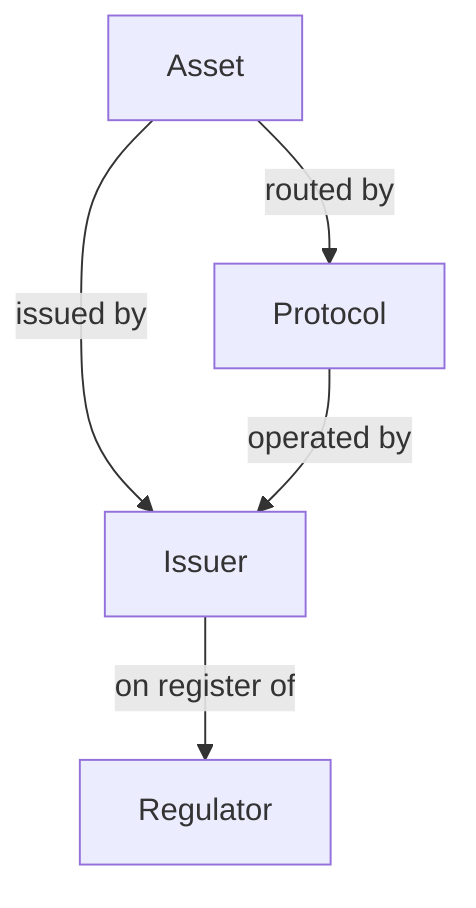

Assets are only half of the registry. Issuer pages show the legal entity behind a token, regulator pages show the registers an authority publishes, and protocol pages show the on-chain systems that issue or route assets. Use them to check who stands behind an asset and who supervises them.

## Key concepts

| Term | Meaning |
| --- | --- |
| Issuer page | The record of one legal entity, at `/issuers/<id>`. It rolls up every asset the entity issues. |
| Compliance profile | The issuer's identity and standing checks: sanctions, KYI, enforcement, licensing, filings and wallet provenance. |
| Field state | The badge on each compliance-profile or checklist row: **Verified**, **Awaiting issuer**, **Indeterminate** or **Nothing yet**. |
| Regulator page | The record of one authority, at `/regulators/<code>`, with every entity on the registers it publishes. |
| Register | A public list an authority publishes, such as a licence list. Bluprynt fetches it and keeps one row per entity. |
| Catalogue | How the regulator entered the registry, for example **Curated catalogue**. |
| Protocol page | The record of one protocol, at `/protocols/<id>`, with its value locked, contracts, governance and audits. |

## How profile pages connect

Each link is a registry record you can click through. An issuer page lists the issuer's assets and registers. A regulator page lists every entity on its registers and the assets those entities issue.

## Read an issuer page

<Steps>
  <Step title="Check the header">
    Open an issuer from the [issuer directory](https://explorer.bluprynt.com/issuers) or from an asset page. The status tags (1) show how many assets are in the registry, KYI status, sanctions status and whether the issuer is on the platform. The disclosure checklist card (2) gives the issuer's coverage across its live assets and how it compares with the registry average. If the issuer hasn't claimed its profile, a banner (3) says the entity name above was resolved from the issuer's own terms and privacy pages and is unconfirmed.

    <Frame caption="An issuer page header, claim banner and overview.">
      
    </Frame>
  </Step>
  <Step title="Read the overview">
    Use the tabs (4) to switch between **Overview**, **Assets**, **Disclosures**, **Entity & Governance** and **Reports**. On **Overview**, the compliance profile (5) lists each check with its field state. **Regulatory licensing** (6) lists each licence or registration with its register, status and source link. The disclosure checklist (7) lists nine weighted items. Each one reads **Self-reported**, **Not disclosed**, **Awaiting issuer** or a count such as **1 on record**. The checklist score in the header counts items across every deployment of every asset the issuer stands behind, for example 1,045 of 1,344 items across 28 deployments of 7 assets.
  </Step>
</Steps>

### Issuer page sections

| Section | What it shows | Evidence |
| --- | --- | --- |
| Compliance profile | Sanctions, KYI verification, enforcement actions, licensed, filings, wallet provenance | Sanctions lists, KYI attestations, regulator registers, on-chain wallet reads |
| Quick stats | Verified assets, total assets, active licences, disclosure %, disclosed fields, documents on file, register attestations, roles in registry, data-quality findings | Computed from the registry record |
| Regulatory licensing | Each licence or registration, grouped by jurisdiction, with status | Regulator registers, linked with **View source** |
| Key facts across its tokens | How many of the issuer's tokens state each key fact, such as holder claims or reserve data origin, with the most common answer | Issuer documents for each token |
| Concentration & exposure | Market cap and supply by chain, and named reserve custodians with quotes | Market data, on-chain supply, reserve attestations |
| Registry network | Every role the firm plays (issuer, custodian, auditor and so on) and the counterparties linked to it | Disclosure documents and registers |
| Data-quality findings | Contradictions between what the issuer discloses and what registers publish | Each finding links both sources |

### Issuer checklist items

| Item | Weight |
| --- | --- |
| Legal identity | 3 |
| Jurisdiction | 3 |
| Licenses | 3 |
| White paper | 2 |
| Reserves | 2 |
| Audit | 2 |
| Sanctions screening | 2 |
| KYI | 2 |
| Website & contact | 1 |

An item is on record only when the registry holds the underlying field. On an issuer that hasn't verified through KYI, items on record read **Self-reported**. Items the registry doesn't hold read **Not disclosed**.

### Field states

| State | Badge | Meaning |
| --- | --- | --- |
| `VERIFIED_NEGATIVE` | **Verified** | The check is confirmed, for example a clean sanctions screen on a verified issuer. |
| `AWAITING_ISSUER` | **Awaiting issuer** | The registry holds a value, but the issuer hasn't confirmed it. |
| `INDETERMINATE` | **Indeterminate** | The registry looked and holds no value. |
| `NOTHING_YET` | **Nothing yet** | The issuer couldn't be resolved, so nothing has been checked. |

## Read a regulator page

<Steps>
  <Step title="Check the header and counts">
    Open a regulator from the [regulator directory](https://explorer.bluprynt.com/regulators). The header (1) shows the authority's name, code, type and catalogue, plus the register Bluprynt reads and a link to the authority's website. The summary cards (2) count entities regulated, active entities, assets governed and the market cap of governed assets. Use the tabs (3) to switch between **Entities**, **Assets** and **Market**.

    <Frame caption="A regulator page: header, counts, the entities table and the registers behind it.">
      
    </Frame>
  </Step>
  <Step title="Search the entities and check the sources">
    The **Entities regulated** table (4) lists every entity on the authority's registers, as the register publishes it, with licence or ID, status, since date and register. Search it by name, LEI or registration ID, and filter by status or register. **Registers & sources** (5) names each register, its kind (for example **Regulator register** and **Official**), how many records it holds, when it was fetched and checked, and its check cadence. **Recent changes** (6) lists changes Bluprynt detected on those registers since first capture.
  </Step>
</Steps>

### Regulator page fields

| Field | Meaning |
| --- | --- |
| Entities regulated | Entities on the authority's registers or licence lists, one row per entity |
| Active entities | Entities whose register status is active |
| Assets governed | Assets the registry links to this authority |
| Market cap of governed assets | Total market cap of those assets, with how much comes from issuers holding an active licence |
| Status | The status the register publishes, such as **Authorised** |
| Since | The date the register gives for the entry, or **Not published** |
| Cadence | How often the register is re-checked, as an ISO 8601 duration. `P7D` means every 7 days. |

## Read a protocol page

<Steps>
  <Step title="Check the header and metrics">
    Open a protocol from the [protocol directory](https://explorer.bluprynt.com/protocols). The header (1) shows the protocol's category, description and monitoring state. The checklist card (2) shows whether a disclosure record exists yet. The metric cards (3) show value locked, 24-hour volume, contracts on record and audits. Use the tabs (4) to switch between **Overview**, **Disclosures** and **Reports**.

    <Frame caption="A protocol page: header, metrics, overview cards and registry record.">
      
    </Frame>
  </Step>
  <Step title="Read the overview">
    **Operating entity** (5) names the legal entity that runs the protocol, or says **Not disclosed**. The disclosure checklist (6) tracks 32 items in four families, and lists what is **Still missing**. **Registry record** (7) shows the category, chains, operator jurisdiction, versions, last update and the registry ID the record comes from.
  </Step>
</Steps>

### Protocol checklist families

| Family | Items |
| --- | --- |
| Governance & control | 9 |
| Security assurance | 7 |
| Dependencies & economics | 8 |
| Legal entity & terms | 8 |

## Reports on profile pages

Each profile type has a **Reports** tab that renders a PDF from the registry record as of now. Any signed-in account can generate one; anonymous visitors see a sign-in card.

| Page | Report | Contents |
| --- | --- | --- |
| Issuer | EA-01 · Entity KYI profile | Legal-entity identity, register standing, personnel and findings |
| Asset | EA-02 · Asset disclosure report | Disclosure graph, reserve evidence, governance, market data and the full field record |
| Protocol | PA-01 · Protocol disclosure summary | Governance and control, security assurance, dependencies and economics, legal terms, source quotes and recent material changes |

The **Generate PDF** button is disabled when the record can't support the template, and the panel names the missing prerequisites. Each finished report is offered for download with its content hash, and earlier generations stay listed below it.

## Worked example: check who supervises an issuer

1. Open the issuer's page.
2. On **Overview**, read **Regulatory licensing**. Each licence names its register and status.
3. Click the regulator to open its page.
4. Search the **Entities regulated** table for the issuer's legal name or LEI. Confirm the status, for example **Authorised**.
5. In **Registers & sources**, check when the register was last fetched, so you know how current the entry is.

## Troubleshooting

| Problem | What to do |
| --- | --- |
| The issuer name looks wrong | Until the issuer claims its profile, the name is resolved from its own public pages and is unconfirmed. Check the banner and the sources. |
| Since reads **Not published** | The register doesn't publish a start date for that entry. |
| A protocol shows **Not yet assessed** | No disclosure record exists for that protocol yet, so it isn't scored. |
| Sanctions reads **Sanctions not screened** | The registry holds no screening result for that entity. |

## FAQ

<AccordionGroup>
  <Accordion title="What does 'Issuer (inferred)' mean?">
    The registry linked the entity to its assets from public evidence, but the entity hasn't verified itself through [KYI](/tools/kyi). Once it does, the page shows **KYI verified**.
  </Accordion>
  <Accordion title="Where do regulator entity lists come from?">
    From the registers each authority publishes. Bluprynt fetches each register on its cadence and keeps one row per entity, exactly as the register lists it.
  </Accordion>
</AccordionGroup>

## Related pages

<CardGroup cols={2}>
  <Card title="Status tags and the disclosure checklist" icon="list-check" href="/explorer/disclosure-checklist">Every tag, state and checklist rule.</Card>
  <Card title="Know Your Issuer" icon="id-card" href="/tools/kyi">How an issuer verifies its profile.</Card>
</CardGroup>
