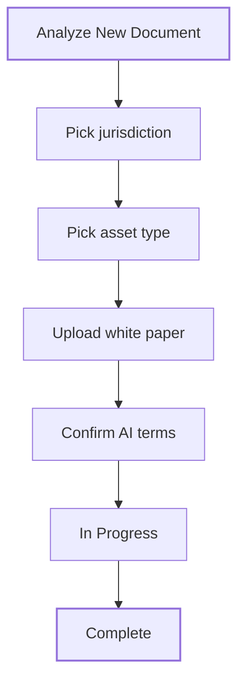

**Analyze** checks an existing white paper against regulatory guidelines, including MiCA. You pick the jurisdiction and asset type, upload the document, and Bluprynt returns a compliance score and a section-by-section evaluation with recommendations. Use it before you publish, or to check a white paper written elsewhere.

## Key concepts

| Term | Meaning |
|---|---|
| **Analysis** | One run of Analyze on one or more uploaded documents. |
| **Jurisdiction** | Whose guidelines you evaluate against, for example European Union. |
| **Asset type** | EMT (e-money token), ART (asset-referenced token) or OT (other token). |
| **Compliance score** | The overall result of the analysis. |
| **Evaluation table** | The list of white paper sections with a status and % completion for each. |

## How it works

The analysis is AI-assisted. Before you continue, you confirm that you understand its limits, that human oversight is required and that final responsibility lies with you.

## Analyze a white paper

<Steps>
  <Step title="Open Analyze">
    Click **Analyze** in the sidebar. The **Summary** (2) shows total analyzed, complete, in progress and the average compliance score. **Analyzed Documents** (3) lists past runs. Click **Analyze New Document** (1).

    <Frame caption="The Analyze page.">
      
    </Frame>
  </Step>
  <Step title="Review the terms">
    **Review carefully before proceeding** (1) explains the limits of AI analysis. Tick the boxes to confirm and to accept the Terms of Service and Privacy Policy (2). Click **Continue** (3), or **Go back** (4).

    <Frame caption="The confirmation shown before a new analysis.">
      
    </Frame>
  </Step>
  <Step title="Choose the guidelines and upload">
    Under **Bluprynt Document Analysis**, answer *Which jurisdiction's guidelines do you want to evaluate against?* and *What type of asset is your White Paper for?* If you're not sure of the type, click **Not sure? Answer a few questions to find out**. See [MiCA asset classifier](/passport/mica-classifier). Click **Upload documents**, add your white paper and click **Analyze document**.
  </Step>
  <Step title="Read the result">
    Open the analysis from the list. The **Evaluation Table** shows each white paper section with its **Status** (1) and **% Completion** (2), then the **Overall Completion** (3). A detailed in-depth analysis with regulatory references and recommendations follows.

    <Frame caption="The evaluation table of a completed MiCA EMT analysis.">
      
    </Frame>
  </Step>
</Steps>

## Reference

### Analysis statuses

| Status | Meaning |
|---|---|
| **In Progress** | Bluprynt is analyzing the document. |
| **Pending Review** | The analysis is waiting for review. |
| **Complete** | The result is ready. |

### Section statuses

| Status | Meaning |
|---|---|
| **Complete** | The section meets the guideline. |
| **Partly Complete** | The section covers part of the guideline. |
| **Missing** | The section isn't in the document. |

### Supported values

| Setting | Values |
|---|---|
| Jurisdiction | European Union |
| Asset type | EMT, ART, OT |
| Upload | One or more documents |

### MiCA EMT sections evaluated

| Section |
|---|
| Preliminary Section. Required Statements |
| Summary |
| Part A. Information about the issuer of the E-Money Token |
| Part B. Information about the e-money token |
| Part C. Information about the offer to the public or admission trading |
| Part D. Information on the rights and obligations attached to EMT |
| Part E. Information on the underlying technology |
| Part F. Information on the risks |
| Part G. Information on sustainability indicators |

## Worked example

You have a draft EMT white paper. You click **Analyze New Document**, confirm the terms, choose **European Union** and **EMT**, upload the PDF and click **Analyze document**. The run shows **In Progress**, then **Complete**. Every section reads **Complete** at 100% except Part G, which reads **Partly Complete**. You follow the recommendation for Part G and run the analysis again.

## Troubleshooting

| Problem | What to do |
|---|---|
| **Continue** stays disabled | Tick every confirmation box. |
| A run is stuck | Use **Retry** on the run in **Analyzed Documents**. |
| You picked the wrong asset type | Start a new analysis with the right type. |

## FAQ

<AccordionGroup>
  <Accordion title="Is the AI result legal advice?">
    No. Human oversight is required and final responsibility lies with you.
  </Accordion>
  <Accordion title="How is this different from Documents?">
    Analyze checks a document you already have. [Documents](/passport/disclosures) helps you write one.
  </Accordion>
</AccordionGroup>

## Related pages

- [MiCA asset classifier](/passport/mica-classifier)
- [Documents](/passport/disclosures)
