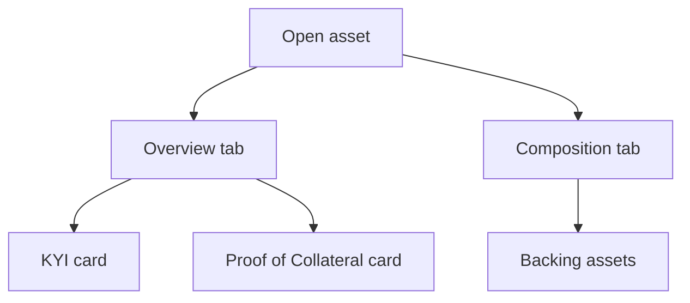

The asset trust center is the private page for one asset inside Passport. It shows each verification step, KYI and Proof of Collateral, with its state and the next action. Open it from **Open trust center** or **Open asset** on the Overview, or from **My Assets** in the sidebar.

## Key concepts

| Term | Meaning |
|---|---|
| **Asset verification** | The header block that sums up the asset's steps, for example *At least 1 step outstanding*. |
| **KYI card** | The Know Your Issuer step for this asset. |
| **Proof of Collateral card** | The collateral disclosure step for this asset. |
| **Asset details and tokens** | A drawer with the asset's details and the tokens and authorities found on chain. |
| **Composition** | The tab that lists the assets backing this one. |
| **Backing asset** | An asset that this asset holds or references. Its own verification state affects this asset. |

## How it works

The page reads each step live. If a step can't be read, the card says so and still lets you continue.

## Use the trust center

<Steps>
  <Step title="Open the Overview tab">
    The **Overview** tab (1) is open by default. The header shows the asset name, its shortened address, its chain and **View public profile** (5).

    <Frame caption="The trust center for a KYI-verified asset.">
      
      
    </Frame>
  </Step>
  <Step title="Read the KYI card">
    The KYI card (3) states where KYI stands, for example *Know Your Issuer verification is complete for this asset.* Click **Asset details and tokens** (4) to open the asset's details, tokens and authorities. See [Verify an asset](/passport/verify-asset).
  </Step>
  <Step title="Check the backing assets">
    Click **Composition** (2). The tab lists the assets that back this one (2). While Proof of Collateral is in progress it shows **Still being filled in** and a link to **Proof of Collateral on Overview** (3).

    <Frame caption="The Composition tab while the collateral disclosure is still being filled in.">
      
      
    </Frame>
  </Step>
</Steps>

## Reference

### KYI card messages

| Message | Meaning |
|---|---|
| *Know Your Issuer verification is complete for this asset.* | KYI is verified. |
| *Complete Know Your Issuer verification for this asset. Start it here, or pick up where you left off.* | KYI isn't finished. Click **Start KYI verification**. |
| *Everything is resolved. One wallet signature per controlling authority is what is left.* | Click **Sign to finish**. |
| *Your Know Your Issuer filing is in. Verification finishes on our side.* | The filing is under review. |
| *Know Your Issuer verification for this asset was revoked. Verify it again to restore.* | Click **Verify KYI again**. |
| *Know Your Issuer verification could not be read for this asset.* | Passport couldn't read the state. Reload. |

### Proof of Collateral card messages

| Message | Meaning |
|---|---|
| *Run Proof of Collateral to evidence what backs this asset on-chain.* | Not started. Click **Start form**. |
| *Proof of Collateral has resolved for this asset.* | Collateral is resolved. |
| *Proof of Collateral attests what backs an asset we have already verified, so Know Your Issuer comes first.* | Shown with **Needs KYI first**. |
| *Proof of Collateral could not be read for this asset. The disclosure form does not depend on that read, so it can still be opened here.* | The form still opens. |

### Backing asset states

| State | Meaning |
|---|---|
| None | The asset has no backing assets on record. |
| Verified | Every backing asset is verified. |
| *An asset backing this one is not verified* | At least one backing asset is incomplete. |
| *Verification of an asset backing this one was revoked* | A backing asset's verification was revoked. |

## Worked example

You open Delta Dollar. The KYI card is green: *Know Your Issuer verification is complete for this asset.* The Proof of Collateral card offers **Start form**. You click **Composition** and see **Still being filled in**, because the collateral disclosure hasn't been submitted yet. You go back to **Overview** and start the form.

## Troubleshooting

| Problem | What to do |
|---|---|
| *Some steps could not be read for this asset* | One step's state is unknown. The cards still let you act. Reload later. |
| *Could not load this asset. Please try again.* | Reload the page. |
| *Nothing on chain is listed under this asset yet.* | The token list is empty. Check the address and chain. |
| *Your verified wallets also control 2 more assets.* | Click **Add them to verify** to add them. |

## FAQ

<AccordionGroup>
  <Accordion title="Is the trust center public?">
    No. Only members of your organization can see it. The public version lives at verified.bluprynt.com. See [Public trust page](/passport/public-page).
  </Accordion>
  <Accordion title="Why does Composition say Still being filled in?">
    The asset's composition comes from its Proof of Collateral disclosure. It fills in once you submit the form.
  </Accordion>
</AccordionGroup>

## Related pages

- [Verify an asset](/passport/verify-asset)
- [Proof of Collateral](/passport/proof-of-collateral)
- [Public trust page](/passport/public-page)
