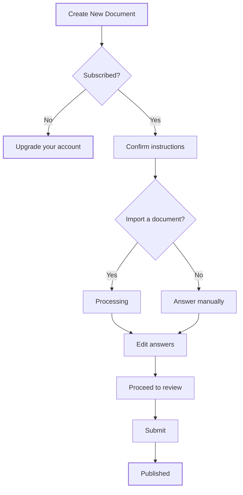

**Documents** is where you prepare Smart Disclosures: regulatory documents such as a MiCA white paper, built from guided questions. You can import an existing document to pre-fill the answers or enter everything by hand. Creating documents needs an active Bluprynt subscription.

## Key concepts

| Term | Meaning |
|---|---|
| **Smart Disclosure** | A regulatory document built from a published form, for example an EU white paper for an OT (Other Token). |
| **Document type** | The official type of the output, for example *White Paper*. |
| **Jurisdiction** | The rulebook the document follows, for example European Union. |
| **Import** | Upload an existing document so Passport fills in answers from it. |
| **Draft** | A document you're still editing. |
| **Subscription** | A paid plan. Without one, **Create New Document** opens **Upgrade your account**. |

## How it works

When you import, Passport shows *We're processing your document* while it extracts, transforms and populates data from the upload, then converts the answers to additional formats. It ends with *Your document is ready!*

## Create a document

<Steps>
  <Step title="Open Documents">
    Click **Documents** in the sidebar. The **Summary** (2) counts total, published, draft and in-progress documents. **Recent Documents** lists each one with its status (3). Click **Create New Document** (1).

    <Frame caption="The Documents page.">
      
      
    </Frame>
  </Step>
  <Step title="Pass the subscription gate">
    Without a subscription, **Upgrade your account** opens: *You must have an active Bluprynt subscription to create documents.* Select the type of account (1) and click **Upgrade** (2), or **Cancel** (3) to go back.

    <Frame caption="The subscription gate. Plan details are hidden.">
      
      
    </Frame>
  </Step>
  <Step title="Confirm the instructions">
    With a subscription, Passport asks you to read the instructions and confirm: *I confirm that I have read these instructions and understand that the use of this platform and the accuracy of the document are my responsibility.* The instructions ask you to review all AI-generated content, to understand that a published document can be legally binding, and to seek legal counsel where needed.
  </Step>
  <Step title="Choose a form and how to fill it">
    Search for the form you need. Then choose **Yes, I have a document to import** to pre-fill answers from an upload, or **No, I'll enter everything manually**.
  </Step>
  <Step title="Edit, review and submit">
    Answer each question. Click **Proceed to review**. If answers need fixing, **Document incomplete** lists them: *You must correct the following answers before submitting your document.* Otherwise **Ready to submit?** asks you to confirm.
  </Step>
  <Step title="Open, edit or download a document">
    Click a document in **Recent Documents**. Its page offers **Edit** (1), **Download** (2) and **View Document** (3), and lists its **Document Details** (4).

    <Frame caption="A document's detail page. Member names are hidden.">
      
      
    </Frame>
  </Step>
</Steps>

## Reference

### Document statuses

| Status | Meaning |
|---|---|
| **Draft** | You're still editing it. |
| **Ready** | Complete and ready to submit. |
| **Publishing** | Submission is in progress. |
| **Published** | Submitted and live. |
| **Out of sync** | The document changed since its outputs were produced. |

### Document details

| Field | Meaning |
|---|---|
| Asset | The asset the document is about. |
| Issuer | The issuing entity. |
| Jurisdiction | For example European Union. |
| Document Type | For example White Paper. |
| Created, Created by | When and by which member. |
| Last edited, Last edited by | When and by which member. |

### Summary counts

| Count | Includes |
|---|---|
| Total Documents | Every document in the period. |
| Published | Published documents. |
| Drafts | Drafts. |
| In Progress | Documents being processed or published. |

Use the period selector to switch between 7 days, 30 days, 90 days and All time.

## Worked example

You issue a utility token in the EU. You click **Create New Document**, confirm the instructions and search for the EU white paper form. You have an older white paper, so you choose **Yes, I have a document to import** and upload it. After *Your document is ready!* you check every AI-filled answer, fix two flagged ones, click **Proceed to review** and submit. The document moves from **Draft** to **Publishing** to **Published**.

## Troubleshooting

| Message | What to do |
|---|---|
| *You must have an active Bluprynt subscription to create documents.* | Upgrade your plan from the dialog or from [Settings](/passport/settings). |
| *Organization is not registered as an issuer yet* | Finish [KYB](/passport/organization) first. |
| *Selected form has no published version* | Pick another form, or contact support. |
| *Processing error - please retry* | Retry the import. |
| *Document incomplete* | Fix the listed answers, then review again. |

## FAQ

<AccordionGroup>
  <Accordion title="Can I rename a document?">
    Yes. Use **Rename document**. The name is internal only and doesn't change the official document type in the outputs.
  </Accordion>
  <Accordion title="Who is responsible for the content?">
    You are. Review all AI-generated content before you submit, and seek legal counsel where needed.
  </Accordion>
  <Accordion title="Is Proof of Collateral a document here?">
    No. Proof of Collateral is filled in from the asset page and uses no document credit. See [Proof of Collateral](/passport/proof-of-collateral).
  </Accordion>
  <Accordion title="I already have a white paper. Can Bluprynt check it?">
    Yes. Use [Analyze](/passport/analyze) to score it against MiCA.
  </Accordion>
</AccordionGroup>

## Related pages

- [Analyze](/passport/analyze)
- [MiCA asset classifier](/passport/mica-classifier)
- [Settings](/passport/settings)
