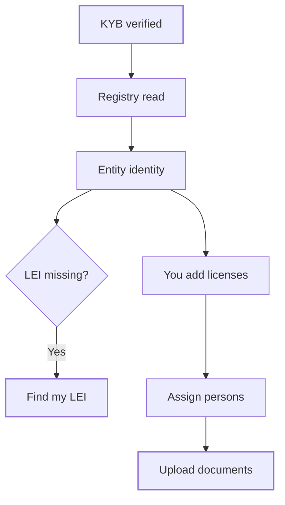

**My Entity** is the record of the legal entity behind your organization. Bluprynt fills it from KYB and public registers such as GLEIF, and you complete what the registers don't hold. Supervisors, exchanges and counterparties read this record through your assets' public pages and reports.

## Key concepts

| Term | Meaning |
|---|---|
| **Entity of record** | The legal entity that issues your assets. Its legal name is the page title. |
| **KYB verified** | Badge shown when KYB confirmed the entity. |
| **Entity identity** | Registry facts: legal name, jurisdiction, LEI, legal form, registered address, registration status, parent company. |
| **Provenance** | The source label under each fact, for example **GLEIF · authoritative** or **GLEIF · entity-supplied, unchecked**. |
| **Find my LEI** | A search of the GLEIF register by your entity's legal name. |
| **Authorizations & licenses** | Your regulator, license status and related details. |
| **Responsible persons** | Named officers, such as the compliance officer and the money laundering reporting officer. |
| **Entity disclosure documents** | Governance documents, terms, risk disclosures and AML program files. |

## How it works

Each fact keeps its source. A value you type replaces the registry read until the next registry resolve confirms it.

## Complete your entity profile

<Steps>
  <Step title="Open My Entity">
    Click **My Entity** in the sidebar. The page shows the **KYB verified** badge (1) and **Assets issued by this entity** (2), with **Open** on each asset.

    <Frame caption="My Entity for a KYB-verified organization. The legal name is hidden.">
      
      
    </Frame>
  </Step>
  <Step title="Look up your LEI">
    If no source supplies an LEI, the row reads *no connected source supplies this yet*. Click **Find my LEI** (1). Passport searches the GLEIF register for entries named like your legal name and lists them (2). Pick yours, or enter the LEI in [Settings](/passport/settings) if the register holds nothing.

    <Frame caption="Find my LEI with no matching register entry.">
      
      
    </Frame>
  </Step>
  <Step title="Add licenses, persons and documents">
    Under **Authorizations & licenses**, click **Edit** on a row, type the value, for example the **Regulator** (1), and click **Save** (2) or **Cancel**. Edit the next row (3). Under **Responsible persons**, click **Assign** (4). Under **Entity disclosure documents**, click **Add file** or **Upload**.

    <Frame caption="Editing the Regulator row.">
      
      
    </Frame>
  </Step>
</Steps>

## Reference

### Entity identity

| Fact | Source |
|---|---|
| Legal name | KYB and GLEIF. |
| Jurisdiction | GLEIF or KYB. |
| LEI | GLEIF, or **Find my LEI**, or Settings. |
| Legal form | GLEIF, for example *Limited liability company*. |
| Registered address | GLEIF. |
| Registration status | GLEIF, for example *ISSUED · active*. |
| Parent company | GLEIF relationship records. |

### Provenance labels

| Label | Meaning |
|---|---|
| **GLEIF · authoritative** | Read from GLEIF and fully corroborated. |
| **GLEIF · partly corroborated** | Only part of the value matched other sources. |
| **GLEIF · entity-supplied, unchecked** | You supplied it and no source has confirmed it yet. |
| **GLEIF · confirmed by you** | You confirmed the registry value. |

### Authorizations & licenses and responsible persons

| Section | Rows |
|---|---|
| Authorizations & licenses | Regulator, regulator email, license status and related license details. |
| Responsible persons | Compliance officer, money laundering reporting officer and their email addresses. |

### Entity disclosure documents

| Document | Upload rule |
|---|---|
| Entity Governance Documents | Multiple files: articles, bylaws, board resolutions. |
| Terms & Conditions | Single file. Replaces on re-upload. |
| Risk Disclosures | Single file. Replaces on re-upload. |
| Entity AML Program | Single file. Replaces on re-upload. |

## Worked example

Your entity is KYB-verified but the LEI row is empty. You click **Find my LEI** and pick the matching GLEIF entry. You click **Edit** on **Regulator**, type your supervisor's name and click **Save**. You click **Assign** next to the money laundering reporting officer, then upload your AML program under **Entity disclosure documents**. Your entity report in [Reports](/passport/reports) now has the data it needs.

## Troubleshooting

| Message | What to do |
|---|---|
| *KYB has no name to search with* | KYB holds no legal name for the entity, so **Find my LEI** can't search. Complete KYB first. |
| *The register holds nothing under …* | GLEIF has no entry with that name. Enter your LEI in [Settings](/passport/settings). |
| *We could not reach the register just now* | Try **Find my LEI** again later. |
| *Could not save that. Please try again.* | Your edit wasn't saved. Retry. |
| *Could not upload that file. Please try again.* | Retry the upload. |
| *Could not load your entity. Please try again.* | Reload the page. |

## FAQ

<AccordionGroup>
  <Accordion title="What happens when I edit a registry value?">
    Your value replaces the registry read until the next resolve confirms it.
  </Accordion>
  <Accordion title="Where do these facts appear publicly?">
    On your assets' [public trust pages](/passport/public-page) and in the Entity Information [report](/passport/reports).
  </Accordion>
  <Accordion title="Can I delete an uploaded document?">
    Yes. Use **Delete document** next to the file, or upload a new one to replace a single-file slot.
  </Accordion>
</AccordionGroup>

## Related pages

- [Organizations and KYB](/passport/organization)
- [Reports](/passport/reports)
- [Public trust page](/passport/public-page)
