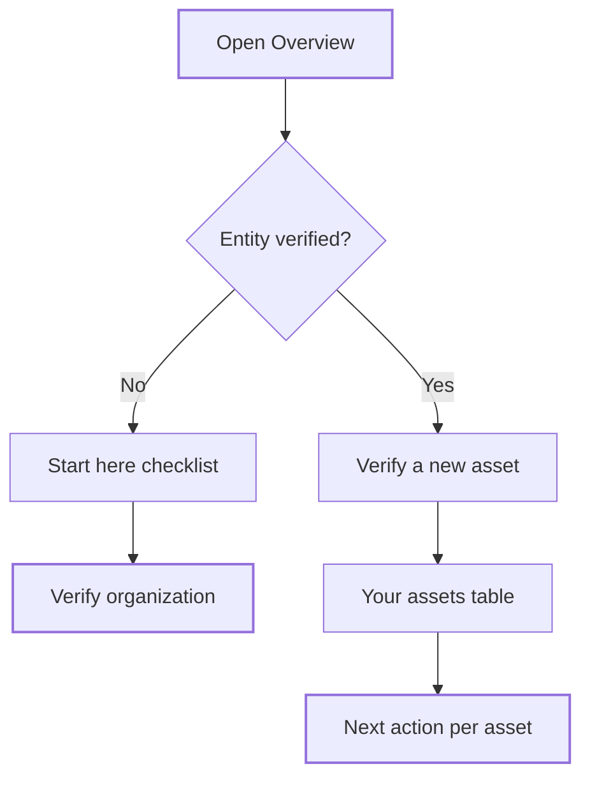

**Overview** is the first screen you see after you sign in. It shows one organization's progress in one place: whether the entity is verified, a box to add a new asset, and a table of every asset with its KYI and collateral state. Use it to see what needs you next.

## Key concepts

| Term | Meaning |
|---|---|
| **Entity verified · KYB** | Badge shown once the organization's legal entity is verified. |
| **Verify a new asset** | The panel where you paste a token or vault address to start KYI. |
| **Your assets** | Every asset in the organization, with chain, address, KYI state, collateral state and actions. |
| **Start here** | The two-step checklist an unverified organization sees instead of the badge. |

## How it works

The header line counts your entity and assets, for example *One entity · 5 assets · everything that needs you, in one place.*

## Use the Overview

<Steps>
  <Step title="Check the organization and its status">
    The organization switcher (1) shows which organization you're in. The **Entity verified · KYB** badge (2) confirms the legal entity is verified.

    <Frame caption="Overview for a verified organization.">
      
      
    </Frame>
  </Step>
  <Step title="Add an asset">
    Paste a token or vault address into **Verify a new asset** (3). See [Verify an asset](/passport/verify-asset) for the full flow.
  </Step>
  <Step title="Act on an asset">
    Each row in **Your assets** offers the next action. Click **Start form** (4) to begin Proof of Collateral, **Open trust center** (5) to see every step, or **Public page** (6) to open what the public sees.
  </Step>
</Steps>

## Reference

### Your assets columns

| Column | Shows |
|---|---|
| Asset | Asset name and ticker. |
| Chain | The network the asset lives on, for example Ethereum, Sepolia or Solana. |
| Address | The shortened contract or mint address, with a copy button. |
| KYI | The KYI state or its next action. See the table below. |
| Collateral | The Proof of Collateral action or state. |
| Actions | **Open trust center**, **Public page** or **Open asset**. |

### KYI column values

| Value | Meaning |
|---|---|
| **Verified** | KYI is complete for this asset. |
| **Sign to finish** | Every detail is in; one wallet signature per controlling authority is left. |
| **Submit for review** | Signatures are in; send the filing for review. |
| **Pending** | Your filing is in. Verification finishes on Bluprynt's side. |
| **Partly verified** | Some of the asset's tokens are verified and some aren't. |
| **Revoked** | KYI was revoked. Verify it again to restore it. |
| **Not started** | Nothing has been filed for this asset yet. |

### Collateral column values

| Value | Meaning |
|---|---|
| **Needs KYI first** | Proof of Collateral needs a verified asset. Finish KYI first. |
| **Start form** | No disclosure exists yet. Click to begin. |
| **Continue form** | A draft exists. Click to carry on. |
| **View form** | The disclosure is submitted. Click to read it. |
| **Open form** | Passport couldn't read the disclosure state. The form still opens. |

## Worked example

Your organization shows **Entity verified · KYB** and five assets. Ember Bond and Delta Dollar show **Verified** for KYI and **Start form** for collateral. Plume USD and USD Coin show **Sign to finish** and **Needs KYI first**. You click **Sign to finish** on Plume USD to collect the wallet signature, then return to start its collateral form.

## Troubleshooting

| Problem | What to do |
|---|---|
| You see **Start here — two steps to your first verified asset** | Your organization isn't verified yet. Click **Verify organization**. See [Organizations and KYB](/passport/organization). |
| The **Verify** button is disabled with *Locked — complete step 1 above* | KYB isn't complete. Finish it first. |
| An asset you expected is missing | Check the organization switcher. Assets belong to one organization. |
| *Could not load your assets. Please try again.* | Reload the page. |

## FAQ

<AccordionGroup>
  <Accordion title="Why does collateral say Needs KYI first?">
    Proof of Collateral attests what backs an asset Bluprynt has already verified, so KYI comes first.
  </Accordion>
  <Accordion title="What's the difference between Open trust center and Public page?">
    **Open trust center** opens the private asset page inside Passport. **Public page** opens the read-only page at verified.bluprynt.com that anyone can see.
  </Accordion>
  <Accordion title="Can I search for an asset?">
    Yes. Use **Search for documents or assets** at the top, or **Filter assets…** under **My Assets** in the sidebar.
  </Accordion>
</AccordionGroup>

## Related pages

- [Verify an asset](/passport/verify-asset)
- [Asset trust center](/passport/asset-page)
- [Proof of Collateral](/passport/proof-of-collateral)
