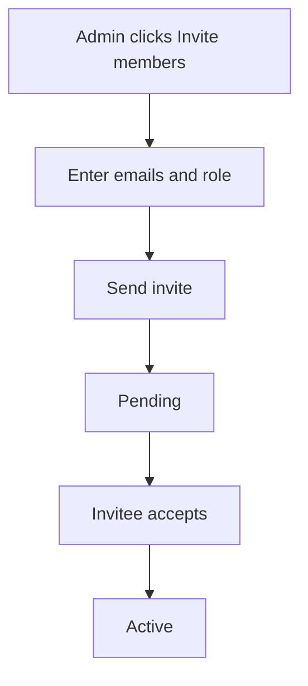

Members are the people who can work in an organization. Admins invite new members by email and choose each person's role. Use this page to add your compliance team, legal advisers or engineers.

## Key concepts

| Term | Meaning |
|---|---|
| **Member** | A person with access to the organization. |
| **Admin** | A role that can update the organization, invite members and manage memberships. |
| **Member role** | A role that works in the organization but can't manage it. |
| **Owner** | The member who owns the organization. Only the owner can delete it. |
| **Active** | A member who has accepted and can sign in. |
| **Pending** | An invitation that hasn't been accepted yet. |

## How it works

## Invite a member

<Steps>
  <Step title="Open the members list">
    Open **Settings → Organizations**, open your organization and choose the **Members** tab (1). Search by name, email or role (2). Each member shows a role (4) and an actions menu (5).

    <Frame caption="The Members tab of an organization. Names and emails are hidden.">
      
    </Frame>
  </Step>
  <Step title="Open the invite dialog">
    Click **Invite members** (3) on the Members tab, or **Invite members** in the sidebar.
  </Step>
  <Step title="Enter emails and choose a role">
    In **Invite your team to Bluprynt via email**, type the **Email addresses** (1) and choose a **Role** (2). Click **Send invite** (3).

    <Frame caption="The invite dialog.">
      
    </Frame>
  </Step>
  <Step title="Pick Admin or Member">
    The **Role** list offers **Admin** and **Member** (1).

    <Frame caption="The role list in the invite dialog.">
      
    </Frame>
  </Step>
</Steps>

## Reference

### Roles and permissions

| Permission | Admin | Member |
|---|---|---|
| Work with assets, documents and reports | Yes | Yes |
| Update organization name, LEI and ONCHAIN ID | Yes | No |
| Invite members and manage invites | Yes | No |
| Change roles, **Remove member**, **Revoke invitation** | Yes | No |
| Delete the organization | Owner only | Owner only |

### Member states

| State | Meaning |
|---|---|
| **Active** | The person has joined the organization. |
| **Pending** | The invitation is waiting to be accepted. |

### Invite fields

| Field | Required | Notes |
|---|---|---|
| Email addresses | Yes | The invitee's email address. |
| Role | Yes | **Admin** or **Member**. |

## Worked example

Your legal counsel needs to review a white paper. You click **Invite members**, enter their email, choose **Member** and click **Send invite**. They appear as **Pending** on the Members tab. Once they accept, they show as **Active** and can open **Documents**, but they can't change the organization's details.

## Troubleshooting

| Problem | What to do |
|---|---|
| You don't see **Invite members** on the Members tab | Only Admins can invite. Ask an Admin. |
| An invitee says they never got the email | Check the address on the Members tab under **Pending**. |
| You can't find someone | Search by name, email or role. |

## FAQ

<AccordionGroup>
  <Accordion title="Can I change a member's role later?">
    Yes. Admins open the actions menu next to a member and change the role. The same menu offers **Remove member**. For a pending invitation, it offers **Revoke invitation** and lets you change the invitee's role.
  </Accordion>
  <Accordion title="Can a Member delete the organization?">
    No. Only the organization's owner can delete it.
  </Accordion>
  <Accordion title="Does an invitee need an account first?">
    They sign in with, or sign up for, a Bluprynt account using the invited email. See [Sign in and sign up](/passport/sign-in).
  </Accordion>
</AccordionGroup>

## Related pages

- [Organizations and KYB](/passport/organization)
- [Settings](/passport/settings)
