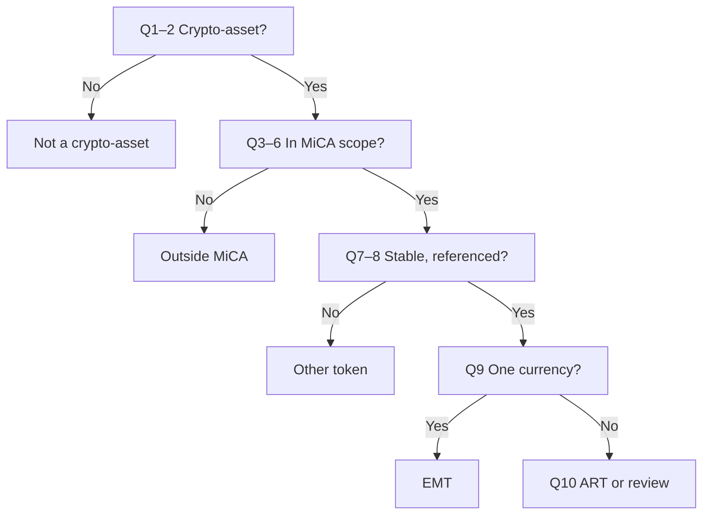

The MiCA asset classifier tells you how MiCA treats your token. You answer up to ten yes-or-no questions. It builds on the flow published by ESMA and adds the exceptions in the relevant MiCA articles. Use it before you [analyze](/passport/analyze) or [write](/passport/disclosures) a white paper.

## Key concepts

| Term | Meaning |
|---|---|
| **MiCA / MiCAR** | The EU Markets in Crypto-Assets Regulation. |
| **Crypto-asset** | A digital representation of a value or right that can be transferred and stored electronically using DLT. |
| **EMT** | E-money token. References the value of one official currency. |
| **ART** | Asset-referenced token. References a value, a right, or a combination, including one or more official currencies. |
| **Other token (OT)** | A crypto-asset that is neither an EMT nor an ART. |

## How it works

Each answer either ends the flow with a result or opens the next question. The [Questions](#questions) table gives the exact result for each exit.

## Classify a token

<Steps>
  <Step title="Open the classifier">
    In **Analyze**, start a new analysis and click **Not sure? Answer a few questions to find out**. The classifier opens with a link to the flow **published by ESMA** (1). The first question (2) asks whether the token is a digital representation of a value or of a right.

    <Frame caption="The MiCA Asset Classifier, first question.">
      
      
    </Frame>
  </Step>
  <Step title="Answer each question">
    Click **Yes** or **No**. The next question appears under the last (1, 2). Keep going until a result shows.

    <Frame caption="The classifier after the first answer.">
      
      
    </Frame>
  </Step>
  <Step title="Use the result">
    Use the result as the asset type when you [analyze](/passport/analyze) or [write](/passport/disclosures) your white paper. For questions, click **Have more questions? Contact us**.
  </Step>
</Steps>

## Reference

### Questions

| # | Question | Ends the flow when | Result |
|---|---|---|---|
| 1 | Is the token a digital representation of a value or of a right? | No | Not a crypto-asset under MiCAR |
| 2 | Can it be transferred and stored electronically? | No | Not a crypto-asset under MiCAR |
| 3 | Does the token use Distributed Ledger Technology (DLT) or a similar technology? | No | MiCA does not apply |
| 4 | Is the token issued by one of the listed entities? | Yes | Not a crypto-asset under MiCAR |
| 5 | Is the token unique and not fungible with other crypto-assets? | Yes | MiCA does not apply |
| 6 | Is the token any of the listed types? | Yes | MiCA does not apply |
| 7 | Does the token purport to maintain a stable value? | No | Other token |
| 8 | Is a value or right referenced? | No | Other token |
| 9 | Does it reference the value of one official currency? | Yes | EMT |
| 10 | Does it reference a value or right or a combination thereof, including one or more official currencies? | Yes | ART |

If you answer No to question 10, the classifier shows *Please review your choices, or contact Bluprynt for support*.

### Results

| Result | Meaning |
|---|---|
| Not a 'crypto-asset' under MiCAR | MiCA's crypto-asset definition doesn't cover the token. |
| MiCA does not apply to the crypto-asset | It's a crypto-asset, but outside MiCA's scope. |
| EMT | E-money token. |
| ART | Asset-referenced token. |
| Other token | A crypto-asset under MiCA that is neither an EMT nor an ART. |

## Worked example

Your token is a fungible ERC-20 that tracks the euro one to one. You answer Yes to questions 1–3, No to 4–6, Yes to 7 and 8, and Yes to 9. The classifier returns **EMT**. You then run [Analyze](/passport/analyze) with asset type **EMT**.

## Troubleshooting

| Problem | What to do |
|---|---|
| *Please review your choices, or contact Bluprynt for support* | Your answers don't fit a MiCA class. Check questions 7–10 again. |
| You changed your mind on an answer | Click the other button on that question. Later questions update. |

## FAQ

<AccordionGroup>
  <Accordion title="Is the result legally binding?">
    No. It's a guided reading of MiCA's classification rules. Seek legal counsel for a final view.
  </Accordion>
  <Accordion title="Is there a public version?">
    Yes. Compliance Explorer has a MiCA checker at [explorer.bluprynt.com/mica-checker](https://explorer.bluprynt.com/mica-checker).
  </Accordion>
</AccordionGroup>

## Related pages

- [Analyze](/passport/analyze)
- [Documents](/passport/disclosures)
- [Compliance Explorer](/explorer/overview)
