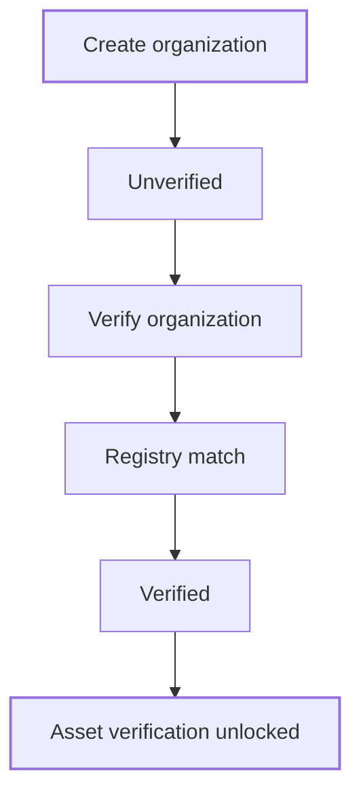

An organization is the issuer you act for in Passport. Assets, members, documents and reports all belong to one organization. Before you can verify an asset, you verify the organization's legal entity. This is KYB.

## Key concepts

| Term | Meaning |
|---|---|
| **Organization** | A workspace for one issuer. You can belong to several. |
| **Organization switcher** | The control at the top of the sidebar that shows the current organization and lets you change it. |
| **LEI** | Legal Entity Identifier, the 20-character code from the GLEIF register. Optional when you create an organization. |
| **ONCHAIN ID / DID** | A decentralized identifier that links your organization to its on-chain identity, for example ERC734/735. Optional. |
| **KYB** | Verification of the organization's legal entity. Bluprynt matches the entity against GLEIF and regulator registers. |
| **Verified / Unverified** | The organization's KYB status, shown in **Settings → Organizations**. |

## How it works

A new organization starts **Unverified**. The Overview shows **Start here — two steps to your first verified asset**. Step 2, verifying your first asset, stays **Locked** until step 1 is done.

## Create an organization

<Steps>
  <Step title="Open the switcher">
    Click the organization name at the top of the sidebar. The list shows your organizations (1). Click **Create new** (2).

    <Frame caption="The organization switcher, open.">
      
      
    </Frame>
  </Step>
  <Step title="Fill in the organization">
    In **Create your Organization**, enter the **Organization Name** (1). This is the public display name. Optionally add an **LEI Number** (2) and an **ONCHAIN ID / DID** (3). You can also add an organization logo. Click **Create organization** (4).

    <Frame caption="The Create your Organization dialog.">
      
      
    </Frame>
  </Step>
  <Step title="Or create it from Settings">
    Open **Settings → Organizations** (1). Search your organizations (2) or click **Create organization** (3). The same dialog opens.

    <Frame caption="Settings, Organizations tab.">
      
      
    </Frame>
  </Step>
</Steps>

## Verify the organization (KYB)

<Steps>
  <Step title="Start from the checklist">
    In a new organization, the Overview shows **ENTITY NOT VERIFIED** (4) and the **Start here** checklist. Click **Verify organization** (1). Step 2 shows **Locked** (2) until you finish. The sidebar also shows a **Verify Your Business** prompt (3).

    <Frame caption="Overview for an organization that isn't verified yet.">
      
      
    </Frame>
  </Step>
  <Step title="Confirm your legal entity">
    Bluprynt matches your legal entity against the GLEIF register and regulator registers. When verification completes, the Overview shows **Entity verified · KYB** and **My Entity** fills with the registry record. See [Entity profile](/passport/entity).
  </Step>
</Steps>

<Note>
The KYB submission itself is a write to production, so this guide stops at the **Verify organization** step.
</Note>

## Reference

### Create organization fields

| Field | Required | Notes |
|---|---|---|
| Organization logo | No | Shown in the switcher and on public pages. |
| Organization Name | Yes | Public display name of your organization. |
| LEI Number | No | 20 characters, for example `2549000PPUXXXX999999`. |
| ONCHAIN ID / DID | No | For example an ERC734/735 identity. |

### Organizations table

| Column | Shows |
|---|---|
| Name | Organization name and logo. |
| Status | **Verified** or **Unverified**. |
| ONCHAIN ID / DID | The identifier, if set. |
| LEI Number | The LEI, if set. |
| Role | Your role: **Admin** or **Member**. |
| Actions | A menu for the organization. |

### Who can do what

| Action | Admin | Member |
|---|---|---|
| Update organization details | Yes | No |
| Invite members and manage invites | Yes | No |
| Manage memberships | Yes | No |
| Delete the organization | Owner only | No |

## Worked example

You run compliance for a fund issuer. You click **Create new**, enter the fund manager's name and its LEI, and click **Create organization**. The Overview shows **Start here**. You click **Verify organization**. Once KYB completes, the badge reads **Entity verified · KYB** and the **Verify a new asset** panel unlocks.

## Troubleshooting

| Problem | What to do |
|---|---|
| **Verify** on the Overview says *Locked — complete step 1 above* | Finish KYB first. |
| You can't edit organization details | Only Admins can. Ask an Admin, or ask to be made one. |
| The wrong assets are showing | You're in another organization. Use the switcher. |
| You don't know your LEI | Leave it blank. You can look it up later from **My Entity → Find my LEI**. |

## FAQ

<AccordionGroup>
  <Accordion title="Do I need an LEI to create an organization?">
    No. Both the LEI and the ONCHAIN ID / DID are optional.
  </Accordion>
  <Accordion title="How do I leave an organization?">
    Open **Settings → Organizations**, open the organization, and click **Leave Organization**. See [Settings](/passport/settings).
  </Accordion>
</AccordionGroup>

## Related pages

- [Members and roles](/passport/members)
- [Entity profile](/passport/entity)
- [Settings](/passport/settings)
