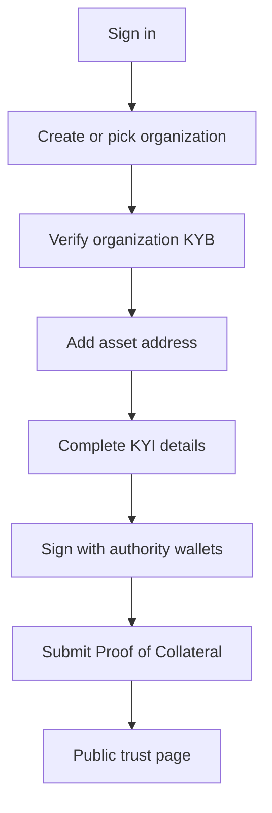

Bluprynt Passport is the issuer workspace at [app.bluprynt.com](https://app.bluprynt.com). Issuers, their compliance teams and their advisers use it to prove who stands behind a token and what backs it. Everything you verify in Passport appears on the asset's public trust page and in [Compliance Explorer](/explorer/overview).

<Frame caption="The Passport Overview for a verified organization.">
  
</Frame>

## Key concepts

Every term used across Bluprynt Passport is defined in [Concepts](/passport/concepts).

## How it works

Each step unlocks the next. Asset verification stays locked until KYB is complete. Proof of Collateral shows **Needs KYI first** until KYI is verified.

## Feature guides

<CardGroup cols={2}>
  <Card title="Sign in and sign up" icon="log-in" href="/passport/sign-in">
    Create your account, sign in and reset your password.
  </Card>
  <Card title="Overview" icon="layout-dashboard" href="/passport/home">
    Your home screen: progress, assets and the next action for each.
  </Card>
  <Card title="Organizations and KYB" icon="building-2" href="/passport/organization">
    Create and switch organizations, and verify the legal entity.
  </Card>
  <Card title="Members and roles" icon="users" href="/passport/members">
    Invite colleagues and choose Admin or Member.
  </Card>
  <Card title="Entity profile" icon="landmark" href="/passport/entity">
    Your legal entity record, LEI lookup, licenses and documents.
  </Card>
  <Card title="Verify an asset (KYI)" icon="badge-check" href="/passport/verify-asset">
    Add a token, fill in its details and sign with your wallets.
  </Card>
  <Card title="Asset trust center" icon="shield-check" href="/passport/asset-page">
    Every verification step for one asset, in one place.
  </Card>
  <Card title="Public trust page" icon="globe" href="/passport/public-page">
    What anyone sees at verified.bluprynt.com.
  </Card>
  <Card title="Proof of Collateral" icon="vault" href="/passport/proof-of-collateral">
    The asset disclosure form, its sections and evidence uploads.
  </Card>
  <Card title="Documents" icon="file-text" href="/passport/disclosures">
    Prepare Smart Disclosures such as MiCA white papers.
  </Card>
  <Card title="Analyze" icon="scan-search" href="/passport/analyze">
    Score an existing white paper against MiCA.
  </Card>
  <Card title="MiCA asset classifier" icon="list-checks" href="/passport/mica-classifier">
    Find out whether your token is an EMT, an ART or another token.
  </Card>
  <Card title="Reports" icon="chart-bar" href="/passport/reports">
    Generate entity, collateral, AML, cyber and custody reports.
  </Card>
  <Card title="Wallets and attestations" icon="wallet" href="/passport/wallets-and-attestations">
    Every wallet you proved and every attestation published.
  </Card>
  <Card title="Settings" icon="settings" href="/passport/settings">
    Your account, your plan and your organizations.
  </Card>
  <Card title="Proof of Collateral tool" icon="layers" href="/tools/proof-of-collateral">
    How lenders, exchanges and supervisors read your collateral.
  </Card>
</CardGroup>

## Navigation

The left sidebar holds every Passport area.

| Sidebar item | What it opens |
|---|---|
| Organization switcher | The current organization, your other organizations and **Create new**. |
| **Overview** | The home screen. See [Overview](/passport/home). |
| **My Entity** | The entity profile. See [Entity profile](/passport/entity). |
| **My Assets** | Your assets, with a **Filter assets…** box and a status chip per asset. |
| **Integrations** | API keys and connections. See the [Public API](/api/public/overview). |
| **Reports** | Report templates and prerequisites. See [Reports](/passport/reports). |
| **Documents** | Smart Disclosures. See [Documents](/passport/disclosures). |
| **Wallets** | Wallets you proved. See [Wallets and attestations](/passport/wallets-and-attestations). |
| **Attestations** | Published KYI attestations. |
| **Analyze** | White paper analysis. See [Analyze](/passport/analyze). |
| **Invite members** | The invite dialog. See [Members and roles](/passport/members). |
| **Settings** | Account and organization settings. See [Settings](/passport/settings). |

## Embed verification in your own app

Passport is the hosted workspace. To run KYI inside your own product, use the [KYI widget](/tools/kyi) and the [SDK quickstart](/sdk/quickstart).

## Related pages

- [Proof of Collateral tool](/tools/proof-of-collateral)
- [KYI widget](/tools/kyi)
- [Compliance Explorer](/explorer/overview)
- [Bluprynt Proof](/proof/overview)
