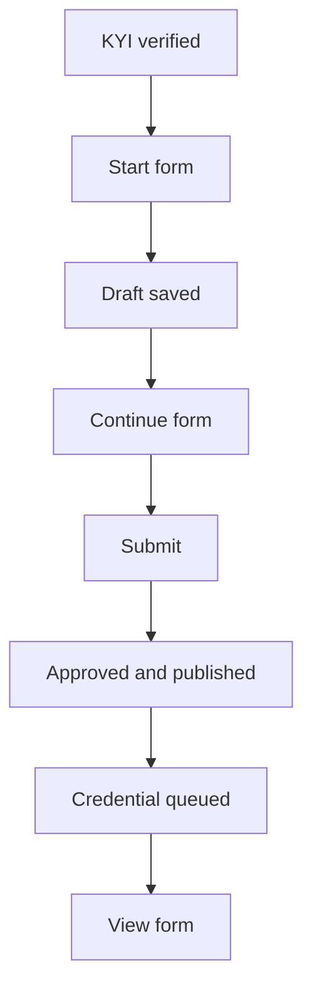

Proof of Collateral evidences what backs an asset. In Passport you fill in the **Bluprynt Asset Disclosure** for a KYI-verified asset: the asset's structure, its custody, valuation, reserve and the risks around it, with documents attached as evidence. Lenders, exchanges, custodians and supervisors then read the result. See the [Proof of Collateral tool](/tools/proof-of-collateral).

## Key concepts

| Term | Meaning |
|---|---|
| **Proof of Collateral card** | The step on the asset page that opens the disclosure form. |
| **Bluprynt Asset Disclosure** | The form behind Proof of Collateral. The current version is 1.1.0. |
| **Section** | A group of questions. Some apply only to on-chain or off-chain assets, or to one template. |
| **Gate** | A numbered question block, AD-Gate 1 to AD-Gate 15, that tests one risk. |
| **Template** | A question set for one structure, for example S1 for tokenized funds. |
| **Upload request** | A file field that asks for an evidence document. |
| **Submit** | Publishes the disclosure. There's no separate review step. |

## How it works

Proof of Collateral needs KYI first. Until KYI is verified, the card shows **Needs KYI first**. The form is filled in from the asset it's about, so asset facts you already confirmed carry over.

When you submit, the disclosure is approved at once and its credential is queued. There's no review step and no document credit is used.

## Fill in the disclosure

<Steps>
  <Step title="Find the card">
    Open the asset's trust center. The **Proof of Collateral** card (1) shows the step's state. Click **Start form** (2). On the Overview, the same action sits in the **Collateral** column.

    <Frame caption="The Proof of Collateral card on a KYI-verified asset.">
      
    </Frame>
  </Step>
  <Step title="Work through the sections">
    Answer each section in order: KYI, universal asset information, the on-chain or off-chain fields, then Stages A, B, D and C. See [Form sections](#form-sections). Your answers save as a draft. Come back with **Continue form**.
  </Step>
  <Step title="Attach the evidence">
    Each template has an **Upload Requests** section, and several gates ask for files. Upload the documents asked for, such as custody agreements or attestation reports.
  </Step>
  <Step title="Submit">
    Submit the form. It's approved and published straight away, and the card shows **View form**. The asset's **Composition** tab and [public trust page](/passport/public-page) fill in from the disclosure.

    <Frame caption="The Overview Collateral column shows Start form until a disclosure exists.">
      
    </Frame>
  </Step>
</Steps>

<Note>
Starting or submitting a disclosure writes to production, so this guide doesn't show the form screens. The section list below comes from the form definition itself.
</Note>

## Form sections

| Stage | Section | What it covers |
|---|---|---|
| — | KYI | Carries over the asset's verified identity. |
| — | Universal Asset Information | Facts that apply to every asset. |
| — | Tokenized asset fields | Apply when the asset is on-chain. |
| — | Non-tokenized asset fields | Apply when the asset is off-chain. |
| A — Triage Gates | AD-Gate 1 — Financial Security Classification | Whether the asset is a financial security. |
| | AD-Gate 2 — Asset Wrapper Type | The legal wrapper. |
| | AD-Gate 3 — Governing Jurisdiction | The governing law. |
| | AD-Gate 4 — Transfer & Eligibility Restrictions | Who can hold and transfer it. |
| B — Structural Risk Gates | AD-Gate 5 — Bankruptcy Remoteness | Whether the collateral is ring-fenced. |
| | AD-Gate 6 — Independent Custody | Who holds the collateral. |
| | AD-Gate 7 — Independent Valuation | Who values it. |
| | AD-Gate 8 — Reserve Portfolio Composition | What the reserve holds. |
| D — Template-Specific Questions | Template S1 — Tokenized Fund / ETF / Mutual Fund Shares | Plus S1 upload requests. |
| | Template C1 — Structured Note / Tokenized Note Issuance | Plus C1 upload requests. |
| | Template R1 — Receivables / Private Credit Pool | Plus R1 upload requests. |
| | Template M1 — Mineral / Royalty / Real-Asset SPV | Plus M1 upload requests. |
| | Template L1 — Bankruptcy-Remote SPC / Structured Lending Vehicle | Plus L1 upload requests. |
| C — PoC v2.0 Evidence Layers & Failure-Pattern Disclosures | AD-Gate 9 — Rehypothecation Depth Attestation | Whether collateral is re-pledged. |
| | AD-Gate 10 — Bridge Configuration & Cross-Chain Attestation | Bridges and cross-chain copies. |
| | AD-Gate 11 — Oracle & Price-Feed Dependency | Price sources the asset relies on. |
| | AD-Gate 12 — Governance & Admin-Key Configuration | Who holds admin keys. |
| | AD-Gate 13 — Reserve Counterparty Concentration | Exposure to single counterparties. |
| | AD-Gate 14 — Lawful-Order & Freeze Capability | Whether tokens can be frozen on lawful order. |
| | AD-Gate 15 — Continuous Attestation & Revocation Triggers | What keeps the proof current, and what revokes it. |
| Additional due diligence | Brazil (CVM Resolution 88/2022), sections BR-A to BR-G | Platform and issuer identification, offer data, offer closing, continuous information, caps and history, estate custody and reconciliation, public list cross-check. |

### Field types

| Type | Count in v1.1.0 |
|---|---|
| Text | 157 |
| Yes / no | 58 |
| Single choice | 46 |
| Number | 35 |
| File upload | 34 |
| Repeating group | 17 |
| Date | 7 |
| Blockchain address | 2 |
| Multiple choice | 1 |

## Reference

### Card states and actions

| Card shows | Meaning |
|---|---|
| **Needs KYI first** | KYI isn't verified. Finish [KYI](/passport/verify-asset). |
| **Start form** | No disclosure exists yet. |
| **Continue form** | A draft is in progress. |
| **View form** | The disclosure is submitted and published. It opens read-only. |
| **Open form** | Passport couldn't read the disclosure state. The form still opens. |

### Collateral readiness

| State | Card message |
|---|---|
| Outstanding | *Run Proof of Collateral to evidence what backs this asset on-chain.* |
| Resolved | *Proof of Collateral has resolved for this asset.* |
| Unknown | *Proof of Collateral could not be read for this asset. The disclosure form does not depend on that read, so it can still be opened here.* |

## Worked example

Suppose your asset is a tokenized note and its KYI is verified. You click **Start form**. KYI and the universal facts are already filled in from the asset. You answer the tokenized asset fields, then the triage and structural gates: the custodian, the valuation agent and the reserve mix. Under Template C1 you answer the note questions and upload the note's terms and the custody agreement in **C1 — Upload Requests**. You answer gates 9 to 15 and submit. The card now shows **View form** and the public trust page shows the reserve disclosure.

## Troubleshooting

| Problem | What to do |
|---|---|
| The card shows **Needs KYI first** | Verify the asset first. See [Verify an asset](/passport/verify-asset). |
| *Could not open the asset disclosure. Please try again.* | Retry. If it persists, contact support. |
| *Could not check for an existing application. Please try again.* | Reload the asset page. |
| You need to check what you submitted | Click **View form**. Submitted disclosures open read-only. |

## FAQ

<AccordionGroup>
  <Accordion title="Is there a review before the disclosure goes live?">
    No. Submitting publishes the disclosure. It's approved on submission and its credential is queued.
  </Accordion>
  <Accordion title="Does Proof of Collateral use document credits?">
    No. Unlike Smart Disclosures in [Documents](/passport/disclosures), submitting the asset disclosure uses no credit.
  </Accordion>
  <Accordion title="Do I answer every template?">
    Each template covers one structure: S1, C1, R1, M1 or L1. The tokenized and non-tokenized field sections apply only to on-chain or off-chain assets.
  </Accordion>
  <Accordion title="Why is Brazil in the form?">
    The form includes additional due diligence for offerings under CVM Resolution 88/2022.
  </Accordion>
</AccordionGroup>

## Related pages

- [Proof of Collateral tool](/tools/proof-of-collateral)
- [Asset trust center](/passport/asset-page)
- [Public trust page](/passport/public-page)
- [Reports](/passport/reports)
