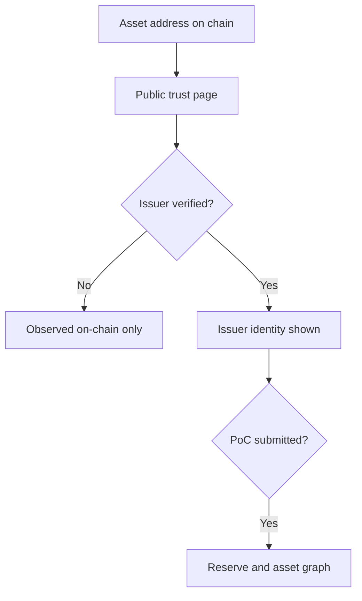

Every asset has a public trust page at `verified.bluprynt.com`. Anyone can open it without an account: investors, exchanges, lenders and supervisors. It shows what Bluprynt has verified about the issuer and the asset, and what is still only observed on chain.

## Key concepts

| Term | Meaning |
|---|---|
| **Public trust page** | The page at `https://verified.bluprynt.com/verified-assets/{address}/{chain}`. |
| **Issuer badge** | Shows whether the issuer is verified, for example **UNVERIFIED ISSUER**. |
| **Proof of Collateral badge** | Shows whether a collateral disclosure exists, for example **NO PROOF OF COLLATERAL**. |
| **Observed on-chain · not attested** | Data Bluprynt read from the chain but no issuer has attested. |
| **Credential status** | Whether a Bluprynt credential exists for the asset. |
| **Claim this asset** | The call to action for an issuer who hasn't verified the asset yet. |

## How it works

Completing KYI and Proof of Collateral unlocks the issuer identity, the reserve and asset graph, the risk scorecard, credentials and continuous monitoring on this page.

## Open and read the page

<Steps>
  <Step title="Open the page">
    In Passport, click **Public page** on the Overview or **View public profile** on the asset page. Or open `https://verified.bluprynt.com/verified-assets/{address}/{chain}` directly.
  </Step>
  <Step title="Read the badges">
    The top badges (1) give the headline state of the issuer and the collateral. The chips under the name (2) add detail, for example **UNCLAIMED ASSET**, **OBSERVED ON-CHAIN · NOT ATTESTED** and **REDEMPTION TERMS NOT DISCLOSED**.

    <Frame caption="The public trust page for an asset that no issuer has claimed yet.">
      
    </Frame>
  </Step>
  <Step title="Check credentials, reserve and issuer">
    **Credential status** (4) shows whether a credential exists. The reserve section (5) shows the issuer's reserve disclosure, if any. The issuer section (6) shows who stands behind the asset.
  </Step>
  <Step title="Claim the asset if it's yours">
    If you issue this asset, click **Claim this asset** (3) or **Sign up as issuer**. You then verify it in Passport. See [Verify an asset](/passport/verify-asset).
  </Step>
</Steps>

## Reference

### Page states

| Badge or chip | Meaning | How to change it |
|---|---|---|
| **UNVERIFIED ISSUER** | No verified issuer is linked to the asset. | Complete [KYB](/passport/organization) and [KYI](/passport/verify-asset). |
| **NO PROOF OF COLLATERAL** | No collateral disclosure is published. | Submit [Proof of Collateral](/passport/proof-of-collateral). |
| **UNCLAIMED ASSET** | No organization has claimed the asset. | Click **Claim this asset**. |
| **OBSERVED ON-CHAIN · NOT ATTESTED** | Contract data is read from the chain only. | Complete KYI. |
| **REDEMPTION TERMS NOT DISCLOSED** | No redemption terms are on record. | Disclose them in Proof of Collateral. |
| Credential status **None** | No credential has been issued. | Complete KYI. |

### URL format

| Part | Example |
|---|---|
| Address | `0x6e5366909051Cc4b691243052DA45A2040b5d8e9` |
| Chain | `sepolia` |
| Full URL | `https://verified.bluprynt.com/verified-assets/0x6e5366909051Cc4b691243052DA45A2040b5d8e9/sepolia` |

## Worked example

An exchange's listings team receives a token address. They open its public trust page and see **UNVERIFIED ISSUER** and **NO PROOF OF COLLATERAL**. They ask the issuer to claim the asset. After the issuer completes KYI and submits Proof of Collateral, the same page shows the verified issuer and the reserve disclosure.

## Troubleshooting

| Problem | What to do |
|---|---|
| The page shows only on-chain observations | The issuer hasn't completed KYI. |
| The page doesn't load for an address | Check the chain segment in the URL matches the asset's network. |
| You want to share the page | Click **Copy share link** or **Share link**. |

## FAQ

<AccordionGroup>
  <Accordion title="Do readers need a Bluprynt account?">
    No. The public trust page is open to anyone.
  </Accordion>
  <Accordion title="Can I read the same data by API?">
    Yes. See the [Public API](/api/public/overview).
  </Accordion>
</AccordionGroup>

## Related pages

- [Asset trust center](/passport/asset-page)
- [Proof of Collateral tool](/tools/proof-of-collateral)
- [Compliance Explorer](/tools/compliance-explorer)
