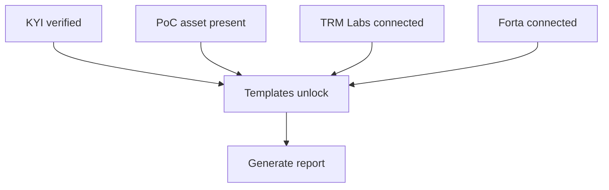

**Reports** turns your verified data into regulatory reports. Each template draws on one or more sources: your KYI verification, your Proof of Collateral, and connected providers for AML and cyber data. The page shows which templates are ready and what each locked one still needs.

## Key concepts

| Term | Meaning |
|---|---|
| **Template** | A report type with a code, for example EA-01 Entity Information. |
| **Cluster** | A group of templates: Entity & Asset, AML / ATF, Cyber Risk, Custody. |
| **Prerequisite** | A data source a template needs: KYI, Proof of Collateral, TRM Labs or Forta. |
| **Ready / Data gaps / Source needed** | The legend dot next to each template. |

## How it works

The **Account setup** strip at the top counts how many of the four prerequisites you've met, for example *2 of 4 prerequisites met*.

## Generate a report

<Steps>
  <Step title="Open Reports">
    Click **Reports** in the sidebar. **Account setup** (1) shows each prerequisite. Filter templates by cluster (2).

    <Frame caption="The Reports page with two of four prerequisites met.">
      
    </Frame>
  </Step>
  <Step title="Generate a ready template">
    Click **Generate** (3) on a ready template. For per-asset templates, pick the asset in **Select asset…** (4) first.
  </Step>
  <Step title="Unlock a locked template">
    Locked templates show what they need, for example **Connect in Integrations · AML** (5). Click **View Report Prerequisites →** to see every prerequisite and the templates it unlocks. Satisfied ones show **Complete** (1, 2). Click **Connect TRM Labs** (3) or **Connect Forta** (4) to add a source.

    <Frame caption="Report prerequisites.">
      
    </Frame>
  </Step>
</Steps>

## Reference

### Templates

| Code | Template | Cluster | Needs |
|---|---|---|---|
| EA-01 | Entity Information | Entity & Asset | KYI |
| EA-02 | Asset & Collateral Disclosure | Entity & Asset | KYI, Proof of Collateral |
| R-04 | AML/ATF Programme & Risk Assessment | AML / ATF | KYI, TRM Labs |
| R-05 | Sanctions Screening Programme | AML / ATF | KYI, TRM Labs |
| R-06 | Suspicious Activity Report | AML / ATF | KYI, TRM Labs. Restricted to the MLRO. |
| R-07 | Annual Cyber Risk Return | Cyber Risk | KYI, Proof of Collateral, Forta |
| R-08 | Cyber Incident Report | Cyber Risk | KYI, Proof of Collateral, Forta |
| R-12 | Custody of Client Assets | Custody | KYI, Proof of Collateral |

### Prerequisites

| Prerequisite | What it requires | Unlocks |
|---|---|---|
| KYI verification complete | The issuing entity's KYI must be verified. | EA-01, EA-02, R-04, R-05, R-06, R-07, R-08, R-12 |
| Proof of Collateral asset present | At least one asset with Proof of Collateral approved or verified. | EA-02, R-07, R-08, R-12 |
| TRM Labs connection | Sanctions screening, counterparty risk and transaction-monitoring data. | R-04, R-05, R-06 |
| Forta connection | Cyber-risk KPIs and security incident telemetry. | R-07, R-08 |

### What two templates contain

| Template | Contents |
|---|---|
| Entity Information | Issuer KYI verification: legal entity, LEI, beneficial ownership, regulatory standing. |
| Asset & Collateral Disclosure | Asset stack graph, reserve composition, NAV, AML and cyber exposure. Per-asset Proof of Collateral. |

## Worked example

Your entity is KYI-verified and one asset has Proof of Collateral. The strip reads *2 of 4 prerequisites met*. You click **Generate** on Entity Information for a supervisor. For your quarterly collateral pack, you pick the asset in **Select asset…** and generate Asset & Collateral Disclosure. Your AML templates stay locked until you connect TRM Labs.

## Troubleshooting

| Problem | What to do |
|---|---|
| Every template is locked | Complete [KYI](/passport/verify-asset) first. |
| EA-02 is locked | Submit [Proof of Collateral](/passport/proof-of-collateral) for at least one asset. |
| AML templates say **Requires TRM Labs for AML screening** | Connect TRM Labs in Integrations. |
| Cyber templates say **Requires Forta for cyber monitoring** | Connect Forta in Integrations. |

## FAQ

<AccordionGroup>
  <Accordion title="Who can generate the Suspicious Activity Report?">
    R-06 is marked **Restricted — MLRO only**.
  </Accordion>
  <Accordion title="Where do I connect TRM Labs and Forta?">
    In **Integrations** in the sidebar. The **Connect** links take you there.
  </Accordion>
</AccordionGroup>

## Related pages

- [Entity profile](/passport/entity)
- [Proof of Collateral](/passport/proof-of-collateral)
- [Verify an asset](/passport/verify-asset)
