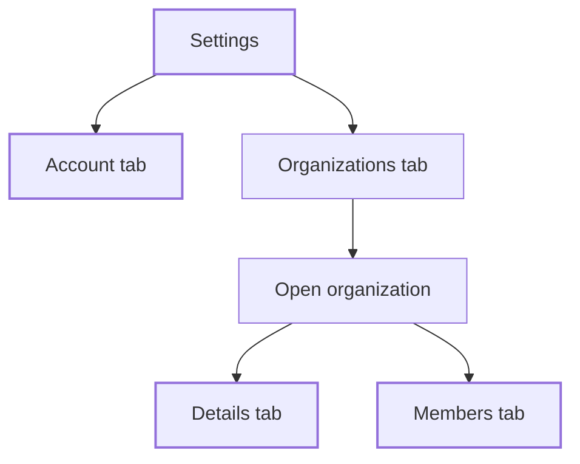

**Settings** holds your personal account and the organizations you belong to. Open it from **Settings** at the bottom of the sidebar. It has two tabs: **Account** and **Organizations**.

## Key concepts

| Term | Meaning |
|---|---|
| **Account** | Your name, login email, phone and address. |
| **Plan** | Your subscription and its remaining credits. Credits are used by [Documents](/passport/disclosures). |
| **Organizations tab** | Every organization you belong to, with its status and your role. |
| **Organization settings** | One organization's **Details** and **Members** tabs. |

## How it works

Each field has its own **Save** button. Saving one field doesn't save the others.

## Manage your settings

<Steps>
  <Step title="Update your account">
    Open the **Account** tab (1). The plan card shows your plan and credits; click **Upgrade** (2) to change it. Edit your **Name** (3), **Email** (4), **Phone** (5) and **Address** (6). Click **Save** under each one.

    <Frame caption="Settings, Account tab. Personal values are hidden.">
      
    </Frame>
  </Step>
  <Step title="Open your organizations">
    Open the **Organizations** tab (1). Search by name, domain or your role (2), or click **Create organization** (3).

    <Frame caption="Settings, Organizations tab.">
      
      
    </Frame>
  </Step>
  <Step title="Edit an organization">
    Click an organization. On **Details** (1), edit the name (2), the **LEI Number** (3) and the **ONCHAIN ID / DID** (4), each with its own **Save**. Click **Leave Organization** (5) to leave it. The owner also sees **Delete Organization**. The **Members** tab is covered in [Members and roles](/passport/members).

    <Frame caption="An organization's Details tab.">
      
    </Frame>
  </Step>
</Steps>

## Reference

### Account fields

| Field | Notes |
|---|---|
| Name | First and last name. Use your legal name. |
| Email | The address you log in with. Bluprynt emails you to verify any change. |
| Phone | Your contact number. |
| Address | Your resident address. Some jurisdictions require a physical address when you submit documents. |

### Organization fields

| Field | Who can edit |
|---|---|
| Organization Avatar | Admins. Optional but recommended. |
| Name | Admins. 32 characters at most. |
| LEI Number | Admins |
| ONCHAIN ID / DID | Admins |

## Worked example

Your company got its LEI after you created the organization. You open **Settings → Organizations**, open the organization, type the LEI into **LEI Number** and click **Save**. The [entity profile](/passport/entity) can now match the GLEIF record.

## Troubleshooting

| Problem | What to do |
|---|---|
| You can't edit organization fields | Only Admins can. See [Members and roles](/passport/members). |
| The email change didn't apply | Bluprynt shows *We have sent you a confirmation email*. Open it and confirm. |
| *Please use 32 characters at maximum.* | Shorten the organization name. |
| **Create New Document** asks you to upgrade | Click **Upgrade** on the Account tab. |

## FAQ

<AccordionGroup>
  <Accordion title="What happens if I leave an organization?">
    You lose access to its assets, documents and reports. An Admin can invite you again.
  </Accordion>
  <Accordion title="Where are API keys?">
    In **Integrations** in the sidebar. See the [Public API](/api/public/overview).
  </Accordion>
</AccordionGroup>

## Related pages

- [Organizations and KYB](/passport/organization)
- [Members and roles](/passport/members)
- [Sign in and sign up](/passport/sign-in)
