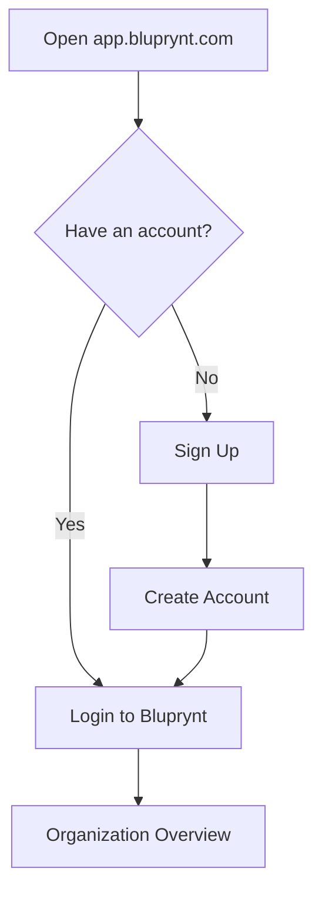

Every Passport session starts at [app.bluprynt.com/login](https://app.bluprynt.com/login). You sign in with your email address and password. If you're new, you create an account first and then create or join an organization.

## Key concepts

| Term | Meaning |
|---|---|
| **Account** | Your personal login: email, name and password. One account can belong to many organizations. |
| **Organization** | The issuer you act for. You pick it after you sign in. |
| **Referral code** | An optional code you can enter when you sign up. |

## How it works

## Sign in

<Steps>
  <Step title="Enter your email and password">
    Open [app.bluprynt.com/login](https://app.bluprynt.com/login). Type your **Email** (1) and **Password** (2), then click **Continue** (3).

    <Frame caption="The Login to Bluprynt form.">
      
    </Frame>
  </Step>
  <Step title="Reset a forgotten password">
    Click **Reset Password** (4) under the form and follow the email you receive.
  </Step>
</Steps>

## Sign up

<Steps>
  <Step title="Open the sign-up form">
    On the login page, click **Sign Up**. Passport opens **Welcome to Bluprynt**.
  </Step>
  <Step title="Fill in your details">
    Enter your **Email** (1), your **First name** and **Last name** (2), and **Set a password** (3). If you have a referral code, enter it under **Do you have a referral code?** (4).

    <Frame caption="The Welcome to Bluprynt sign-up form.">
      
    </Frame>
  </Step>
  <Step title="Accept the terms and create the account">
    Tick the box to accept the Terms of Service and Privacy Policy (5), then click **Create Account** (6).
  </Step>
</Steps>

## Reference

### Login form

| Field | Required | Notes |
|---|---|---|
| Email | Yes | The address you signed up with. |
| Password | Yes | Masked as you type. |

### Sign-up form

| Field | Required | Notes |
|---|---|---|
| Email | Yes | Becomes your login. You can change it later in [Settings](/passport/settings). |
| First name, Last name | Yes | Use your legal name. |
| Set a password | Yes | Your login password. |
| Referral code | No | Leave blank if you don't have one. |
| Terms checkbox | Yes | Accepts the Terms of Service and Privacy Policy. |

## Worked example

Maria joins her company's compliance team. She clicks **Sign Up**, enters her work email, her name and a password, accepts the terms and clicks **Create Account**. An Admin at her company then [invites her](/passport/members) to the company's organization, and she switches to it from the organization switcher.

## Troubleshooting

| Problem | What to do |
|---|---|
| **Continue** stays disabled | Fill in both Email and Password. |
| You forgot your password | Click **Reset Password** on the login page. |
| You signed in but see no assets | You're in the wrong organization. Open the organization switcher in the sidebar. See [Organizations](/passport/organization). |
| You need access to a colleague's organization | Ask one of its Admins to [invite you](/passport/members). |

## FAQ

<AccordionGroup>
  <Accordion title="Can one account belong to several organizations?">
    Yes. **Settings → Organizations** lists every organization you belong to and your role in each.
  </Accordion>
  <Accordion title="Can I change my email later?">
    Yes. Open **Settings → Account** and edit **Email**. Bluprynt emails you to verify the change.
  </Accordion>
  <Accordion title="Is the same login used for Bluprynt Proof?">
    Bluprynt Proof has its own sign-in at compliance.bluprynt.com. See [Bluprynt Proof](/proof/overview).
  </Accordion>
</AccordionGroup>

## Related pages

- [Overview](/passport/home)
- [Organizations and KYB](/passport/organization)
- [Settings](/passport/settings)
