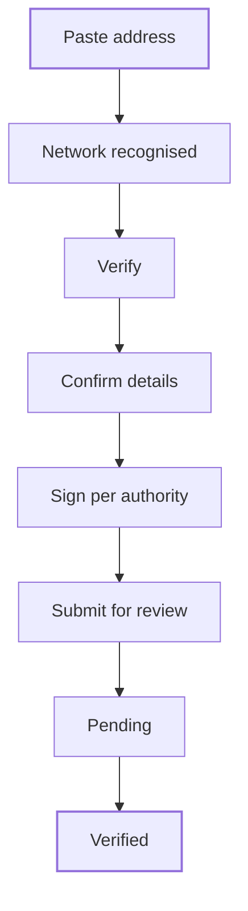

KYI, Know Your Issuer, ties a token to your verified entity. You paste the token address, confirm the details Bluprynt reads, and sign once with each wallet that controls the token. Bluprynt then reviews the filing and publishes a KYI attestation.

<Note>
To run the same flow inside your own app, use the [KYI widget](/tools/kyi). The SDK guides cover the [flow](/sdk/flow) and [wallet verification](/sdk/wallet-verification).
</Note>

## Key concepts

| Term | Meaning |
|---|---|
| **Asset** | A token or vault you issue, identified by its address and chain. |
| **Token** | One on-chain deployment of the asset. An asset can have several. |
| **Authority** | A wallet or contract that controls a token, such as its owner or a permission registry. |
| **Signer** | The wallet that signs for an authority. For a multisig, the signer and the authority differ. |
| **What we need from you** | The asset details Passport asks you to confirm. |
| **Submit for review** | Sends the filing to Bluprynt. Verified tokens get attestations once it's approved. |

## How it works

One signature settles every token a wallet controls. Bluprynt takes the proof from the signer and writes it against every authority that wallet controls.

## Verify an asset

<Steps>
  <Step title="Paste the address">
    On the Overview, paste the token or vault address into **Verify a new asset** (1). Passport recognises the network from the address. Nothing is read until you press **Verify** (2). If the token is already on your list, Passport says so and offers **Open its page** (3).

    <Frame caption="An address pasted into Verify a new asset.">
      
      
    </Frame>
  </Step>
  <Step title="Confirm the asset details">
    Open **Asset details and tokens**. A banner counts what's left, for example **1 token still needs a wallet signature** (1). Under **What we need from you** (2), check each detail Passport read and fix any that are wrong.

    <Frame caption="Asset details and tokens for an asset that still needs a signature.">
      
      
    </Frame>
  </Step>
  <Step title="Sign with each authority wallet">
    Under **Tokens on this asset**, click **Sign** (3) on a token, or **Sign all wallets** (4). The **Verify your wallets** dialog (1) lists each authority and its signer, for example *Owner · multisig of 6 signers*. Click **Sign** (2) for each wallet and approve the message in that wallet. Click **Close** (3) when you're done.

    <Frame caption="The Verify your wallets dialog. Signing is not shown.">
      
      
    </Frame>
  </Step>
  <Step title="Submit for review">
    When every token has a signature, click **Submit for review**. The KYI state becomes **Pending**: *Your Know Your Issuer filing is in. Verification finishes on our side.* When Bluprynt approves it, the state becomes **Verified** and the attestation appears under [Attestations](/passport/wallets-and-attestations).
  </Step>
</Steps>

<Warning>
A wallet you can't sign for leaves its tokens listed but unverified.
</Warning>

## Reference

### Asset details

| Field | Required | Notes |
|---|---|---|
| Asset Name | Yes | *What is the name of the asset?* |
| Ticker Symbol | Yes | For example `BTC` for Bitcoin. |
| Description | Yes | Describe the asset and the project behind it. |
| Asset Image | Yes | Take the image a source already publishes, or upload your own. |
| Image License | Yes | All Rights Reserved, CC BY (Attribution), CC BY-NC (Non-Commercial) or Public Domain / CC0. |
| White Paper | Yes | A link to the white paper. |
| Website | Yes | A URL where people can learn more about the asset and its project. |
| X / Twitter | No | The project's X profile. |

### KYI states

| State | Meaning | Next action |
|---|---|---|
| Not started | Nothing filed. | **Start KYI verification** |
| Sign to finish | Details are complete; signatures are missing. | **Sign** or **Sign all wallets** |
| Submit for review | Every token has a signature. | **Submit for review** |
| Pending | Filed and under review. | Wait. |
| Partly verified | Some tokens are verified, others aren't. | Sign the rest. |
| Verified | KYI is complete. | Start [Proof of Collateral](/passport/proof-of-collateral). |
| Revoked | Verification was revoked. | **Verify KYI again** |

### Address messages

| Message | Meaning |
|---|---|
| *{Network} recognised from the address. Nothing is read until you press Verify.* | Ready to read. |
| *{Name} is already on your list. Open its page* | The asset is already in this organization. |
| *We could not read that address on any chain we support. Check it and try again.* | Wrong address, or an unsupported chain. See [Supported chains](/supported-chains). |
| *Locked — complete step 1 above to verify your first asset.* | Finish [KYB](/passport/organization) first. |

## Worked example

You paste Plume USD's Ethereum address and press **Verify**. Passport reads the name, ticker, description, white paper and website. You set **Image License** to *All Rights Reserved*. The banner says **1 token still needs a wallet signature**. The token's owner is a multisig of 6 signers, so you click **Sign** and approve the message from one signer wallet. You click **Submit for review**, and the asset shows **Pending** until Bluprynt approves it.

## Troubleshooting

| Problem | What to do |
|---|---|
| **Verify** is disabled | The address isn't valid yet, or KYB isn't complete. |
| A token stays unverified | No one signed for its authority. Sign with a wallet that controls it. |
| *Your verified wallets also control 2 more assets.* | Click **Add them to verify**. |
| KYI shows **Revoked** | Click **Verify KYI again**. |

## FAQ

<AccordionGroup>
  <Accordion title="Do I sign once per token?">
    No. One signature settles every token a wallet controls.
  </Accordion>
  <Accordion title="How does signing work for a multisig?">
    The authority is the multisig. One of its signer wallets signs, and Bluprynt records the proof against the multisig.
  </Accordion>
</AccordionGroup>

## Related pages

- [Asset trust center](/passport/asset-page)
- [Proof of Collateral](/passport/proof-of-collateral)
- [KYI widget](/tools/kyi)
- [Supported chains](/supported-chains)
