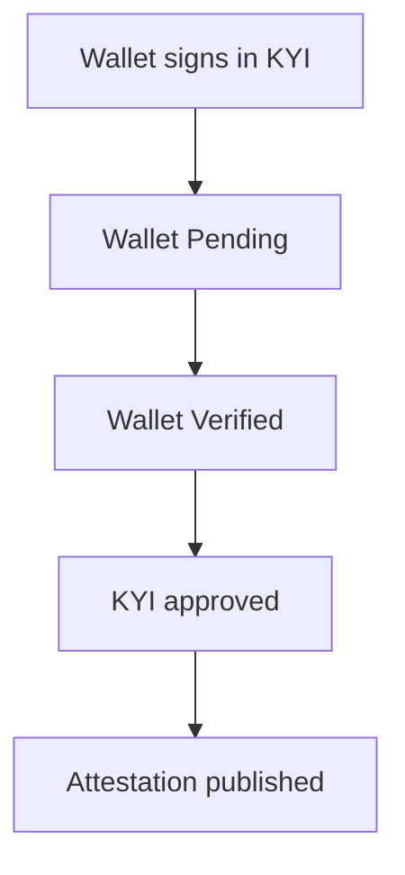

**Wallets** and **Attestations** are the ledgers behind KYI. **Wallets** lists every wallet your organization authenticated while verifying assets. **Attestations** lists every KYI attestation Bluprynt published on chain for you, with a link to view it in a block explorer.

## Key concepts

| Term | Meaning |
|---|---|
| **Authenticated wallet** | A wallet that signed during KYI to prove it controls a token. |
| **Attestation** | An on-chain record that Bluprynt verified a fact, here a KYI result. |
| **Schema** | The attestation type. KYI attestations use the `kyi` schema. |
| **Explorer link** | **View** opens the attestation in the chain's block explorer. |

## How it works

## Review wallets and attestations

<Steps>
  <Step title="Open Wallets">
    Click **Wallets** in the sidebar. **Summary** (1) counts total, verified, pending and revoked wallets. **KYI Authenticated Wallets** (2) lists each wallet. Click **Verify** (3) on a pending wallet to finish its signature.

    <Frame caption="The Wallets page.">
      
    </Frame>
  </Step>
  <Step title="Open Attestations">
    Click **Attestations** in the sidebar. **Summary** (1) counts total, published, pending and revoked attestations. Click **View** (2) to open one in the explorer. **Status** (3) shows whether it's published.

    <Frame caption="The Attestations page.">
      
    </Frame>
  </Step>
  <Step title="Change the period or see everything">
    Use the period selector to switch between 7 days, 30 days, 90 days and All time. Click **See all →** for the full list.
  </Step>
</Steps>

## Reference

### Wallet columns and states

| Column | Shows |
|---|---|
| Wallet address | Shortened address with a copy button. |
| Network | For example Ethereum. |
| Status | **Pending**, **Verified** or **Revoked**. |
| Authenticated | The date the wallet was verified. |
| Actions | **Verify** for a pending wallet. |

### Attestation columns and states

| Column | Shows |
|---|---|
| Address | The attested token address. |
| Explorer | **View** link. |
| Status | **published**, pending or revoked. |
| Schema | For example `kyi`. |
| Chain | For example `sepolia`. |
| Created | The publish date. |

## Worked example

A lender asks which wallets you proved for your stablecoin. You open **Wallets**, set **All time** and filter by the address. You then open **Attestations**, find the token's address and click **View** to send them the on-chain record.

## Troubleshooting

| Problem | What to do |
|---|---|
| A wallet stays **Pending** | It hasn't signed yet. Click **Verify**, or sign from the asset's [details](/passport/verify-asset). |
| No attestation after KYI | Attestations publish once Bluprynt approves the KYI filing. Check the asset shows **Verified**. |

## FAQ

<AccordionGroup>
  <Accordion title="Can I read attestations by API?">
    Yes. See the [Public API](/api/public/overview).
  </Accordion>
  <Accordion title="What does Revoked mean?">
    The wallet or attestation is no longer valid. The asset's KYI shows **Revoked** and needs to be verified again.
  </Accordion>
</AccordionGroup>

## Related pages

- [Verify an asset](/passport/verify-asset)
- [Public trust page](/passport/public-page)
