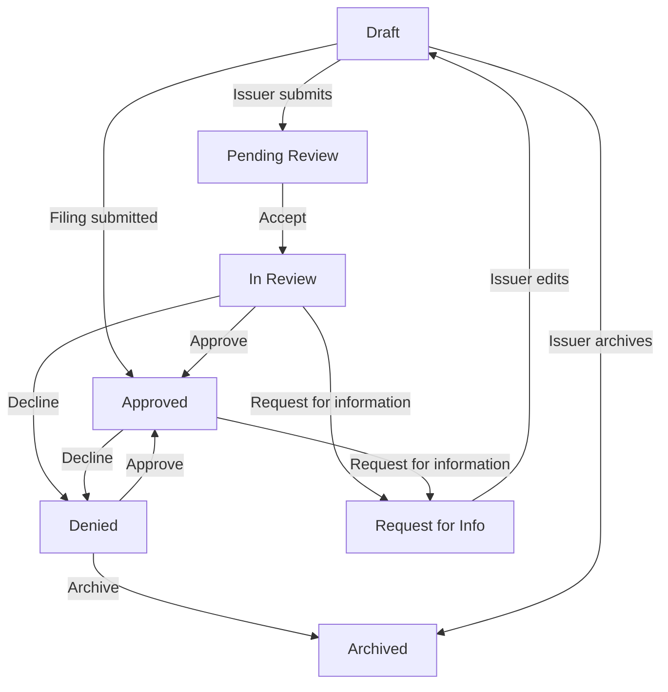

An application moves through seven states, from the issuer's first draft to your decision. This page is the reference for reviewers and admins who need to know what each state means, who can change it and what happens next.

## Key concepts

| Term | Meaning |
|---|---|
| **State** | Where the application is in its life. Each application has exactly one. |
| **Assigned reviewer** | The member who must act next. The approval workflow picks them. Only they can approve, decline or request information. |
| **Application form** | A form whose credential is issued only after your approval. |
| **Filing form** | A form whose credential is issued as soon as the issuer submits. It skips review. |

## How it works

<Note>
The Compliance Hub labels a declined application **Denied**. Earlier versions of these docs called it *Rejected*. It's the same state.
</Note>

## State reference

| State | What it means | Who moves it here | Action |
|---|---|---|---|
| **Draft** | The issuer is still filling in the form. You requested it, or the issuer started it. | Issuer, or you with **Request a form** | Start or request a form |
| **Pending Review** | Submitted and waiting for a reviewer to pick it up. | Issuer | Submit an application form |
| **In Review** | A reviewer is working on it. | Assigned reviewer | **Accept** |
| **Request for Info** | Sent back to the issuer for more information. When the issuer edits it, it returns to **Draft** for resubmission. | Assigned reviewer | **Request for information** |
| **Approved** | Every approver has signed off. The credential is issued. | Last approver in the workflow, or the system for a filing | **Approve**, or submit a filing form |
| **Denied** | Declined. No credential is issued. | Assigned reviewer | **Decline** |
| **Archived** | Closed and no longer active. | Issuer (from Draft) or regulator (from Denied) | Archive |

## Transition rules

The Compliance Hub checks each action against the current state. An action outside these rules fails with *Invalid application state for this operation*.

| Action | Allowed from | Result | Also needs |
|---|---|---|---|
| Submit (application form) | Draft | Pending Review | Every required field answered |
| Submit (filing form) | Draft | Approved | Every required field answered |
| **Accept** | Pending Review | In Review | — |
| **Approve** | In Review, Denied | Approved, or In Review with the next approver | You are the assigned reviewer |
| **Decline** | In Review, Approved | Denied | You are the assigned reviewer |
| **Request for information** | In Review, Approved | Request for Info | You are the assigned reviewer |
| Issuer edits | Draft, Request for Info | Draft | — |
| Archive (issuer) | Draft | Archived | — |
| Archive (regulator) | Denied | Archived | — |

### Multi-step approval

**Approve** doesn't always end the review. If the form's [approval workflow](/proof/approval-workflow) lists several approvers, each **Approve** marks the current approver done and assigns the next active one. The application stays **In Review** until the last approver approves. Then it becomes **Approved** and the credential is issued.

## Worked example

An issuer submits a *Digital Asset License* application. It enters **Pending Review** and the workflow assigns your first approver, a Reviewer. They click **Accept**, so it moves to **In Review**. They spot a missing reserve report and click **Request for information**. The state becomes **Request for Info**. The issuer adds the report, which puts the application back in **Draft**, and resubmits. It returns to **Pending Review**, the Reviewer accepts and approves it. The workflow assigns the second approver, an Organization Admin. They click **Approve**, the state becomes **Approved** and the credential is issued.

## Errors and troubleshooting

| Message | Cause | What to do |
|---|---|---|
| *You are not assigned to this application yet* | You tried to approve, decline or request information on an application assigned to someone else. | Ask the assigned reviewer, or check the **Reviewer** column. |
| *Invalid application state for this operation* | The action isn't allowed from the current state, for example **Approve** on Pending Review. | Use the action the state allows. **Accept** comes first. |
| *Application must be in IN_REVIEW or DENIED state* | You tried to approve from another state. | Accept the application first. |
| *Application must be in DRAFT state* | The issuer tried to submit something that isn't a draft. | The application was already submitted. |
| *Application must be in DRAFT or REQUESTED_FOR_INFO state* | The issuer tried to edit a submitted application. | Wait for a reviewer to request information. |
| *No valid approver or superadmin found* | The workflow has no active approver and your organization has no active Super Admin. | Add an active approver to the form's workflow. |

## FAQ

<AccordionGroup>
  <Accordion title="Can I reverse a decision?">
    Yes, within limits. You can approve a **Denied** application, and decline or request information on an **Approved** one. You must be the assigned reviewer.
  </Accordion>
  <Accordion title="Why did a filing skip review?">
    Filing forms issue their credential when the issuer submits. They go straight from **Draft** to **Approved**. Use an application form if you need to review first.
  </Accordion>
  <Accordion title="Can I delete an application?">
    No. You archive it instead. Regulators can archive **Denied** applications. Issuers can archive their own **Draft**.
  </Accordion>
  <Accordion title="What does Needs Review mean in the status filter?">
    It's a filter, not a state. It shows applications in **Pending Review** or **In Review** together.
  </Accordion>
</AccordionGroup>

## Related pages

- [Applications](/proof/applications)
- [Review an application](/proof/applications#review-an-application)
- [Approval workflow](/proof/approval-workflow)
- [Credentials](/proof/credentials)
