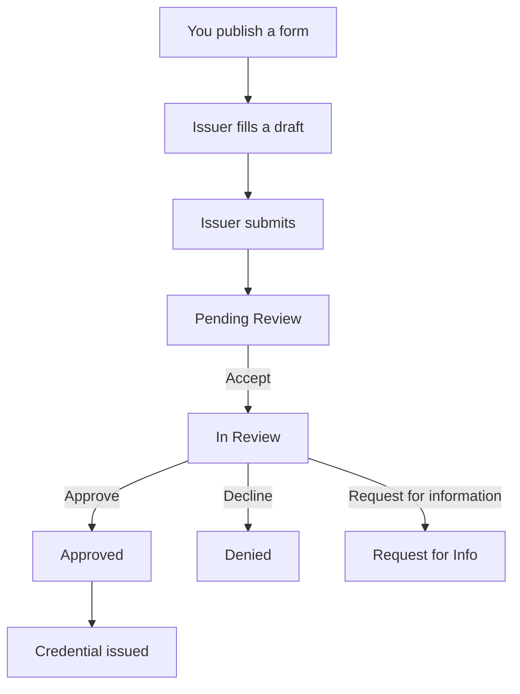

An application is an issuer's answers to one of your published forms. **Applications** lists every application your organization has received, so reviewers can pick up work and track decisions. Approving an application issues its [credential](/proof/credentials).

## Key concepts

| Term | Meaning |
|---|---|
| **Application** | One issuer's submission of one form. It has a state, an assigned reviewer and the issuer's answers. |
| **Form** | The questions you publish in the [Form manager](/proof/form-manager). Each application uses one form version. |
| **Credential / Form** | The credential type the application issues, shown above the form name. |
| **Issuing to** | The organization or asset that receives the credential. |
| **Reviewer** | The member the [approval workflow](/proof/approval-workflow) assigned. *Unassigned* means no one yet. |
| **State** | Where the application is in review. See [Application states](/proof/application-states). |

## How it works

Filing forms skip review. Their credential is issued as soon as the issuer submits.

## Find an application

<Steps>
  <Step title="Open Applications">
    Click **Applications** in the sidebar. **Pending applications** (1) counts open work, broken down by state. **Processed applications** (2) counts closed ones.

    <Frame caption="The Applications list">
      
    </Frame>
  </Step>
  <Step title="Filter by state">
    Click **All Statuses** (3) and pick a state (1). **Needs Review** shows Pending Review and In Review together.

    <Frame caption="The status filter">
      
    </Frame>
  </Step>
  <Step title="Filter by reviewer">
    Click **All Reviewers** (4). Pick **Unassigned**, or a member to see their queue (1).

    <Frame caption="The reviewer filter">
      
    </Frame>
  </Step>
  <Step title="Open the application">
    Click a row (5) to open it.
  </Step>
</Steps>

## Read an application

<Steps>
  <Step title="Read the answers">
    The **Application** tab (2) shows the issuer's answers, grouped into the form's sections (4). Unanswered fields read *Not provided*. A required field with no answer shows *Value is required*. Use the arrows (1) to move to the previous or next application.

    <Frame caption="An application's answers">
      
    </Frame>
  </Step>
  <Step title="Download documents">
    File answers appear as documents. Click the download button (1) to open one.

    <Frame caption="Documents attached to an application">
      
    </Frame>
  </Step>
  <Step title="Check the issuer">
    Click **Entity Details** (3) to see the organization behind the application. See [Watchlist issuers](/proof/watchlist-issuers).
  </Step>
</Steps>

## Review an application

The review buttons appear at the top of the application, based on its state. Each one asks you to confirm.

| State | Buttons you see | What the confirmation says |
|---|---|---|
| Pending Review | **Accept** | *This action will move the application to review.* |
| In Review | **Approve**, plus a menu with **Approve**, **Decline** and **Request for information** | See below |

| Action | Confirmation | Result |
|---|---|---|
| **Accept** | *This action will move the application to review. Continue?* | In Review |
| **Approve** | *This action will approve the application and issue the credential. Continue?* | Next approver, or Approved |
| **Decline** | *This action will decline the application. Continue?* | Denied |
| **Request for information** | *This action will request additional information from the issuer. Continue?* | Request for Info |

To review:

1. Filter to **Needs Review** and open an application.
2. Click **Accept** to take it into review.
3. Read the answers and documents.
4. Click **Approve**, or open the menu and click **Decline** or **Request for information**.
5. Confirm.

Only the assigned reviewer can approve, decline or request information. If the form has several approvers, **Approve** hands the application to the next one. See [Approval workflow](/proof/approval-workflow).

## Reference

### List columns

| Column | Shows |
|---|---|
| **Date / ID** | When the application was created, and its ID |
| **Credential / Form** | Credential type, with the form name below |
| **Issuing to** | The organization or asset receiving the credential |
| **Issuer** | The issuer organization |
| **Status** | The [state](/proof/application-states) |
| **Reviewer** | The assigned reviewer, or *Unassigned* |

### Filters

| Filter | Values |
|---|---|
| Status | All Statuses, Needs Review, Pending Review, In Review, Request for Info, Approved, Denied, Archived, Draft |
| Reviewer | All Reviewers, Unassigned, each member |

## Worked example

You open **Applications** and filter to **Needs Review**. A *Know Your Issuer* application sits in **Pending Review**, assigned to you. You click **Accept**, then read the answers on the **Application** tab and download the attached disclosures. The reserves section is incomplete, so you open the menu, click **Request for information** and confirm. The issuer gets the application back to edit.

## Errors and troubleshooting

| Problem | Cause | What to do |
|---|---|---|
| No review buttons | The state has no review action, for example Draft or Archived | Check the **Status** column. |
| *You are not assigned to this application yet* | Someone else is the assigned reviewer | Check **Reviewer**. Ask them, or an admin to change the workflow. |
| *Invalid application state for this operation* | The state changed since you opened it | Reload the page. |
| A filing never appears in Needs Review | Filings are approved on submit | Filter to **Approved**. |

## FAQ

<AccordionGroup>
  <Accordion title="Is Denied the same as Rejected?">
    Yes. The Compliance Hub labels a declined application **Denied**.
  </Accordion>
  <Accordion title="Can I edit an issuer's answers?">
    No. Use **Request for information** to send the application back to the issuer.
  </Accordion>
  <Accordion title="Where do new applications come from?">
    Issuers start them from a published form, or you send a form with **Request a form**. See [Watchlist issuers](/proof/watchlist-issuers#request-a-form).
  </Accordion>
  <Accordion title="What happens after I approve?">
    The credential is issued in the background. See [Credentials](/proof/credentials#how-a-credential-is-issued).
  </Accordion>
</AccordionGroup>

## Related pages

- [Application states](/proof/application-states)
- [Approval workflow](/proof/approval-workflow)
- [Form manager](/proof/form-manager)
- [Credentials](/proof/credentials)
