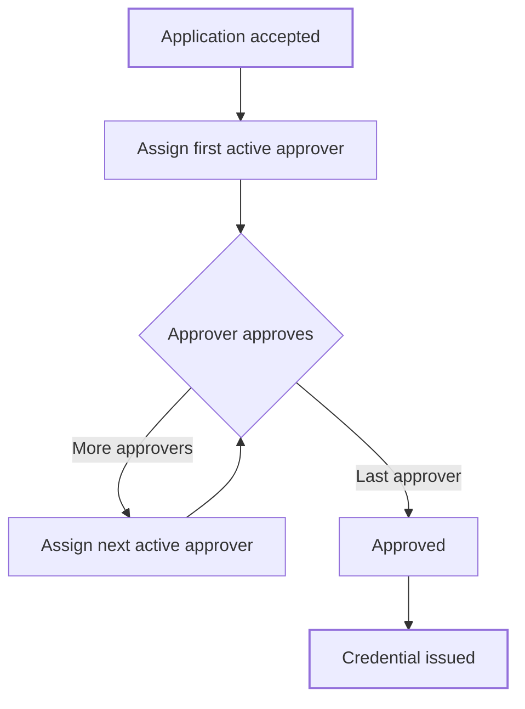

The approval workflow is step 4 of the [Form manager](/proof/form-manager). It lists the members who must approve each application, in order. Use it to require more than one sign-off, for example an analyst then a director.

## Key concepts

| Term | Meaning |
|---|---|
| **Approver** | A member in the workflow list |
| **Assigned reviewer** | The approver whose turn it is. Only they can approve, decline or request information. |
| **Super Admin fallback** | If no listed approver is active, the earliest active Super Admin is assigned. |

## How it works

The workflow:

- Assigns approvers in list order.
- Skips approvers who already approved.
- Skips members who are inactive or no longer exist.
- Lists each member once, even if you add them twice.
- Falls back to the earliest active Super Admin if no listed approver is left.

## Set the workflow

<Steps>
  <Step title="Pick the approvers">
    Click **Add Approver** (2) and pick a member for each row (1). The number on the left is the order.

    <Frame caption="Step 4: Approval workflow">
      
      
    </Frame>
  </Step>
  <Step title="Order them">
    Drag a row by its handle to change the order. Click the bin to remove an approver.
  </Step>
  <Step title="Continue">
    Click **Next** to go to **Review & publish**.
  </Step>
</Steps>

## Reference

| Situation | Who is assigned |
|---|---|
| First approver is active | First approver |
| First approver approved | Next active approver |
| An approver is inactive | They're skipped |
| No listed approver is active | Earliest active Super Admin |
| No approver and no active Super Admin | Nobody. The action fails with *No valid approver or superadmin found*. |

## Worked example

You list two approvers: a Reviewer, then an Organization Admin. An application is accepted, so the Reviewer is assigned. They approve, and the Organization Admin is assigned. The Organization Admin approves, the application becomes **Approved** and the credential is issued. If the Reviewer had been inactive, the Organization Admin would be assigned first.

## Errors and troubleshooting

| Message | Cause | What to do |
|---|---|---|
| *No valid approver or superadmin found* | Every approver is inactive and there's no active Super Admin | Add an active approver. |
| *User is not in the approvers list* | Someone outside the workflow tried to approve | Add them to the workflow, or ask a listed approver. |
| *You are not assigned to this application yet* | It isn't your turn | Wait for the earlier approver. |

## FAQ

<AccordionGroup>
  <Accordion title="Does a Filing form use the workflow?">
    No. Filing forms issue their credential on submit, without review.
  </Accordion>
  <Accordion title="What if I leave the list empty?">
    The earliest active Super Admin is assigned.
  </Accordion>
</AccordionGroup>

## Related pages

- [Form manager](/proof/form-manager)
- [Application states](/proof/application-states)
- [Members and settings](/proof/members)
