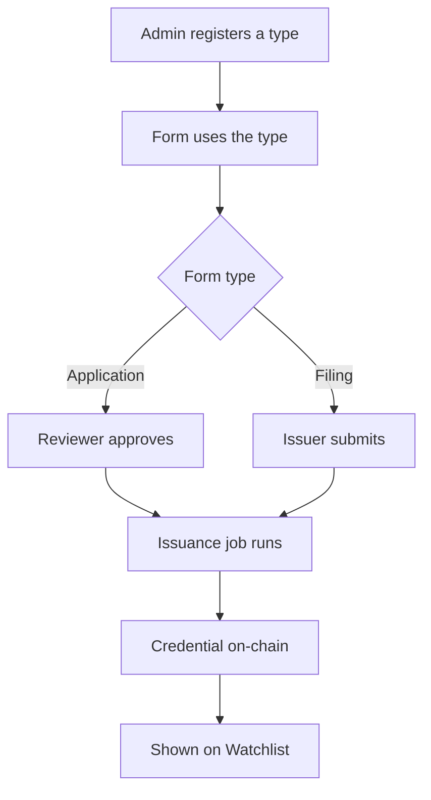

A credential is your organization's on-chain answer to "is this licensed?" or "has this been disclosed?". You define credential types, link each to a form, and the Compliance Hub issues a credential when an application is approved or a filing is submitted. Anyone can then check the credential against the on-chain registry.

## Key concepts

| Term | Meaning |
|---|---|
| **Credential type** | A kind of credential your organization issues, such as *Know Your Issuer* or *Proof of Collateral*. It's registered in the on-chain Credential Registry. |
| **Credential** | One issued instance of a type, for one organization or asset. A credential is a kind of attestation. |
| **Credential Registry** | The on-chain registry that lists credential types and the credentials issued under them. |
| **Compliance Engine Credential ID** | The credential type's identifier in the registry. |
| **Recipient** | The issuer organization or the asset that holds the credential. Set on the [form](/proof/form-manager). |

## How a credential is issued



- **Application** forms issue the credential when the last approver approves. The confirmation reads *This action will approve the application and issue the credential.*
- **Filing** forms issue the credential when the issuer submits. No approval is needed.
- Issuance runs in the background, so the credential can appear a short time after the decision.
- Application forms issue a licence-kind attestation. Filing forms issue a disclosure-kind attestation.

## Manage credential types

<Steps>
  <Step title="Open Credentials">
    Click **Credentials** in the sidebar. The list shows each type, its description and status. Click a type's menu (2) to edit it.

    <Frame caption="Your organization's credential types">
      
    </Frame>
  </Step>
  <Step title="Create a credential type">
    Click **New Credential** (1). Enter a **Credential title** (1) and a **Description** (2). Click **Register credential** (3). The type is published to the Credential Registry and becomes available for issuance.

    <Frame caption="Create credential type">
      
    </Frame>
  </Step>
  <Step title="Find the registry ID">
    Open an existing type to edit it. **Compliance Engine Credential ID** (1) shows its registry identifier. Click **Copy** (2) to copy it.

    <Frame caption="Edit credential type">
      
    </Frame>
  </Step>
</Steps>

## What a credential contains

Bluprynt credentials follow the [W3C Verifiable Credentials](https://www.w3.org/TR/vc-data-model/) data model. A KYI credential has this shape:

```json KYI credential (example values)
{
  "@context": [
    "https://www.w3.org/2018/credentials/v1",
    "https://schema.bluprynt.com/attestation/v1"
  ],
  "id": "kyi-<subject address>-<timestamp>",
  "type": ["VerifiableCredential", "Attestation"],
  "issuer": "<issuer identifier>",
  "issuanceDate": "2026-01-15T12:00:00.000Z",
  "credentialSubject": {
    "id": "<verified authority address>",
    "wallet": "<verified authority address>",
    "assetSymbol": "EXMPL",
    "attestationClass": "INFORMATIONAL",
    "category": "ISSUER_FILLING",
    "verificationLevel": "ISSUER",
    "status": "VERIFIED"
  },
  "proof": null
}
```

| Field | Meaning |
|---|---|
| `@context` | The W3C and Bluprynt schemas the credential follows |
| `id` | The credential's identifier |
| `type` | Always includes `VerifiableCredential` and `Attestation` |
| `issuer` | Who issued it |
| `issuanceDate` | When it was issued, ISO 8601 |
| `expirationDate` | When it expires, if it does |
| `credentialSubject.wallet` | The verified authority wallet of the asset |
| `credentialSubject.assetSymbol` | The asset's symbol |
| `credentialSubject.attestationClass`, `category`, `verificationLevel` | How the claim was verified |
| `credentialSubject.status` | The claim's status, for example `VERIFIED` |
| `proof` | Signature metadata when present. `null` in the KYI payload. |

The Compliance Hub also keeps a record for each issued credential: its type, issuer, asset, application, jurisdiction, status, issue and expiry dates, and the IPFS content ID of the stored payload.

## Verify a credential

<Steps>
  <Step title="Check it in the Watchlist">
    Open **Watchlist**, then the **Credentials** tab (1). Each row shows the credential, its asset, jurisdiction, status, and issue and expiry dates.

    <Frame caption="Credentials on the Watchlist">
      
    </Frame>
  </Step>
  <Step title="Check the status">
    Trust a credential only when its status is **Active** and it hasn't expired.
  </Step>
  <Step title="Check it outside the Compliance Hub">
    KYI credentials are public. Look one up with [KYI](/tools/kyi) or the [Public API](/api/public/overview).
  </Step>
</Steps>

## Reference

### Credential statuses

| Status | Meaning |
|---|---|
| **Active** | Valid |
| **Pending review** | Not yet active |
| **Deactivated** | Revoked or switched off. Don't rely on it. |

### Supported networks

The attestation service supports KYI verification on Solana, Ethereum and Plume.

## Worked example

You register a credential type *Example Licence*. You create an **Application** form for **Issuer** recipients that uses it. An issuer applies, and your two approvers approve. The issuance job writes the credential on-chain, and it appears on the Watchlist **Credentials** tab as **Active**. An exchange checks the issuer's status with [KYI](/tools/kyi) before listing their token.

## Errors and troubleshooting

| Problem | Cause | What to do |
|---|---|---|
| **New Credential** is missing | You aren't an admin | Ask an Organization Admin. |
| Approved, but no credential yet | Issuance runs in the background | Wait, then reload the **Credentials** tab. |
| Status is **Deactivated** | The credential was switched off | Treat the claim as no longer valid. |

## FAQ

<AccordionGroup>
  <Accordion title="What's the difference between a credential and an attestation?">
    A credential is a kind of attestation: one your organization issues about a regulated status, such as a licence.
  </Accordion>
  <Accordion title="Are credentials private?">
    The type and issued credential are written to the on-chain registry. Your forms and answers stay in your organization.
  </Accordion>
</AccordionGroup>

## Related pages

- [Form manager](/proof/form-manager)
- [Applications](/proof/applications)
- [KYI](/tools/kyi)
- [Proof of Collateral](/tools/proof-of-collateral)
