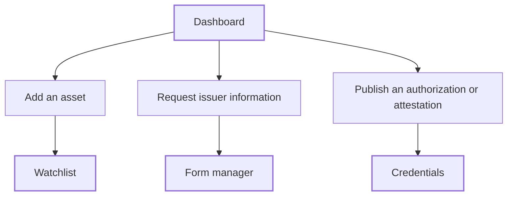

The dashboard is the first page you see after you sign in. It gets a new organization started with three independent setup paths, and lists the assets you monitor. Every member sees it. Its wording depends on your organization's [sector](/proof/concepts#your-organization).

## Key concepts

| Term | Meaning |
|---|---|
| **Monitored asset** | A token on your [Watchlist](/proof/registry). The dashboard lists its chain, address, KYI and Proof of Collateral status. |
| **Issuer information request** | A structured form you send to an issuer. Their answers come back verified, timestamped and attached to the record. |
| **Authorization** or **attestation** | A licence, registration, listing, rating or approval you publish on-chain as a [credential](/proof/credentials). Public-sector dashboards say _authorization_; private-sector dashboards say _attestation_. |
| **Resolved data** | Facts the Compliance Hub reads for you: price, holders, collateral, oracles and admin controls. |
| **Requested data** | Facts only the issuer can give: reserves, legal terms, redemption and disclosures. |

## How it works

The three paths are independent. Start with whichever matches your mandate or your diligence.

## Public and private sector

The dashboard has the same three paths for every organization. The labels follow the sector you picked when the organization was created.

| | Public sector | Private sector |
|---|---|---|
| **Heading for a new organization** | **Set up supervision** | **Get started** |
| **Third setup card** | **Publish an Authorization Onchain** — a licence, registration or approval. The answer to "is this licensed?" | **Publish an Attestation Onchain** — a listing, rating or approval you granted. The answer to "does this still hold?" |
| **Where issuer answers go** | Your examination record | Your diligence record |
| **Privacy banner** | Not shown | **Your workspace is private** |

Both sectors issue the same [credentials](/proof/credentials). Only the wording differs.

<Info>
Your workspace is private. Assets, forms and answers stay inside your organization. Nothing is filed on your behalf.
</Info>

## Use the dashboard

<Steps>
  <Step title="Add an asset to monitor">
    Click **Add an Asset to Monitor** (1), then **Go to Registry**. You add a token by its contract address and network. On-chain data such as issuer identity, mint authority and collateral status fills in and stays up to date. See [Watchlist assets](/proof/watchlist-assets).

    <Frame caption="The dashboard for a new public-sector organization">
      
      
    </Frame>
  </Step>
  <Step title="Request issuer information">
    Click **Request Issuer Information** (2), then **Go to Form manager**. Build a form and send it to an issuer you supervise or deal with. See [Form manager](/proof/form-manager).
  </Step>
  <Step title="Publish an authorization or attestation on-chain">
    Click **Publish an Authorization Onchain** (3), or **Publish an Attestation Onchain** in a private-sector organization, then **Go to Credentials**. You can update or revoke the credential as status changes. See [Credentials](/proof/credentials).
  </Step>
  <Step title="Invite your team">
    Click **Invite team members** (4) to add colleagues. See [Members and settings](/proof/members).
  </Step>
</Steps>

## Reference

### Monitored assets table

| Column | Shows |
|---|---|
| **Asset** | Token name and symbol |
| **Chain** | The network the contract lives on |
| **Address** | The token contract address |
| **KYI** | Whether the issuer has a [KYI](/tools/kyi) credential |
| **Proof of Collateral** | The [Proof of Collateral](/tools/proof-of-collateral) status |

### What fills in, and when

| Data | Source | When |
|---|---|---|
| Price, holders, collateral, oracles, admin controls | Resolved by the Compliance Hub | Starts within minutes of adding an asset |
| Reserves, legal terms, redemption, disclosures | Requested from the issuer | Blank until the issuer files. That's a gap in their filing, not an error. |

## Worked examples

### A supervisor

You supervise three stablecoins. You click **Add an Asset to Monitor** and add each by contract address. Within minutes the **Monitored assets** table lists all three with their chain and address. Their reserves stay blank, so you click **Request Issuer Information** and send each issuer your reserve disclosure form.

### An exchange

Your listings team wants to list a new tokenized money market fund. You click **Add an Asset to Monitor** and add the token by contract address and network. Its admin controls and asset graph fill in, but its reserves are blank. You click **Request Issuer Information** and send the issuer your listing due diligence form. When your approvers sign off, you click **Publish an Attestation Onchain** to record the listing approval. The token stays on your Watchlist, so you can check its dependencies and on-chain activity after it's listed.

## Errors and troubleshooting

| Problem | Cause | What to do |
|---|---|---|
| **No assets yet** | Nothing is on your Watchlist | Add an asset from the [Watchlist](/proof/watchlist-assets). |
| Reserves or disclosures are blank | The issuer hasn't filed | Send a form. See [Watchlist issuers](/proof/watchlist-issuers#request-a-form). |

## FAQ

<AccordionGroup>
  <Accordion title="Do I have to complete all three setup cards?">
    No. They're independent. You can monitor assets without ever publishing a credential.
  </Accordion>
  <Accordion title="Why are Activity, Supervisory Intelligence and Monitoring greyed out?">
    They aren't available yet.
  </Accordion>
</AccordionGroup>

## Related pages

- [Watchlist](/proof/registry)
- [Form manager](/proof/form-manager)
- [Credentials](/proof/credentials)
