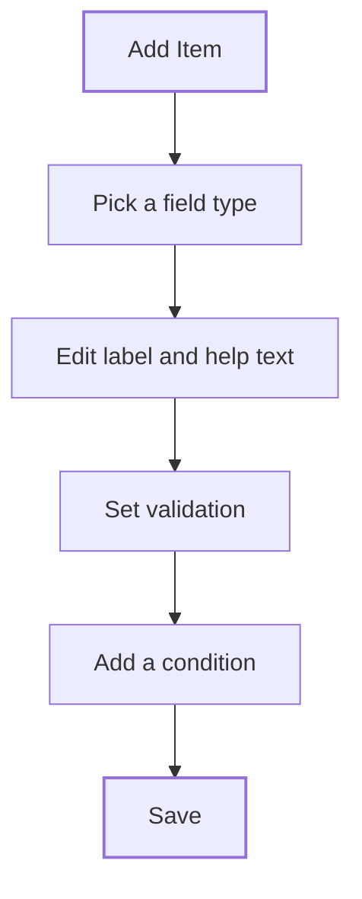

The form builder is step 3 of the [Form manager](/proof/form-manager). You add the questions issuers answer, pick a field type for each, and set validation and conditions. Admins use it to turn a regulatory requirement into structured, checkable answers.

## Key concepts

| Term | Meaning |
|---|---|
| **Field** | One question. It has a type, a label and optional validation. |
| **Section** | A group of fields. Sections become tabs in the application view. |
| **Reference ID** | A stable key for the field's answer |
| **Validation** | Rules an answer must meet, such as **Required** or a maximum length. |
| **Condition** | A rule that shows a field or section only when another answer matches |
| **Raw** | The form definition as JSON. |

## How it works

Issuers see each field as an input. The Compliance Hub checks every answer against its validation before the issuer can submit.

## Build a form

<Steps>
  <Step title="Review the fields">
    Each row is a field. Fields marked **Required** must be answered. Use the icons on the right to duplicate, edit or delete a field. Drag the handle on the left to reorder. Click **Raw** (3) to see the JSON. Click **Add Item** (2) to add a field.

    <Frame caption="Step 3: Form builder">
      
      
    </Frame>
  </Step>
  <Step title="Pick a field type">
    Choose a type from the menu (1). **Section** adds a group for other fields.

    <Frame caption="The field type menu">
      
      
    </Frame>
  </Step>
  <Step title="Configure the field">
    Click the pencil on a field to open **Edit field**. Check the **Type** (1). Fill **Label**, **Description**, **Reference ID**, **Placeholder** and **Answer guidelines**. Under **Validation** (2), tick **Required** and set the limits for the type. Click **Save**.

    <Frame caption="Edit field">
      
      
    </Frame>
  </Step>
  <Step title="Continue">
    Click **Next** to set the [approval workflow](/proof/approval-workflow).
  </Step>
</Steps>

## Reference

### Field types

| Menu label | Engine type | What the issuer gives |
|---|---|---|
| **Static text** | `static` | Nothing. Display-only text, never validated. |
| **Text** | `string` | Free text |
| **Number** | `number` | A number |
| **Boolean** | `boolean` | True or false |
| **Date** | `date` | A date, stored as ISO 8601 |
| **Select** | `select` | One option from your list |
| **Multi-select** | `multiselect` | Any number of options from your list |
| **File** | `file` | An upload. The name, MIME type, size and URL are stored. |
| **Blockchain address** | `blockchain` | A CAIP address for an on-chain asset. The format isn't checked. |
| **Sustainability** | `sustainability` | Sustainability data for an on-chain asset: `address`, `ccri` and `cmc` |
| **Array** | `array` | An ordered list of values of one non-list type |
| **Table / rows** | `array_obj` | An ordered list of rows. Each row has one value per sub-field. |
| **Section** | `section` | Nothing. A container for other fields. |

### Validation by type

| Type | Rules |
|---|---|
| Text | Required, minimum length, maximum length, pattern with a custom message |
| Number | Required, minimum, maximum |
| Date | Required, earliest date, latest date |
| Array, Table / rows | Minimum items, maximum items |
| File, Blockchain address, Sustainability | Required |

### Field settings

| Setting | Use |
|---|---|
| **Label** | The question. Required. |
| **Description** | Help text under the question |
| **Reference ID** | Stable key used by conditions |
| **Placeholder** | Example text inside an empty input |
| **Answer guidelines** | Guidance on what a good answer contains |
| **Conditional** | Show the field only when a rule matches. Pick the other field from **Select field...**, then an operator and a value. The operators offered depend on that field's type. **Static text** can't be used in a condition. |

### Condition operators

| Operator | Matches when the other answer… |
|---|---|
| `set` / `notset` | has a value / has no value |
| `eq` / `ne` | equals / doesn't equal a value |
| `lt` / `gt` | is less / greater than a value |
| `lte` / `gte` | is less or equal / greater or equal |
| `in` / `notin` | is / isn't in a list of values |
| `and` / `or` | combines several rules: all must match / any must match |

## Worked example

Your licence form must ask for reserves only from fiat-backed issuers. You add a **Select** field *Backing type* with the options *Fiat* and *Crypto*. You add a **File** field *Reserve attestation*, tick **Required**, and under **Conditional** pick *Backing type*, `eq` and *Fiat*. Issuers who pick *Crypto* never see the upload.

## Errors and troubleshooting

| Problem | Cause | What to do |
|---|---|---|
| Issuer can't submit | An answer fails validation, or a required field is empty | Check the field's **Validation** settings. |
| A conditional field never shows | The condition points at the wrong field or value | Open **Edit field** and check the rule. |
| An address is accepted in any format | **Blockchain address** doesn't check format | Ask for the network too, or add guidance. |

## FAQ

<AccordionGroup>
  <Accordion title="Can I edit the JSON directly?">
    Click **Raw** to see the form definition. Use it to check structure and reference IDs.
  </Accordion>
  <Accordion title="Is Static text an answer?">
    No. It shows instructions or legal text and holds no value.
  </Accordion>
  <Accordion title="When should I use Table / rows instead of Array?">
    Use **Table / rows** when each entry has several parts, such as a director's name, role and country. Use **Array** for a list of single values.
  </Accordion>
</AccordionGroup>

## Related pages

- [Form manager](/proof/form-manager)
- [Approval workflow](/proof/approval-workflow)
- [Applications](/proof/applications)
