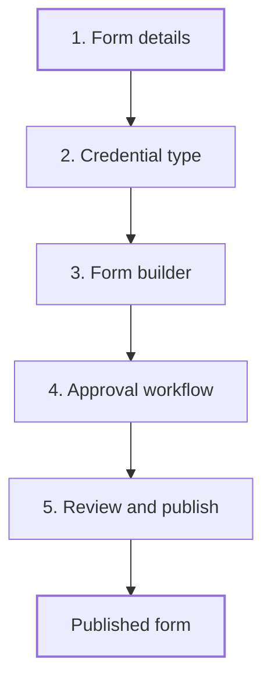

The Form manager is where you design the questions you ask issuers. Each form issues one credential type when it's approved, or when it's submitted for a filing. Only Organization Admins and Super Admins can use it.

## Key concepts

| Term | Meaning |
|---|---|
| **Form** | A versioned set of questions. Issuers answer it to create an [application](/proof/applications). |
| **Form type** | **Application** needs your review before the credential is issued. **Filing** issues it on submit. |
| **Credential recipient** | **Issuer** gives the credential to the organization. **Asset** gives it to a token. |
| **Credential type** | What the form issues, for example *Know Your Issuer*. See [Credentials](/proof/credentials). |
| **Approval workflow** | The ordered list of members who must approve. See [Approval workflow](/proof/approval-workflow). |
| **Published** | Live and available to issuers. |

## How it works

The editor has five steps. You can move back and forth until you publish.

## Create a form

<Steps>
  <Step title="Open the Form manager">
    Click **Form manager** in the sidebar. The list shows each form's type, credential type, recipient and status. Click **Create form** (1), or click a form (2) to edit it.

    <Frame caption="The Form manager list">
      
    </Frame>
  </Step>
  <Step title="Fill in the form details">
    Enter a **Form Name** (1) and a **Description** (2). Pick a **Form Type**: **Application** (3) or **Filing**. Pick a **Credential Recipient**: **Issuer** (4) or **Asset**. Click **Create** (5).

    <Frame caption="Step 1: Form details">
      
    </Frame>
  </Step>
  <Step title="Pick the credential type">
    Choose a type from **Credential** (1). If none fits, click **Create Credential** (2). When the form is approved, or submitted for a filing, a credential of this type is written to the on-chain registry.

    <Frame caption="Step 2: Credential type">
      
    </Frame>
  </Step>
  <Step title="Build the form">
    Add and configure fields. See [Form builder](/proof/form-builder).
  </Step>
  <Step title="Set the approval workflow">
    Add the members who approve, in order. See [Approval workflow](/proof/approval-workflow).
  </Step>
  <Step title="Review and publish">
    Check the **Form Summary** (1): name, description, form type, credential recipient and credential type. Click **Publish** (2) to make the form available for submissions.

    <Frame caption="Step 5: Review and publish">
      
    </Frame>
  </Step>
</Steps>

## Reference

### Form details

| Field | Required | Values |
|---|---|---|
| **Form Name** | Yes | Free text |
| **Description** | No | Free text |
| **Form Type** | Yes | **Application**: requires regulator review and approval before the credential is issued. **Filing**: issued automatically on issuer submission, no approval. |
| **Credential Recipient** | Yes | **Issuer**: entity-level certifications, for example a licence or KYI. **Asset**: asset-level certifications, for example reserve proof or a listing permit. |

### Form list columns

| Column | Shows |
|---|---|
| **Name** | Form name and description |
| **Type** | Application or Filing |
| **Credential type** | The credential the form issues |
| **Recipient** | Issuer or Asset |
| **Status** | For example **Published** |

### Who can do what

| Action | Super Admin | Organization Admin | Reviewer | Analyst |
|---|---|---|---|---|
| Open the Form manager | Yes | Yes | No | No |
| Create, edit, publish forms | Yes | Yes | No | No |

## Worked example

You want issuers to apply for a licence. You click **Create form** and name it *Example licence application*. You choose **Application** so every submission is reviewed, and **Issuer** because the licence belongs to the company. You pick the *Know Your Issuer* credential type, add fields for legal name, address, website and contact email, and set two approvers. On **Review & publish** you check the summary and click **Publish**.

## Errors and troubleshooting

| Problem | Cause | What to do |
|---|---|---|
| **Form manager** isn't in the sidebar | You're a Reviewer or Analyst | Ask an admin. |
| No credential type to pick | None exists yet | Click **Create Credential**. See [Credentials](/proof/credentials#create-a-credential-type). |
| Submissions skip review | The form type is **Filing** | Use **Application** if you need review. |

## FAQ

<AccordionGroup>
  <Accordion title="Application or Filing: which should I use?">
    Use **Application** when a person must decide, such as a licence. Use **Filing** for disclosures you accept as submitted.
  </Accordion>
  <Accordion title="Can one form issue two credential types?">
    No. A form has one credential type. Create a second form for a second type.
  </Accordion>
  <Accordion title="Do issuers see the approval workflow?">
    The workflow assigns reviewers inside your organization. It isn't part of the questions issuers answer.
  </Accordion>
</AccordionGroup>

## Related pages

- [Form builder](/proof/form-builder)
- [Approval workflow](/proof/approval-workflow)
- [Credentials](/proof/credentials)
- [Applications](/proof/applications)
