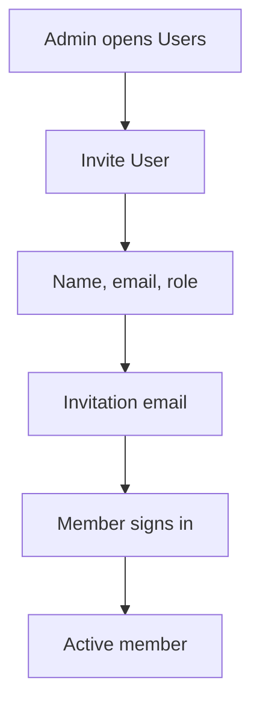

Members are the people in your organization who use the Compliance Hub. Organization Admins and Super Admins invite them and set their role. Every member manages their own name, email and password in **Account settings**.

## Key concepts

| Term | Meaning |
|---|---|
| **Member** | A person in your organization |
| **Role** | What a member can do. One of Super Admin, Organization Admin, Reviewer or Analyst. |
| **Status** | **Active**, or **Archived** for a removed member. Archived rows are struck through. |
| **Invitation** | The email a new member gets to join with their role |

## How it works

## Invite a member

<Steps>
  <Step title="Open Users">
    Go to **Users** at `compliance.bluprynt.com/users`, or click **Invite team members** on the [dashboard](/proof/dashboard). The list shows each member's name, email, role (2), status and when they were added. Click **Invite User** (1).

    <Frame caption="Users">
      
      
    </Frame>
  </Step>
  <Step title="Fill in the invitation">
    Enter **First Name** (1), **Last Name** and **Email**. Pick a **Role** (2). Click **Add user** (3). The member gets an email to join your organization with that role.

    <Frame caption="Invite User">
      
      
    </Frame>
  </Step>
</Steps>

## Your account settings

<Steps>
  <Step title="Open Account settings">
    Click your avatar in the top right, then **Profile**.
  </Step>
  <Step title="Change your details">
    Use **Change Name** (1), **Change Email** (2) or **Change Password** (3). Each section has its own **Save** button. Changing your password needs your current password.

    <Frame caption="Account settings">
      
      
    </Frame>
  </Step>
</Steps>

The avatar menu also has **Toggle theme** for light or dark mode, and **Logout**.

## Reference

### Roles

| Role | Can do |
|---|---|
| **Super Admin** | Everything an Organization Admin can, plus manage members of other organizations. Assigned as the fallback approver. |
| **Organization Admin** | Use the Form manager, create credential types, invite and manage members |
| **Reviewer** | Review applications assigned to them |
| **Analyst** | Use the Dashboard, Applications, Watchlist and Credentials |

### Permissions

| Area | Super Admin | Organization Admin | Reviewer | Analyst |
|---|---|---|---|---|
| Dashboard, Applications, Watchlist, Credentials | Yes | Yes | Yes | Yes |
| Form manager | Yes | Yes | No | No |
| New credential type | Yes | Yes | No | No |
| Users | Yes | Yes | No | No |
| Approve, decline, request information | When assigned | When assigned | When assigned | When assigned |

## Worked example

Your team adds a new reviewer. An Organization Admin clicks **Invite User**, enters her name and work email, picks **Reviewer**, and clicks **Add user**. She accepts the email and signs in. The admin adds her to a form's [approval workflow](/proof/approval-workflow), so new applications are assigned to her.

## Errors and troubleshooting

| Problem | Cause | What to do |
|---|---|---|
| You can't open **Users** | You're a Reviewer or Analyst | Ask an admin. |
| The invite email didn't arrive | Wrong address, or spam filter | Check the address in **Users**. |
| A member is struck through | They were removed and are **Archived** | Invite them again if they need access. |

## FAQ

<AccordionGroup>
  <Accordion title="What happens to applications assigned to an archived member?">
    The [approval workflow](/proof/approval-workflow) skips inactive members and assigns the next active approver.
  </Accordion>
</AccordionGroup>

## Related pages

- [Sign in and access](/proof/sign-in)
- [Approval workflow](/proof/approval-workflow)
- [Dashboard](/proof/dashboard)
