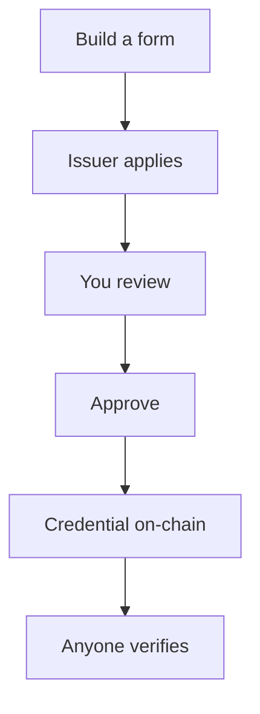

<Frame caption="Product design: the Compliance Hub dashboard.">
  
</Frame>

Bluprynt Proof, at [compliance.bluprynt.com](https://compliance.bluprynt.com), is the Compliance Hub for regulators and other supervisors. You build forms, review what issuers submit through [Bluprynt Passport](/passport/overview), watch the assets you supervise, and issue credentials that anyone can check on-chain.

<Info>
Bluprynt Proof is in early access. Ask [product@bluprynt.com](mailto:product@bluprynt.com) for an organization.
</Info>

## Key concepts

Every term used across Bluprynt Proof is defined in [Concepts](/proof/concepts).

## How it works

## Get started

<CardGroup cols={2}>
  <Card title="Sign in and access" icon="log-in" href="/proof/sign-in">Sign in, reset your password and see what each role can do.</Card>
  <Card title="Dashboard" icon="house" href="/proof/dashboard">Set up supervision and see your monitored assets.</Card>
  <Card title="Members and settings" icon="users" href="/proof/members">Invite members, set roles and manage your account.</Card>
</CardGroup>

## Forms and applications

<CardGroup cols={2}>
  <Card title="Form manager" icon="file-pen" href="/proof/form-manager">Create a form, pick its type and credential, and publish.</Card>
  <Card title="Form builder" icon="list-check" href="/proof/form-builder">Every field type, validation and condition.</Card>
  <Card title="Approval workflow" icon="user-check" href="/proof/approval-workflow">Set who approves, and in what order.</Card>
  <Card title="Applications" icon="folder-open" href="/proof/applications">Find, filter, read and review applications.</Card>
  <Card title="Application states" icon="network" href="/proof/application-states">Every state, who moves it and how.</Card>
</CardGroup>

## Watchlist

<Frame caption="Product design: the Watchlist.">
  
</Frame>

<CardGroup cols={2}>
  <Card title="Watchlist" icon="network" href="/proof/registry">Your supervised issuers, assets and credentials.</Card>
  <Card title="Watchlist assets" icon="coins" href="/proof/watchlist-assets">Add tokens one at a time or by CSV. Read the asset graph.</Card>
  <Card title="Watchlist issuers" icon="building" href="/proof/watchlist-issuers">Add issuers, read their profile and request forms.</Card>
</CardGroup>

## Credentials

<Frame caption="Product design: an asset graph.">
  
</Frame>

<CardGroup cols={2}>
  <Card title="Credentials" icon="id-card" href="/proof/credentials">Credential types, issuance, contents and verification.</Card>
</CardGroup>

## Who uses what

| Role | Main areas |
|---|---|
| **Super Admin** | Everything, plus members of other organizations |
| **Organization Admin** | Form manager, credential types, members |
| **Reviewer** | Applications assigned to them |
| **Analyst** | Dashboard, Applications, Watchlist, Credentials |

## Not available yet

**Activity**, **Supervisory Intelligence** and **Monitoring** appear greyed out in the sidebar. They aren't available yet.

## Related pages

- [Bluprynt Passport](/passport/overview)
- [KYI](/tools/kyi)
- [Proof of Collateral](/tools/proof-of-collateral)
- [Asset Dependency Engine](/tools/asset-dependency-engine)
