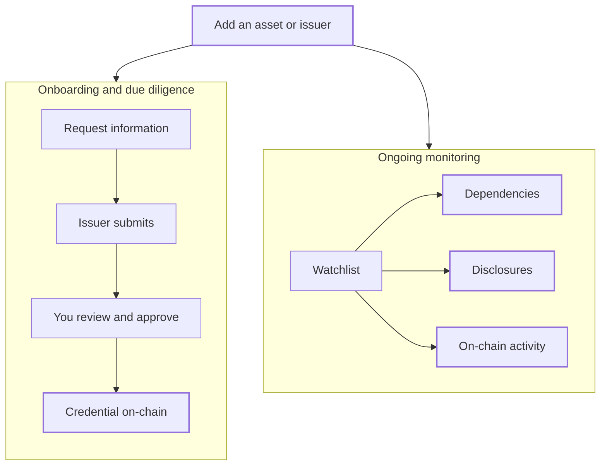

<Frame caption="Product design: the Compliance Hub dashboard.">
  
</Frame>

Bluprynt Proof, at [compliance.bluprynt.com](https://compliance.bluprynt.com), is the Compliance Hub for compliance teams that approve digital assets and oversee them after approval. It does two jobs:

- **Onboarding and due diligence.** You collect structured information from issuers, review it with your team and record the outcome as an on-chain credential.
- **Ongoing monitoring.** For every asset on your Watchlist, the Compliance Hub keeps an up-to-date view of its dependencies, its disclosures and its on-chain activity.

Issuers answer your forms through [Bluprynt Passport](/passport/overview). Anyone can check the credentials you issue.

<Info>
  Bluprynt Proof is in early access. Ask [product@bluprynt.com](mailto:product@bluprynt.com) for an organization.
</Info>

## Who it's for

When you create your organization, you pick a sector. You get the same features either way. The sector only changes how the dashboard is worded.

| Sector | Who | What you use it for |
| --- | --- | --- |
| **Public sector** | Regulators, supervisors and central banks | Licensing issuers, supervising the assets in your jurisdiction and publishing authorizations on-chain |
| **Private sector** | Exchanges, custodians, underwriters, rating agencies and investors | Onboarding assets before you list, hold or accept them, keeping a diligence record and publishing attestations on-chain |

Your workspace is private. Nothing you add is shared with a regulator or with any other organization.

## Key concepts

Every term used across Bluprynt Proof is defined in [Concepts](/proof/concepts).

## How it works

The two halves are independent. You can monitor an asset without ever sending a form, or issue credentials without monitoring anything.

## Get started

<CardGroup cols={2}>
  <Card title="Sign in and access" icon="log-in" href="/proof/sign-in">
    Sign in, reset your password and see what each role can do.
  </Card>

  <Card title="Dashboard" icon="house" href="/proof/dashboard">
    Your starting points and your monitored assets.
  </Card>

  <Card title="Members and settings" icon="users" href="/proof/members">
    Invite members, set roles and manage your account.
  </Card>
</CardGroup>

## Onboarding and due diligence

Turn your requirements into a form. Send it to an issuer. Review what comes back with the approvers you choose, then publish the result on-chain. Use an **Application** form when a person must decide, such as for a licence or a listing approval. Use a **Filing** form for disclosures you accept as submitted.

<CardGroup cols={2}>
  <Card title="Form manager" icon="file-pen" href="/proof/form-manager">
    Create a form, pick its type and credential, and publish.
  </Card>

  <Card title="Form builder" icon="list-check" href="/proof/form-builder">
    Every field type, validation and condition.
  </Card>

  <Card title="Approval workflow" icon="user-check" href="/proof/approval-workflow">
    Set who approves, and in what order.
  </Card>

  <Card title="Applications" icon="folder-open" href="/proof/applications">
    Find, filter, read and review applications.
  </Card>

  <Card title="Application states" icon="network" href="/proof/application-states">
    Every state, who moves it and how.
  </Card>

  <Card title="Credentials" icon="id-card" href="/proof/credentials">
    Credential types, issuance, contents and verification.
  </Card>
</CardGroup>

## Ongoing monitoring

<Frame caption="Product design: the Watchlist.">
  
</Frame>

Add an asset to your Watchlist by its contract address and network. Within minutes the Compliance Hub starts reading it. It keeps the asset page up to date, so you don't have to collect the data again.

| What you monitor | What you see | Where |
| --- | --- | --- |
| **Dependencies** | The asset graph: collateral, yield sources, oracles and controllers behind the token, each marked resolved, awaiting issuer or indeterminate | Asset page, **Reserves** tab |
| **Disclosures** | What the issuer declared next to what's observed on-chain, such as the backing ratio, plus the issuer's latest filing | Asset page, **Compliance** and **Overview** tabs |
| **On-chain activity** | Mint and burn, markets and venues, holders, and admin controls such as pause rights, mint control, upgrade authority and timelocks | Asset page, **Performance**, **Markets** and **Governance & Control** tabs |

<Frame caption="Product design: an asset graph.">
  
</Frame>

<CardGroup cols={2}>
  <Card title="Watchlist" icon="network" href="/proof/registry">
    Your monitored issuers, assets and credentials.
  </Card>

  <Card title="Watchlist assets" icon="coins" href="/proof/watchlist-assets">
    Add tokens one at a time or by CSV. Read the asset page and graph.
  </Card>

  <Card title="Watchlist issuers" icon="building" href="/proof/watchlist-issuers">
    Add issuers, read their profile and request forms.
  </Card>
</CardGroup>

<Note>
  The Compliance Hub doesn't send alerts yet. You see the latest state when you open an asset. To get notified when an issuer's disclosures change, use [Disclosure Monitoring](/tools/disclosure-monitoring) in Compliance Explorer.
</Note>

## Who uses what

| Role | Main areas |
| --- | --- |
| **Super Admin** | Everything, plus members of other organizations |
| **Organization Admin** | Form manager, credential types, members |
| **Reviewer** | Applications assigned to them |
| **Analyst** | Dashboard, Applications, Watchlist, Credentials |

## Not available yet

**Activity**, **Supervisory Intelligence** and **Monitoring** appear greyed out in the sidebar. They aren't available yet. Monitoring on the Watchlist and asset pages works today.

## Related pages

- [Bluprynt Passport](/passport/overview)
- [KYI](/tools/kyi)
- [Proof of Collateral](/tools/proof-of-collateral)
- [Asset Dependency Engine](/tools/asset-dependency-engine)
- [Disclosure Monitoring](/tools/disclosure-monitoring)
