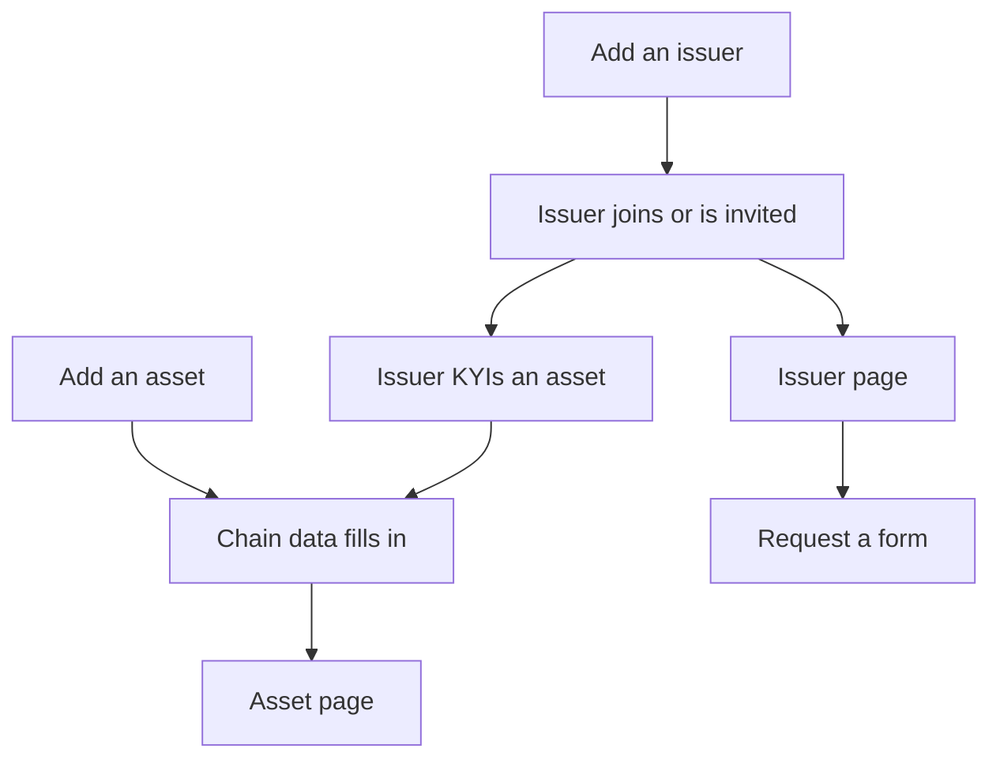

The Watchlist is your organization's list of supervised issuers, monitored assets and issued credentials. It was called **Registry** in earlier versions, and its pages still live under `/registry`. Use it to add what you supervise and to open each issuer's or asset's detail page.

## Key concepts

| Term | Meaning |
|---|---|
| **Issuer** | An organization on your Watchlist. Shown on the **Issuers** tab and counted as **Organizations**. |
| **Asset** | A token you monitor, identified by its contract address and network |
| **Credential** | A credential your organization issued to an issuer or asset |
| **Chain data** | Facts read from the blockchain, filled in automatically |
| **Issuer filings** | Facts the issuer provides through your forms. Blank until they're on the platform and file. |

## How it works

When an issuer on your Watchlist completes [KYI](/tools/kyi) for an asset, that asset joins your monitored list automatically.

## Use the Watchlist

<Steps>
  <Step title="Open the Watchlist">
    Click **Watchlist** in the sidebar. The counters (4) show how many organizations, assets and credentials you supervise.

    <Frame caption="The Watchlist">
      
    </Frame>
  </Step>
  <Step title="Add an asset">
    Click **Add asset** under **Add an asset** (1). See [Watchlist assets](/proof/watchlist-assets).
  </Step>
  <Step title="Add an issuer">
    Click **Add issuer** under **Add an issuer** (2). See [Watchlist issuers](/proof/watchlist-issuers).
  </Step>
  <Step title="Switch tabs">
    Use **Issuers**, **Assets** and **Credentials** (3) to switch the table. Click a row to open its detail page.
  </Step>
</Steps>

## Reference

### Tabs

| Tab | Columns |
|---|---|
| **Issuers** | Organization, Jurisdiction, Website, Status, Registered On |
| **Assets** | Asset, Domicile, Status, Created On |
| **Credentials** | Credential, Asset, Jurisdiction, Status, Issued On, Expires On |

### Detail pages

| Page | Opens from | Tabs |
|---|---|---|
| Issuer | **Issuers** tab, or **Entity Details** on an application | Overview, Assets, Applications, Credentials, Entity & Governance |
| Asset | **Assets** tab, or the dashboard | Overview, Performance, Markets, Reserves, Compliance, Risk Assessment, Governance & Control |

## Worked example

A new stablecoin launches in your jurisdiction. You click **Add asset** and enter its contract address on Ethereum. Its chain data fills in within minutes. The issuer isn't linked yet, so you click **Add issuer**, find nothing and invite them by email. Once they complete KYI, the issuer appears on the **Issuers** tab and you send them your disclosure form.

## Errors and troubleshooting

| Problem | Cause | What to do |
|---|---|---|
| **No data available** | Nothing added yet | Add an asset or issuer. |
| Reserves and disclosures are blank | The issuer hasn't filed | [Request a form](/proof/watchlist-issuers#request-a-form). |
| An asset shows the wrong token | Wrong network picked | Add it again with the right network. |

## FAQ

<AccordionGroup>
  <Accordion title="Can other organizations see my Watchlist?">
    No. Your workspace is private to your organization.
  </Accordion>
</AccordionGroup>

## Related pages

- [Watchlist assets](/proof/watchlist-assets)
- [Watchlist issuers](/proof/watchlist-issuers)
- [Credentials](/proof/credentials)
- [Asset Dependency Engine](/tools/asset-dependency-engine)
