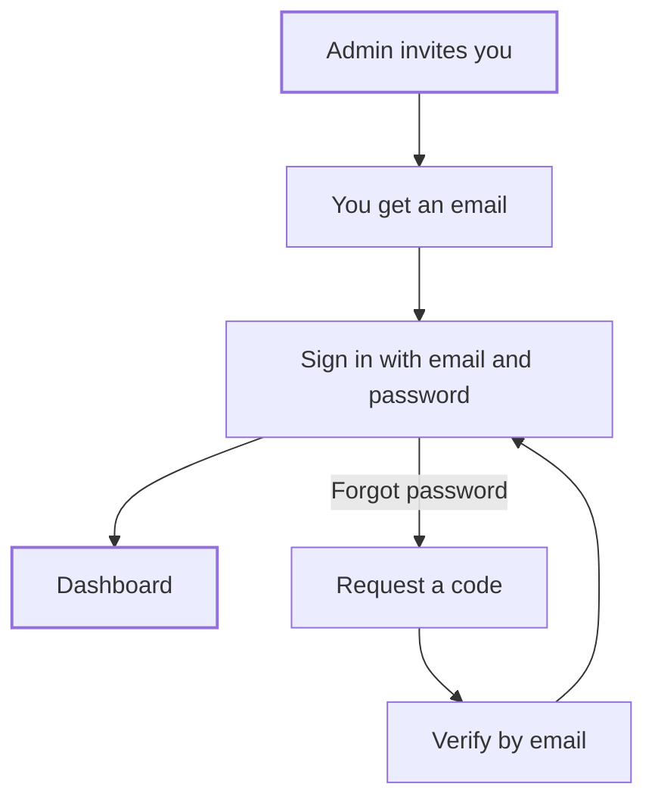

The Compliance Hub is the web app for Bluprynt Proof, at [compliance.bluprynt.com](https://compliance.bluprynt.com). Members of a regulator or supervisor organization sign in here to review applications, watch assets and issue credentials. Access is by invitation only during early access.

## Key concepts

| Term | Meaning |
|---|---|
| **Organization** | Your supervising body in the Compliance Hub. Every member, form, application and credential belongs to one organization. |
| **Member** | A person invited to your organization. Each member has one role. |
| **Role** | Super Admin, Organization Admin, Reviewer or Analyst. The role decides which pages you see. |
| **Invitation** | An email an admin sends from **Users**. You can't sign up without one. |

## How it works

## Sign in

<Steps>
  <Step title="Open the sign-in page">
    Go to [compliance.bluprynt.com](https://compliance.bluprynt.com). Enter the email your invitation was sent to in **Email** (1). Enter your password in **Password** (2).

    <Frame caption="The Compliance Hub sign-in page">
      
      
    </Frame>
  </Step>
  <Step title="Choose whether to stay signed in">
    Tick **Remember me** (3) on a device only you use. Leave it clear on a shared computer.
  </Step>
  <Step title="Sign in">
    Click **Login** (5). The Compliance Hub opens on the [dashboard](/proof/dashboard).
  </Step>
</Steps>

## Reset your password

<Steps>
  <Step title="Open Forgot password">
    On the sign-in page, click **Forgot password?** (4). The **Restore Password** page opens.
  </Step>
  <Step title="Request a code">
    Enter your email (1) and click **Request Code** (2). Follow the email to set a new password.

    <Frame caption="Restore Password: request a verification code by email">
      
      
    </Frame>
  </Step>
  <Step title="Sign in again">
    Click **Back to sign-in** and sign in with your new password. The reset signs you out of your other sessions.
  </Step>
</Steps>

## Roles and access

The sidebar shows only the areas your role can use.

| Area | Super Admin | Organization Admin | Reviewer | Analyst |
|---|---|---|---|---|
| Dashboard, Applications, Watchlist, Credentials | Yes | Yes | Yes | Yes |
| **Form manager** | Yes | Yes | No | No |
| **Users** (invite and manage members) | Yes | Yes | No | No |
| Approve, decline or request information | When assigned | When assigned | When assigned | When assigned |

Review actions also need you to be the **assigned reviewer** on the application. See [Application states](/proof/application-states).

### Areas that aren't available yet

**Activity**, **Supervisory Intelligence** and **Monitoring** appear greyed out in the sidebar. They aren't available yet.

## Worked example

Your Organization Admin invites you as a Reviewer. You open the invitation email, go to [compliance.bluprynt.com](https://compliance.bluprynt.com) and sign in. The sidebar shows **Dashboard**, **Applications**, **Watchlist** and **Credentials**, but not **Form manager**. That's expected for a Reviewer.

## Errors and troubleshooting

| Problem | Cause | What to do |
|---|---|---|
| You can't sign in | Wrong email, wrong password, or no invitation yet | Use the email the invitation went to. Reset your password if needed. |
| **Form manager** is missing | Your role is Reviewer or Analyst | Ask an admin to change your role. |
| A sidebar item is greyed out | The area isn't available yet | Nothing to do. |

## Related pages

- [Dashboard](/proof/dashboard)
- [Members and settings](/proof/members)
- [Bluprynt Proof overview](/proof/overview)
