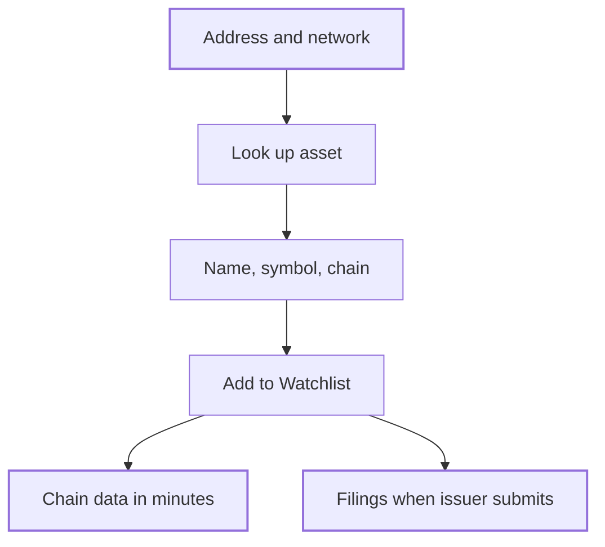

Assets are the tokens you supervise. You add each by its contract address and network, and the Compliance Hub reads what it can from chain. Use this page to add assets and to understand the asset page and its reserve graph.

## Key concepts

| Term | Meaning |
|---|---|
| **Token address** | The asset's contract address |
| **Network** | The chain the contract is on. The same address can be a different token on every chain. |
| **Domicile** | Where the asset is legally based, when known |
| **Issuer link** | The organization behind the asset. *Not linked* until you attach one. |
| **Asset graph** | The asset's reserves and dependencies, shown as a graph on the **Reserves** tab |

## How it works



There's no name search. An address and a network together are the only unambiguous identifier. If you don't have them, find the asset in the public [Compliance Explorer](/explorer/overview) or ask the issuer.

## Add one asset

<Steps>
  <Step title="Choose Asset">
    On the Watchlist, click **Add asset**, then **Asset** (1). Pick **Assets in bulk** (2) to upload a CSV instead.

    <Frame caption="Add asset options">
      
    </Frame>
  </Step>
  <Step title="Enter the address and network">
    Paste the **Token address** (1). Pick the network (2). Click **Look up asset** (3).

    <Frame caption="Look up an asset by address and network">
      
    </Frame>
  </Step>
  <Step title="Check the result and add it">
    Check the name and symbol (1), chain and domicile. **Issuer** reads *Not linked — attach later* (2) if no issuer is known. Click **Add to registry** (3).

    <Frame caption="Lookup result">
      
    </Frame>
  </Step>
</Steps>

## Add assets in bulk

<Steps>
  <Step title="Prepare the CSV">
    Click **Add asset**, then **Assets in bulk**. Click **Download template** (2) for the right columns: `address` and `chain`, both required.

    <Frame caption="Import assets from CSV">
      
    </Frame>
  </Step>
  <Step title="Upload it">
    Drop the file on the drop zone (1) or browse to it. Up to 500 addresses per file.
  </Step>
  <Step title="Validate">
    Click **Upload and validate** (3). Everything except address and network is read from chain.
  </Step>
</Steps>

```csv assets.csv
address,chain
0xA0b86991c6218b36c1d19D4a2e9Eb0cE3606eB48,ethereum
```

## The asset page

Click an asset on the **Assets** tab to open it. The page has these tabs:

| Tab | Shows |
|---|---|
| **Overview** | Issuer, **Credentials & Lifecycle**, **Evidence & Verification** and **Documentation** |
| **Performance** | Mint and burn over the period, redemptions, and yield and pricing cadence |
| **Markets** | Markets and venues: venue, pair, type and when last seen |
| **Reserves** | The asset graph of its backing |
| **Compliance** | How the issuer's disclosures line up, with a shortcut to request a form |
| **Risk Assessment** | The asset's risk posture |
| **Governance & Control** | Admin and mint controls, and smart contract integrity |

### Asset graph states

The **Reserves** tab draws the asset's backing as a graph. Each part has a state:

| State | Meaning |
|---|---|
| **Resolved** | Found and confirmed |
| **Nothing yet** | No data so far |
| **Awaiting issuer** | Needs the issuer to file |
| **Indeterminate** | Data exists but doesn't settle the question |
| **Unavailable** | Couldn't be read |

If the graph can't load, the tab says *Asset graph could not be loaded* or *Asset graph is not yet available*. See the [Asset Dependency Engine](/tools/asset-dependency-engine) for how dependencies are found.

## Reference

### Supported networks

Ethereum, Base, Polygon, Arbitrum One, Optimism, BNB Smart Chain, Avalanche C-Chain, Solana, Aptos, Arbitrum Nova, Blast, Celo, Codex, HyperEVM, Ink, Linea, Mantle, Monad, Plume, Scroll, Sei, Sonic, Stellar, Unichain, World Chain, XDC, XRP Ledger and ZKsync Era.

### Limits

| Limit | Value |
|---|---|
| Addresses per CSV | 500 |
| CSV columns | `address`, `chain` (both required) |
| Chain data delay | Starts within minutes |

## Worked example

You add USDC by pasting `0xA0b86991c6218b36c1d19D4a2e9Eb0cE3606eB48` and picking **Ethereum**. The lookup returns *USD Coin*, symbol *USDC*, domicile blank and issuer not linked. You click **Add to registry**. Within minutes the asset appears on the dashboard with its chain data. Its reserves stay **Awaiting issuer** until the issuer files.

## Errors and troubleshooting

| Problem | Cause | What to do |
|---|---|---|
| **Look up asset** stays disabled | Address or network is missing | Fill both. |
| Wrong token returned | Wrong network | Pick the network the contract is on. |
| Reserves are **Awaiting issuer** | The issuer hasn't filed | [Request a form](/proof/watchlist-issuers#request-a-form). |
| CSV doesn't validate | Missing column, or over 500 rows | Use the template. Split large files. |

## FAQ

<AccordionGroup>
  <Accordion title="Can I search for an asset by name?">
    No. Use the address and network. Find them in the [Compliance Explorer](/explorer/overview).
  </Accordion>
  <Accordion title="Do I need the issuer to add an asset?">
    No. Chain data fills in without them. Filings stay blank until they submit.
  </Accordion>
</AccordionGroup>

## Related pages

- [Watchlist](/proof/registry)
- [Watchlist issuers](/proof/watchlist-issuers)
- [Asset Dependency Engine](/tools/asset-dependency-engine)
- [Proof of Collateral](/tools/proof-of-collateral)
