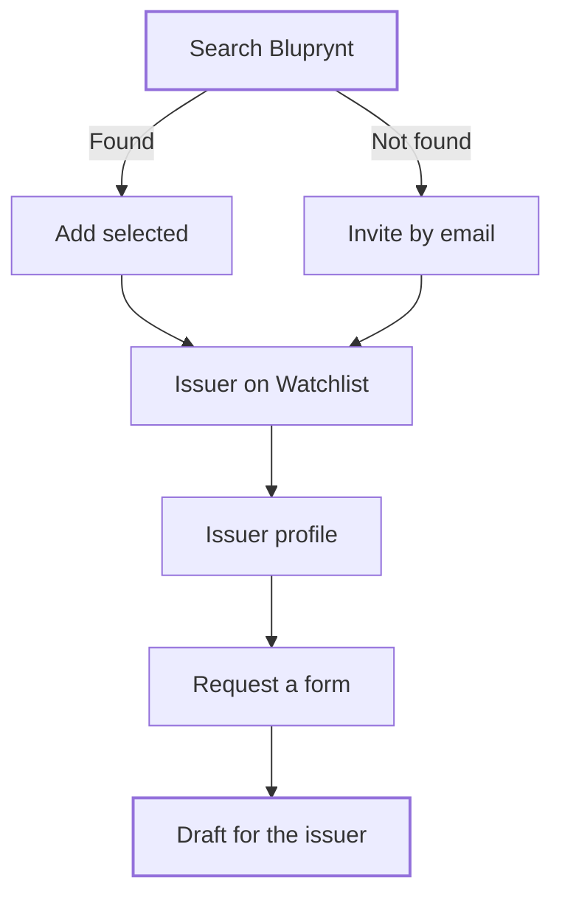

Issuers are the organizations you supervise. Add them from the Watchlist, open their profile to see their assets, applications and credentials, and send them the forms you need answered. Their profile pulls together what Bluprynt knows about them.

## Key concepts

| Term | Meaning |
|---|---|
| **Issuer** | An organization that issues assets. In Bluprynt it's an identity of type *issuer*. |
| **Invitation** | An email that brings an issuer onto Bluprynt under the organization name you typed |
| **Request a form** | Sending a published form to an issuer. They get it as a draft to complete and submit. |
| **Compliance profile** | Checks about the issuer: sanctions, licensing, KYI, filings, adverse media and wallet provenance |

## How it works

## Add an issuer

<Steps>
  <Step title="Search for the organization">
    On the Watchlist, click **Add issuer**. Type at least two characters in the search box (1). It matches name, email, description or website.

    <Frame caption="Add an issuer">
      
      
    </Frame>
  </Step>
  <Step title="Invite them if they aren't found">
    Under **Not finding them?**, type their email (2) and click **Invite by email**. Type the organization's name in the search box first. The invitation is created under that name.
  </Step>
  <Step title="Add them">
    Tick one or more results and click **Add selected** (3).
  </Step>
</Steps>

## Read an issuer's profile

<Steps>
  <Step title="Open the profile">
    Click an issuer on the **Issuers** tab, or **Entity Details** on an application. Use the tabs (1) to move between sections. **Assets** lists the assets this issuer brought to the registry (2), with each one's chain, KYI and Proof of Collateral status.

    <Frame caption="An issuer's assets">
      
      
    </Frame>
  </Step>
  <Step title="Check their applications">
    Click **Applications** to see every application the issuer submitted, with its form, asset, reviewer and status.

    <Frame caption="An issuer's applications">
      
      
    </Frame>
  </Step>
</Steps>

## Request a form

<Steps>
  <Step title="Pick the form">
    On the issuer's profile, click **Request a form** under **Quick actions**. Search for a published form and click **Select** (1).

    <Frame caption="Request a form">
      
      
    </Frame>
  </Step>
  <Step title="Send it">
    Click **Send request** (2). The issuer receives the form as a **Draft** to complete and submit. It then appears in [Applications](/proof/applications).
  </Step>
</Steps>

## Reference

### Profile tabs

| Tab | Shows |
|---|---|
| **Overview** | Compliance profile, entity information, business activities, licences and authorizations, documents and disclosures, quick stats and a compliance checklist |
| **Assets** | Assets issued: Asset, Chain, KYI, Proof of Collateral, Created On |
| **Applications** | Applications submitted: Date / ID, Credential / Form, Asset, Reviewer, Status |
| **Credentials** | Credentials issued to the organization |
| **Entity & Governance** | Legal entity and governance details |

### Compliance profile checks

| Check | What it covers |
|---|---|
| **Sanctions** | Sanctions screening |
| **Licensed** | Licences and authorizations held |
| **KYI verification** | Whether the issuer holds a [KYI](/tools/kyi) credential |
| **Filings** | Regulatory filings found |
| **Adverse media** | Negative news coverage |
| **Wallet provenance** | Where the issuer's wallets come from |

## Worked example

You need a disclosure from an issuer already on Bluprynt. You click **Add issuer**, type part of their name, tick the result and click **Add selected**. On their profile, **Overview** shows their KYI verification. You click **Request a form**, select your disclosure form and click **Send request**. Their draft appears in **Applications** as **Draft** until they submit.

## Errors and troubleshooting

| Problem | Cause | What to do |
|---|---|---|
| No search results | Fewer than two characters, or the issuer isn't on Bluprynt | Type more, or invite them by email. |
| The invitation has the wrong name | The search box held a different name | Type the organization's name before you invite. |
| *Unable to load entity details* | Some profile data isn't available for this issuer | Use the other tabs. Ask the issuer to complete KYI. |
| No forms to request | No published forms | Publish one in the [Form manager](/proof/form-manager). |

## FAQ

<AccordionGroup>
  <Accordion title="Does an issuer's asset join my Watchlist automatically?">
    Yes. When an issuer on your Watchlist completes KYI for an asset, it joins your monitored list.
  </Accordion>
  <Accordion title="Can I request the same form twice?">
    Each request creates a new draft for the issuer.
  </Accordion>
  <Accordion title="Where does the compliance profile come from?">
    It combines the issuer's KYI with Bluprynt's checks. See [KYI](/tools/kyi).
  </Accordion>
</AccordionGroup>

## Related pages

- [Watchlist](/proof/registry)
- [Watchlist assets](/proof/watchlist-assets)
- [Applications](/proof/applications)
- [KYI](/tools/kyi)
