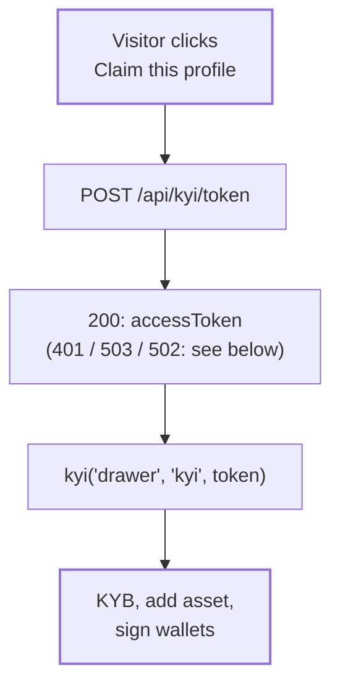

This example comes from the [Compliance Explorer](/explorer/overview) integration (`BLU-4627`). An asset page that no issuer has claimed shows a **Claim this profile** button. The button opens the KYI drawer, so the issuer can verify and claim the asset without leaving Explorer.

<Note>This integration is in review and isn't live on explorer.bluprynt.com yet. The code below is the reviewed implementation, shortened. Use it as a template for your own app.</Note>

## What it does



## 1. Configuration

The partner credentials are server-only environment variables. If either one is missing, the drawer is off and the page keeps its previous claim flow, so a missing configuration never breaks the page.

```ts features/kyi-drawer/model/config.ts
import 'server-only'

export interface KyiPartnerConfig {
  partnerId: string // KYI_PARTNER_ID → the token's iss
  secretKey: string // KYI_SECRET_KEY → HS256 key
}

export function readKyiPartnerConfig(env = process.env): KyiPartnerConfig | null {
  const partnerId = env.KYI_PARTNER_ID?.trim()
  const secretKey = env.KYI_SECRET_KEY?.trim()
  return partnerId && secretKey ? { partnerId, secretKey } : null
}
```

## 2. The token handler

The handler is plain TypeScript with its dependencies passed in, so you can unit-test it without Next.js. `sub` is the signed-in researcher's stable account ID from the session cookie. It never comes from the request.

```ts features/kyi-drawer/api/token-handler.ts
import 'server-only'
import { generateToken } from '@bluprynt/kyi-widget-sdk/server'
import type { KyiPartnerConfig } from '../model/config'

export const KYI_TOKEN_TTL_SECONDS = 3600 // a fresh token is minted every time the drawer opens

export async function issueKyiAccessToken({
  config,
  resolveResearcher,
  sign = generateToken,
}: {
  config: KyiPartnerConfig | null
  resolveResearcher: () => Promise<{ id: string } | null>
  sign?: typeof generateToken
}) {
  if (config == null) {
    return { status: 503, body: { code: 'kyi_unconfigured', message: 'KYI verification is not available yet' } }
  }
  const researcher = await resolveResearcher()
  if (researcher == null || researcher.id.trim() === '') {
    return { status: 401, body: { code: 'unauthorized', message: 'Sign in to claim this asset' } }
  }
  try {
    const accessToken = await sign({
      issuer: config.partnerId,
      secretKey: config.secretKey,
      userId: researcher.id,
      expiresIn: KYI_TOKEN_TTL_SECONDS,
    })
    return { status: 200, body: { accessToken } }
  } catch {
    return { status: 502, body: { code: 'token_failed', message: 'Could not start verification right now' } }
  }
}
```

## 3. The route

```ts app/api/kyi/token/route.ts
import { NextResponse } from 'next/server'
import { getResearcherSession } from '@/entities/researcher/model/session'
import { issueKyiAccessToken } from '@/features/kyi-drawer/api/token-handler'
import { readKyiPartnerConfig } from '@/features/kyi-drawer/model/config'

export async function POST() {
  const result = await issueKyiAccessToken({
    config: readKyiPartnerConfig(),
    resolveResearcher: getResearcherSession,
  })
  return NextResponse.json(result.body, {
    status: result.status,
    headers: { 'cache-control': 'no-store' },
  })
}
```

### Responses

| Status | Body | Meaning | What the page does |
|---|---|---|---|
| `200` | `{ "accessToken": "eyJ…" }` | Token signed. | Opens the drawer. |
| `401` | `{ "code": "unauthorized", "message": "Sign in to claim this asset" }` | No session. | Shows the sign-in dialog, then retries once. |
| `503` | `{ "code": "kyi_unconfigured", "message": "KYI verification is not available yet" }` | `KYI_PARTNER_ID` or `KYI_SECRET_KEY` isn't set. | Falls back to the in-page claim flow. |
| `502` | `{ "code": "token_failed", "message": "Could not start verification right now" }` | `generateToken()` threw. | Shows an error state. |

Every response carries `cache-control: no-store`. A token is a bearer credential for one member's verification, so no browser, CDN or proxy may cache it or serve it to someone else.

## 4. Open the drawer from the browser

The SDK loads on first click with a dynamic `import()`, so it adds nothing to the page's initial bundle.

```ts features/kyi-drawer/model/open-drawer.ts
import type { KYIOptions, KYIWidget } from '@bluprynt/kyi-widget-sdk'

type KyiTokenResult =
  | { kind: 'token'; accessToken: string }
  | { kind: 'signed-out' }
  | { kind: 'unconfigured' }
  | { kind: 'failed' }

export async function requestKyiAccessToken(): Promise<KyiTokenResult> {
  try {
    const res = await fetch('/api/kyi/token', { method: 'POST', cache: 'no-store' })
    const body = await res.json().catch(() => null)
    if (res.status === 401) return { kind: 'signed-out' }
    if (res.status === 503) return { kind: 'unconfigured' }
    if (res.status === 200 && typeof body?.accessToken === 'string' && body.accessToken) {
      return { kind: 'token', accessToken: body.accessToken }
    }
    return { kind: 'failed' }
  } catch {
    return { kind: 'failed' }
  }
}

export async function openKyiDrawer(accessToken: string, options: KYIOptions): Promise<KYIWidget> {
  const { kyi } = await import('@bluprynt/kyi-widget-sdk')
  return kyi('drawer', 'kyi', accessToken, options)
}
```

## 5. A React hook

The hook makes sure only one drawer is ever open, retries once after sign-in, and destroys the drawer when the component unmounts.

```tsx features/kyi-drawer/ui/use-kyi-drawer.ts
'use client'
import { useCallback, useEffect, useRef, useState } from 'react'
import type { KYIWidget } from '@bluprynt/kyi-widget-sdk'
import { openKyiDrawer, requestKyiAccessToken } from '../model/open-drawer'

export function useKyiDrawer({ onUnavailable }: { onUnavailable: () => void }) {
  const [status, setStatus] = useState<'idle' | 'opening' | 'open' | 'error'>('idle')
  const [signInOpen, setSignInOpen] = useState(false)
  const widgetRef = useRef<KYIWidget | null>(null)
  const busyRef = useRef(false)

  useEffect(() => () => widgetRef.current?.destroy(), []) // remove the drawer on unmount

  const launch = useCallback(async (afterSignIn: boolean) => {
    if (busyRef.current || widgetRef.current) return // one drawer at a time
    busyRef.current = true
    setStatus('opening')
    try {
      const result = await requestKyiAccessToken()
      if (result.kind === 'signed-out') {
        setStatus('idle')
        if (!afterSignIn) setSignInOpen(true)
        return
      }
      if (result.kind === 'unconfigured') {
        setStatus('idle')
        onUnavailable()
        return
      }
      if (result.kind === 'failed') {
        setStatus('error')
        return
      }
      widgetRef.current = await openKyiDrawer(result.accessToken, {
        onClose: () => {
          widgetRef.current = null // safe to call twice
          setStatus('idle')
        },
      })
      setStatus('open')
    } catch {
      setStatus('error')
    } finally {
      busyRef.current = false
    }
  }, [onUnavailable])

  return {
    status,
    open: () => void launch(false),
    signInOpen,
    onSignInOpenChange: (next: boolean) => {
      setSignInOpen(next)
      if (!next) void launch(true) // a no-op if they're still signed out
    },
  }
}
```

```tsx Claim button
const { status, open } = useKyiDrawer({ onUnavailable: showInPageClaim })

<button onClick={open} disabled={status === 'opening'}>
  {status === 'opening' ? 'Opening…' : 'Claim this profile'}
</button>
```

## Things to note

- **No prefill.** SDK `0.1.1` has no option to pass a chain or contract address, so the issuer pastes the token address into the drawer themselves, even when they start from that asset's page.
- **Several buttons, one drawer.** Explorer shows a claim link in the asset header and a claim banner. Both send an in-page `CustomEvent` (`explorer:asset-claim-request`) to one component that owns the drawer, so two clicks never open two drawers.
- **Tests.** The handler takes `config`, `resolveResearcher` and `sign` as parameters, so all four responses can be unit-tested without network calls or real keys.
- **Origins.** Every origin that renders the button, including staging and local development, has to be on the [allow-list](/sdk/security#origin-allow-list).

Related: [Access tokens](/sdk/tokens) · [API reference](/sdk/reference) · [Compliance Explorer](/explorer/overview)
