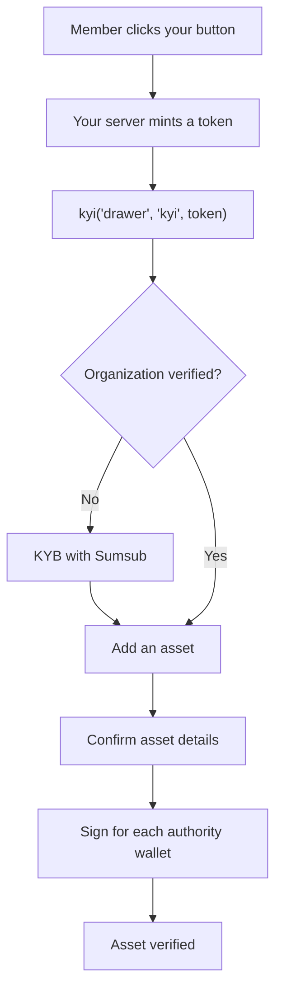

This page walks through the [KYI widget](/sdk/overview) as your members see it. It covers the `kyi` scope from launch to a verified asset, then the `asset-list` and `wallet-list` scopes.

All screenshots are from the production widget, with numbered callouts. Steps 1–3 come from the drawer opened on a test partner page. Steps 4–10 come from [Bluprynt Passport](/passport/overview): the drawer renders the same asset and wallet-signing components once KYB is done, and a fresh test organization can't reach them without filing a real KYB. Personal details are greyed out.

## Step 1: Open the drawer

Your page calls `kyi('drawer', 'kyi', accessToken)`. The drawer slides in from the right and shows where the member's organization stands.

<Frame caption="The kyi scope for a new organization.">
  
</Frame>

1. **Your button.** Any element on your page can open the widget.
2. **Progress.** Two stages: **Organization**, then **First asset**. A finished stage turns green.
3. **Organization status.** `Entity not verified` until KYB is approved.
4. **Verify organization** starts KYB.
5. **Verify your first asset** stays **Locked** until the organization is verified.
6. **Close.** The round close button, a backdrop click or `Escape` closes the drawer and fires `onClose`.

The footer reads "About five minutes · nothing is published until you sign." Nothing about the member becomes public until they sign for a wallet.

What the drawer shows depends on the organization:

| Organization state | Drawer shows |
|---|---|
| Not verified | "Start here — two steps to your first verified asset", with KYB as step 1. |
| Verified, no verified asset | Organization marked **Done** (with "matched in GLEIF" when it matched). Then "One step left — verify your first asset" and the address field. |
| Verified, with a verified asset | "You're verified": the organization line (name · KYB · GLEIF match · date) and the asset line (name · ticker · date). |

## Step 2: Verify the organization (KYB)

KYB runs once per organization. Every asset added afterwards inherits it. Bluprynt matches the company against GLEIF and the regulator's register, then asks the member for anything it couldn't resolve. The forms are provided by Sumsub.

<Frame caption="KYB opens inside the drawer.">
  
</Frame>

1. **The four KYB steps:** company details, company documents, email verification, and associated parties (directors, shareholders and beneficial owners).
2. **Start verification** opens the first form.
3. **Language.** The member can switch the form's language.

<Frame caption="Before the forms, the member agrees to Sumsub's data-processing notice.">
  
</Frame>

1. **Data-processing notice.** US residents also agree to biometric processing.
2. **Agree and continue** opens the company-details form.

Have these ready before you start:

| KYB step | Typical content |
|---|---|
| Company details | Legal name, registration number, country, registered address. |
| Company documents | Certificate of incorporation, proof of address, ownership structure. |
| Email verification | A one-time code sent to the member's email. |
| Associated parties | Directors and beneficial owners, each with their own identity check. |

<Note>Sumsub decides which documents it asks for based on country and company type. The forms are filled out by the member, not by your integration.</Note>

KYB review isn't instant. The member can close the drawer at any time. When you open it again with a new token for the same `sub`, it picks up where they left off.

## Step 3: Add an asset

After KYB, the drawer shows an address field. The member pastes a token or vault address. Bluprynt detects the chain from the address format and checks whether the asset is already on file.

<Frame caption="Shown in Passport. The drawer uses the same field.">
  
</Frame>

1. **Address field.** Accepts EVM `0x…` addresses, Solana mint addresses and XRPL issuers. See [Supported chains](/supported-chains).
2. **Detected network.** If an address is valid on several EVM networks, this becomes a menu so the member can pick one.
3. **Add asset** (**Verify** in the drawer) reads the chain. Nothing is read or created before the member presses it.

| Message under the field | Meaning |
|---|---|
| "Ethereum recognised from the address. Nothing is read until you press Verify." | The address is valid. |
| "We could not read that address on any chain we support. Check it and try again." | Unknown format or unsupported chain. |
| "USD Coin is already on your list." | The organization already has this asset. The button stays disabled. |
| "Locked — complete step 1 above to verify your first asset." | KYB isn't done yet. |

## Step 4: Confirm the asset details

Bluprynt prefills what it can from the chain and from what's already on file for the organization. The member fills in the rest.

<Frame caption="Details read for USDT on Ethereum. Shown in Passport.">
  
</Frame>

1. **The asset**, its chain and its shortened address.
2. **SOURCED** marks values Bluprynt found. Click any row to change it.
3. **NEEDED** marks values the member must provide, such as the asset image and image license.
4. The confirm button counts what's missing ("2 still needed") and turns into **Confirm** when every line is ready.

| Field | Source |
|---|---|
| Asset name, ticker | Token contract. |
| Description, white paper, website, X | Public sources and records already on file. |
| Asset image, image license | The member. They can reuse an image a source publishes or upload their own. |

Confirming creates the asset and its KYI application. Then Bluprynt reads the chain for the wallets that control the token.

## Step 5: Sign for each authority wallet

Bluprynt lists every wallet with on-chain authority over the token: owner, admin, minter, upgrade admin, or mint and freeze authority on Solana. Each wallet signs once, and one signature covers every token that wallet controls.

<Frame caption="The wallet queue for USD Coin. Shown in Passport.">
  
</Frame>

1. **Authority wallet** and its on-chain role, here `Upgrade admin`.
2. **Sign** opens the signing methods.

A wallet the member can't sign for leaves its tokens listed but unverified. If a token is controlled by a multisig, the queue shows "The multisig itself" or "Signer on the multisig". See [Wallet verification](/sdk/wallet-verification#multisig).

### Choose a signing method

<Frame caption="Signing methods for an Ethereum wallet.">
  
</Frame>

1. **Selected wallet**, with its role and status (`Unverified`).
2. **What this signature attests**: only that the member controls the address. The message is signed off-chain, so no funds move and no gas is paid. On the asset page, the authority moves from `DECLARED` to `ATTESTED`.
3. **Signing options.** See the tabs below. Some integrations also offer **Transaction Verification**, where you send a micro-ETH amount to Bluprynt's verification address. Ask your Bluprynt contact whether it's enabled for you.
4. **Next** opens the chosen method.

<Tabs>
  <Tab title="Extension wallet">
    <Frame>
      
    </Frame>

    1. **Connect Wallet** connects a browser extension wallet such as MetaMask or Phantom. Where WalletConnect is enabled for your integration, it opens the WalletConnect picker instead, for mobile wallets.
    2. **Message being signed.** It contains a purpose line, the organization it's issued to, and the address with a one-time nonce.
    3. **Expiry.** The message is valid for five minutes.
    4. **Sign Message** asks the wallet for a `personal_sign` signature.
  </Tab>
  <Tab title="Manual signature (CLI)">
    <Frame>
      
    </Frame>

    1. **Signature challenge.** Copy it whole, line breaks included. It's valid for 30 minutes.
    2. **Ready-made command.** `cast wallet sign --interactive "<challenge>"` prompts for the key, so it never lands in shell history. You can use `--keystore <path>` or `--ledger` instead.
    3. **Paste the signature** (`0x…`) and press **Submit**.

    Any tool that produces an EIP-191 `personal_sign` signature works. See [Wallet verification](/sdk/wallet-verification) for Solana and XRPL commands.
  </Tab>
  <Tab title="HSM / custody">
    <Frame>
      
    </Frame>

    1. **Memo.** From the authority wallet, submit a no-op on-chain transaction carrying this memo. No assets move.
    2. **Send the transaction link** to `product@bluprynt.com`.
    3. **Email** opens a new email to that address in your mail client. Bluprynt checks the transaction and replies. Until then, the wallet stays unverified.

    Use this when the key sits in an HSM or with a custodian that can't sign arbitrary messages. The transaction pays normal network fees.
  </Tab>
</Tabs>

When every token has a signed authority wallet, the member files the application for Bluprynt's decision. Once it's approved, the drawer shows "You're verified" and the asset shows as KYI-verified, including on its [KYI badge](/api/public/badge-recipe).

## The `asset-list` scope

`kyi('drawer', 'asset-list', token)` opens the organization's assets.

<Frame caption="asset-list for an organization that hasn't finished KYB.">
  
</Frame>

1. **Add an asset.** The same address field as in step 3.
2. **Locked** until KYB is done.
3. **Asset list.** Each asset shows its chain, address, KYI status and Proof of Collateral status, and opens its trust center. The status is the same value the public trust center computes.

## The `wallet-list` scope

`kyi('drawer', 'wallet-list', token)` opens the organization's wallets.

<Frame caption="wallet-list for a new organization.">
  
</Frame>

1. **Period.** Filter the summary by time; the default is **All time**.
2. **Counters**: total, verified, pending and revoked wallets.
3. **KYI Authenticated Wallets**: address, network, status, authentication date and actions.

| Wallet status | Meaning |
|---|---|
| Verified | The wallet's signature was accepted. |
| Pending | Verification started but isn't confirmed yet. |
| Revoked | Verification was withdrawn. |

## On phones

On narrow screens the drawer takes the full width, and the steps stack.

<Frame caption="The kyi scope at 390 px.">
  
</Frame>

1. **Progress bar.**
2. **Steps.** The same steps as on desktop.

Related: [Quickstart](/sdk/quickstart) · [Wallet verification](/sdk/wallet-verification) · [Errors and troubleshooting](/sdk/errors)
