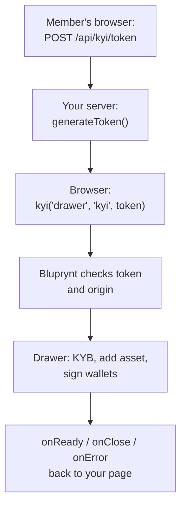

The [KYI Widget SDK](https://blupryntco.github.io/kyi-widget-sdk/index.html) (`@bluprynt/kyi-widget-sdk`) puts [Know Your Issuer](/tools/kyi) inside your product. Your members verify their organization and their assets in a drawer on your page. They never create a separate Bluprynt login or leave your site.

It's built for platforms that list or hold tokens, such as exchanges, launchpads, tokenization platforms, wallets and data sites, and that want issuers verified where they already are.

<Frame caption="The kyi scope, opened from a partner page.">
  
</Frame>

## Key concepts

| Term | Meaning |
|---|---|
| **Partner** | Your platform. Bluprynt issues you a **partner ID** and a **`SECRET_KEY`**. |
| **Member** | A signed-in person on your platform who verifies on behalf of an organization. |
| **Access token** | A short-lived JWT your server signs for one member. The browser passes it to `kyi()`. See [Access tokens](/sdk/tokens). |
| **`sub`** | Your stable internal ID for the member. Bluprynt stores KYB results, assets and wallets against it. |
| **Scope** | Which screen the drawer opens: `kyi`, `asset-list` or `wallet-list`. |
| **KYB** | Know Your Business: verifying the organization, done once per organization. |
| **Authority wallet** | A wallet with on-chain control over a token, such as owner, admin or mint authority. The member signs with it to prove control. |
| **Origin allow-list** | The exact origins (scheme, host, port) allowed to embed the widget. |

## How it works



1. Your server signs a token with your `SECRET_KEY`. The secret never reaches the browser.
2. The browser calls `kyi()`. The SDK opens an iframe at `https://app.bluprynt.com/widget/<scope>`.
3. Bluprynt checks the token and that your page's origin is allowlisted, then links the session to the member's organization.
4. The member completes the steps. Progress is saved against `sub`, so they can stop and pick up later.
5. Lifecycle events come back to your page through `postMessage`. The SDK only accepts messages from Bluprynt's origin and its own iframe.

## Integration lifecycle

<Steps>
  <Step title="Get credentials and allowlist your origins">
    Contact your Bluprynt representative with every origin that will embed the widget, for example `https://app.example.com`, `https://staging.example.com` and `http://localhost:3000`. You receive a partner ID and a `SECRET_KEY`.
  </Step>
  <Step title="Install the SDK">
    ```bash
    npm install @bluprynt/kyi-widget-sdk
    ```
  </Step>
  <Step title="Add a token endpoint">
    An authenticated `POST` route that returns `{ accessToken }`. See [Access tokens](/sdk/tokens).
  </Step>
  <Step title="Open the drawer">
    `kyi('drawer', 'kyi', accessToken, { onClose })` from a button. See the [Quickstart](/sdk/quickstart).
  </Step>
  <Step title="Members verify">
    KYB, add an asset, then sign with each authority wallet. See [Verification flow](/sdk/flow).
  </Step>
  <Step title="Show status">
    Open `asset-list` or `wallet-list` for members to review their verified assets and wallets. Show public status with a [KYI badge](/api/public/badge-recipe), or query it with the [Public API](/api/public/overview).
  </Step>
  <Step title="Clean up">
    Call `widget.destroy()` when your page unmounts.
  </Step>
</Steps>

## What's in the SDK

| Entry point | Function | Purpose |
|---|---|---|
| `@bluprynt/kyi-widget-sdk` | [`kyi()`](/sdk/reference#kyi) | Open the drawer in the browser. |
| `@bluprynt/kyi-widget-sdk/server` | [`generateToken()`](/sdk/reference#generatetoken) | Sign access tokens on Node.js 18+. |

The package is open source at [github.com/blupryntco/kyi-widget-sdk](https://github.com/blupryntco/kyi-widget-sdk), with a [playground](https://blupryntco.github.io/kyi-widget-sdk/playground.html) for trying tokens and scopes.

## Supported chains

The widget verifies assets on the chains listed in [Supported chains](/supported-chains): EVM networks including Ethereum, Base, Plume and Avalanche, plus Solana and XRPL. The signing methods for each chain are in [Wallet verification](/sdk/wallet-verification#methods-by-chain).

## Limits

- **Drawer only.** `drawer` is the one supported display mode.
- **No prefill.** You can't pass a chain or token address. The member pastes it in the drawer.
- **No completion callback.** There's no `onComplete`. To check status after the drawer closes, use the [Public API](/api/public/overview) or a [badge](/api/public/badge-recipe).
- **Allowlisted origins only.** The widget won't load anywhere else.

## Start here

<CardGroup cols={2}>
  <Card title="Quickstart" icon="rocket" href="/sdk/quickstart">A working integration in three steps.</Card>
  <Card title="Verification flow" icon="list-check" href="/sdk/flow">Every screen your members see.</Card>
  <Card title="Access tokens" icon="key" href="/sdk/tokens">Node.js and Python token endpoints.</Card>
  <Card title="Example: Claim this profile" icon="code" href="/sdk/example-explorer-claim">A complete Next.js integration.</Card>
</CardGroup>
