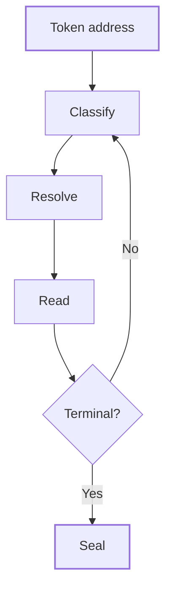

The Asset Dependency Engine turns one token address into a graph of everything that token depends on. This page explains the parts of the graph, how the engine builds it and how to read it. It is for analysts and engineers who need to know exactly what a graph does and doesn't claim.

## Key concepts

| Term | Meaning |
| --- | --- |
| Node | One layer in the stack: a token, an oracle feed, a controller wallet, a custodian or off-chain collateral. |
| Edge | A typed link from one node to the node it depends on, such as `BACKED_BY` or `PRICED_BY`. |
| Layer | A level of the graph. The root, the asset you hold, is depth 0. |
| Terminal | A node where a branch legitimately ends: native ETH, attested off-chain backing, or a plain ERC-20 read. |
| Flag | A machine-readable reason attached to a node, such as `UNSUPPORTED_CHAIN`. A layer the engine can't read stays in the graph with a flag. |
| Depth limit | The engine resolves recursively to depth 16. A path that would go deeper is cut and flagged `DEPTH_EXCEEDED`. |
| Block pin | The finalized block the engine read on each chain. Every read in one traversal uses the same pinned block per chain. |
| Traversal | One run of the engine for one asset. It is identified by the asset and a traversal ID, and sealed with a content hash. |

## How it works

1. **Classify.** The engine works out what the address is: a vault, a wrapper, a CDP, an oracle feed or a fund share class.
2. **Resolve.** It follows what that node points at (underlying, collateral, price feed, bridge, legal wrapper) and classifies each of those too.
3. **Read.** It takes the reads that matter for that node type at one pinned block per chain, and records the skew between chains.
4. **Seal.** It writes an immutable graph state addressed by asset and traversal. The same blocks in give the same graph out.

The traversal is breadth-first. A node reached by two paths appears once, so the graph is a directed acyclic graph rather than a tree. If a path loops back on itself, the engine stops it and flags the node `CYCLE`.

### What ends a branch

| Terminal | Why it ends |
| --- | --- |
| Native ETH | There is nothing beneath the chain's own currency. |
| Attested off-chain backing | An attester collapses the holdings into one figure before any feed sees it, so nothing can hang beneath it. These nodes are `OffChainCollateral` and terminal by construction. |
| Plain ERC-20 read | A token with no deeper structure the engine can follow. |

Anything else that stops a branch is not a terminal. It is a flagged node, with a reason such as `BRIDGE_UNSUPPORTED` or `BACKING_UNRESOLVED`.

## Read a graph

<Steps>
  <Step title="Start at the root">
    The dark node (1) is the asset you hold. Here it is an ERC-4626 vault share on Ethereum. Each node shows its kind and the reads the engine took, such as `totalSupply` or `latestAnswer`.

    <Frame caption="The dependency stack on the public Asset Dependency Engine page. The values are illustrative.">
      
    </Frame>
  </Step>
  <Step title="Follow the edges down">
    Each line is an edge, labelled with what it means: **underlying**, **bridge**, **oracle**, **legal** or **collateral**. The vault's underlying is a tokenized money market fund (2). The fund is priced by a NAV oracle and wrapped by a fund share class, which is backed by US Treasury bills.
  </Step>
  <Step title="Spot unsupported layers">
    An amber node (3) is a layer the engine couldn't read, here an L2 bridge deployment marked **UNSUPPORTED**. It stays in the graph with its reason, so nothing is hidden to make the picture tidy (6). A label such as **STALE?** on the oracle is a cue to check the feed's `updatedAt` read.
  </Step>
  <Step title="Find the terminals">
    A green node (4) marked **TERMINAL** is where a branch legitimately ends, here custodian-attested Treasury bills. The four stages (5) are how the engine got there.
  </Step>
  <Step title="Check the block pins">
    Under the graph, the pinned blocks line (1) lists the block read on each chain and the skew between them. The legend (2) explains the colors: dark is the asset you hold, white nodes were read, green is a terminal and amber is a layer the engine couldn't read.

    <Frame caption="Block pins and the color legend under the illustrative hero graph.">
      
    </Frame>
  </Step>
  <Step title="Know the rules">
    The engine holds itself to four rules (2): it is deterministic, an unsupported layer is a node, terminals are explicit, and the Explorer only renders sealed graph states; it never recomputes a read in your browser. It doesn't guess a dependency it can't classify and doesn't score risk (3). The questions at the top (1) summarize scope and depth.

    <Frame caption="The engine's rules and non-goals.">
      
    </Frame>
  </Step>
</Steps>

## Worked example: a vault share on an L2

You hold a vault share and want to know what is under it. This example follows the illustrative graph above; it isn't a specific listed asset.

1. **Depth 0.** The vault share is classified as an ERC-4626 vault, and the engine finds its underlying.
2. **Depth 1.** The underlying is a tokenized money market fund, read with `totalSupply` and its NAV. The vault also has an L2 deployment reached through a bridge. The engine can't read that bridge, so it draws the node and flags it `BRIDGE_UNSUPPORTED`.
3. **Depth 2.** The fund is priced by a NAV/USD oracle (`PRICED_BY`) and wrapped by a fund share class.
4. **Depth 3.** The share class is backed by US Treasury bills held by an attested custodian. That node is terminal.
5. **Seal.** The engine pins the block on each chain, records the skew and seals the graph with a content hash.

The result tells you the backing reaches Treasury bills through a fund, an oracle and a bridge you can't verify on-chain. You decide whether that bridge matters for your use.

## Limits

| Limit | Behavior |
| --- | --- |
| Maximum depth | 16. Deeper paths are flagged `DEPTH_EXCEEDED`. |
| Cycles | Stopped at the repeat and flagged `CYCLE`. |
| Large vault baskets | Discovery is capped. When a vault holds more tokens than the cap, the node is flagged `BACKING_DISCOVERY_TRUNCATED` and the basket shown is partial. |
| Unreadable layers | Drawn as nodes with a flag such as `UNSUPPORTED_CHAIN`, `BRIDGE_UNSUPPORTED`, `ORACLE_UNSUPPORTED`, `LP_UNSUPPORTED` or `YIELD_UNSUPPORTED`. |
| Risk scoring | None. The engine describes dependencies; it does not rate them. |

The full list of node types, edge types and flags is in the [graph reference](/tools/asset-graph/reference).

## FAQ

<AccordionGroup>
  <Accordion title="Will the same asset always give the same graph?">
    Yes, for the same pinned blocks. Same asset, same pinned blocks, same graph, so every traversal is replayable.
  </Accordion>
  <Accordion title="Why is a layer shown if the engine can't read it?">
    Dropping it would make the graph look more complete than it is. A flagged node tells you exactly where the evidence stops.
  </Accordion>
  <Accordion title="Does the graph cover off-chain assets?">
    It covers off-chain backing when an attestation or proof-of-reserve feed evidences it. Those nodes are terminal. Legal wrapper, custody and attestation layers come from the registry's disclosure evidence.
  </Accordion>
  <Accordion title="Is the Asset Dependency Engine graph on every asset page?">
    No. The asset page shows the registry's disclosure record. The **Reserve dependencies mapped** count there comes from the parties, reserve, oracles and controllers in that record, not from an engine traversal.
  </Accordion>
</AccordionGroup>

## Related pages

<CardGroup cols={2}>
  <Card title="Graph reference" icon="table" href="/tools/asset-graph/reference">Node types, edges, flags and limits.</Card>
  <Card title="The asset page" icon="coins" href="/explorer/asset-page">The disclosure record for an asset.</Card>
</CardGroup>
