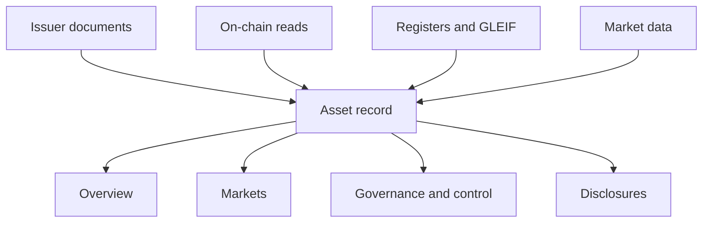

The asset page is the core of Compliance Explorer. It shows one tokenized asset: who issues it, where it trades, which chains it is deployed on, who controls it, what it discloses and what backs it. Every value carries its source, so you can check it yourself before you rely on it.

## Key concepts

| Term | Meaning |
| --- | --- |
| Hero | The header of the asset page: name, issuer, status tags, disclosure score, venues and deployments. |
| Tab | One view of the asset: **Overview**, **Markets**, **Governance & Control**, **Disclosures** and **Reports**. The tab is stored in the URL as `?tab=`. |
| Evidence strip | The line under the tabs that counts the disclosure fields backed by a source document and shows the latest reserve attestation. |
| Disclosure checklist | The 48 facts the registry tracks for every asset, grouped into families. |
| Source | The document, page, register or on-chain read a value comes from, shown as **Source:** with a link. |
| Registry grade (internal) | A grade Bluprynt assigns to the evidence on record, marked **automated** or **analyst-reviewed**. It rates the evidence, not the asset. |

## Where the data comes from

| Source | What it provides |
| --- | --- |
| Issuer documents and web pages | Disclosure fields, parties, holder terms, reserve attestations |
| On-chain reads | Contract addresses, supply, controller and admin roles, reserve accounts |
| Regulator registers and GLEIF | Legal-entity identity, LEI, licences |
| Market data providers | Price, volume, market cap, exchange and DEX listings |
| Oracles | Price and reserve feeds where an asset publishes one |

## Read an asset page

<Steps>
  <Step title="Read the hero">
    Open an asset from search or the [assets directory](https://explorer.bluprynt.com/assets). The title line (1) shows the token name, ticker and issuer, or **Issuer not disclosed** when no issuer is linked. The tags (2) show the token standard and classification, plus **On-chain reserve account** where one is mapped. The pill and line under them (3) show the disclosure score and the latest reserve attestation. The checklist card (4) shows how many of the 48 items are on record and how that compares with the registry average. When no issuer is on the platform, the claim banner (5) says so and links to **Claim this profile**. See [Claim this profile](/sdk/example-explorer-claim) for the full flow. **Listed on** (6) shows the venues that trade the asset and **Chain deployments** (7) every chain it is deployed on.

    <Frame caption="The asset hero for USDT0.">
      
    </Frame>
  </Step>
  <Step title="Read the Overview tab">
    Use the tabs (1) to move between views. The evidence strip (2) counts the disclosure fields backed by a source document and shows the latest reserve attestation and when the next one is due. **At a glance** (3) summarizes price, market cap, total supply, reserve coverage, attestation cadence, disclosure score, latest disclosure and when the record was last checked. Each tile names its source underneath, such as **Market data · USD** or **On-chain**. **Issuer** (4) shows the issuing entity and its regulatory claims, then **Other parties** named in the asset's documents. **Disclosure checklist** (5) shows coverage by family.

    <Frame caption="The Overview tab: evidence strip, at a glance, issuer and checklist.">
      
    </Frame>
  </Step>
  <Step title="Check the evidence">
    Further down, **Reserve attestation** (1) names the attester, standard, scope and coverage ratio, and **Disclosure areas covered** shows which of five areas (issuer, parties and control, reserve, documentation, evidence grade) have evidence. **Evidence & Verification** (2) lists the network, token contract, disclosed fields, source documents, reserve dependencies mapped, registry grade and open gaps. **Holder terms** (3) shows what the documents say about who can control the token, governing law, regulatory claims and named auditors. **Documentation** (4) counts the source documents on file; the documents themselves open with Explorer Pro.

    <Frame caption="Reserve attestation, evidence and holder terms on the Overview tab.">
      
    </Frame>
  </Step>
  <Step title="Read the Markets tab">
    Click **Markets**. The tiles (1) show price, 24-hour volume across all venues, market cap, fully diluted value and on-chain circulating supply. **Listed on · exchanges** (2) lists order-book venues by 24-hour volume. Each venue row (3) shows its country, trust rank and pair count, and each pair row (4) shows price, 24-hour volume, spread and last trade. **Listed on · DEX pools** (5) lists on-chain pools the same way. **Deployed on**, further down, lists each chain with its contract, decimals and share of circulating supply.

    <Frame caption="The Markets tab: market tiles, exchange venues and DEX pools.">
      
    </Frame>
  </Step>
  <Step title="Read the Governance & Control tab">
    Click **Governance & Control**. **Parties & control** lists every party named for the asset (1). Each party shows its roles, such as service provider, oracle or code auditor, and the source page it was read from (2). **Smart contract & operational integrity** (3) lists control facts, such as who can control the token. Each fact shows its **Basis** (why the registry reads the source that way), its **Source** and a **Confidence** percentage.

    <Frame caption="The Governance & Control tab.">
      
    </Frame>
  </Step>
  <Step title="Open the Disclosures tab">
    Click **Disclosures**. A lock on the tab (1) means it needs Explorer Pro. Without Pro you see the upgrade card (2). With Pro the tab has three views: **Checklist** with key facts, the checklist by family and reserve evidence; **Changes**, the timeline of disclosure changes; and **Entities**, every legal entity the asset's documents and registers name.

    <Frame caption="The Disclosures tab as a visitor without Explorer Pro.">
      
    </Frame>
  </Step>
  <Step title="Open the Reports tab">
    Click **Reports**. If you aren't signed in, the tab (1) shows a sign-in card (2). Once you sign in with any account, click **Generate PDF** to render the EA-02 asset disclosure report from the record as it stands now.

    <Frame caption="The Reports tab before sign-in.">
      
    </Frame>
  </Step>
</Steps>

On a phone, the hero, tabs and cards stack into one column.

<Frame caption="The same asset page at 390px wide.">
  
</Frame>

## Reference

### Tabs and access

| Tab | URL | Anonymous | Signed in (free) | Explorer Pro |
| --- | --- | --- | --- | --- |
| Overview | `?tab=overview` | Yes | Yes | Yes |
| Markets | `?tab=markets` | Yes | Yes | Yes |
| Governance & Control | `?tab=governance-control` | Yes | Yes | Yes |
| Disclosures | `?tab=disclosures` | Locked | Locked | Yes |
| Reports | `?tab=reports` | Sign-in card | Yes | Yes |

The **Documentation** section on **Overview** is also Explorer Pro only.

### At a glance

| Field | Meaning |
| --- | --- |
| Token price | Latest price from market data |
| Market cap | From market data providers |
| Total supply | Read on-chain from the token contract |
| Reserve coverage | Reserves to supply as a ratio such as `1.02 : 1`, from the reserve attestation, or **No attestation on record** |
| Attestation cadence | How often reserve attestations are published, from the issuer's disclosure where stated |
| Disclosure % | Checklist items on record, out of 48 |
| Latest disclosure | Date of the newest disclosure document on record |
| Last checked | When Bluprynt last re-read the asset's source documents |

### Issuer

| Field | Meaning |
| --- | --- |
| Role | The issuer's role on the asset |
| Claims to be regulated | Whether the issuer's documents say it is regulated |
| Home regulator | The regulator the issuer names |
| Governing law | The law the holder terms are governed by |
| Offer jurisdictions | Where the issuer says the asset is offered |

### Reserve attestation

| Field | Meaning |
| --- | --- |
| Attester | The firm that produced the attestation |
| Attestation standard | The standard it was performed under, such as ISAE 3000 |
| Attestation scope | What the attestation covers |
| Coverage ratio | Reserves divided by supply on the attestation date |

### Evidence & Verification

| Field | Meaning |
| --- | --- |
| Network | The chain the record is anchored to |
| Token contract | The token's contract address on that chain |
| Disclosed fields | Checklist items on record, out of the total |
| Source documents | Documents the registry holds for the asset |
| Reserve dependencies mapped | Parties, reserves, oracles and controllers in the asset's disclosure record |
| Registry grade (internal) | The grade of the evidence on record, **automated** or **analyst-reviewed**, or **Not graded** |
| Open gaps | Missing items the registry flags, or **None recorded** |

### Markets

| Section | Columns |
| --- | --- |
| Tiles | Price, 24h volume (all venues), Market cap, FDV, On-chain circulating |
| Listed on · exchanges | Pair, Price, 24h volume, Spread, Last trade. Venues show country, trust rank and pair count. |
| Listed on · DEX pools | Pair, Price, 24h volume, Spread, Last trade, by pool venue |
| Deployed on | Network, Contract, Decimals, Circulating · share |
| Primary liquidity pool (registry snapshot, not live) | Pool, DEX, Pool TVL, Pool 24h volume, Fee tier, ±2% depth |

Venue trust is shown as **High trust**, **Medium trust** or **Low trust**. When the market data feed doesn't respond, the tab says **Live market data unavailable** and the rest of the record is unaffected.

## Worked example: check what backs USDT0

1. Open the [USDT0 asset page](https://explorer.bluprynt.com/assets/2c411071-9909-475e-a11e-6a2c1d17d76f).
2. In the hero, read the reserve attestation line and the checklist card.
3. On **Overview**, read **Reserve attestation** for the attester, standard and coverage ratio.
4. In **Evidence & Verification**, read **Reserve dependencies mapped** to see how many parties, reserves, oracles and controllers the record names.
5. Click **Governance & Control** and check which parties can mint or upgrade the contract, and the source for each.
6. Click **Markets** and confirm the contract address under **Deployed on** matches the one you hold.

## Troubleshooting

| Problem | What to do |
| --- | --- |
| **Issuer not disclosed** | The registry hasn't resolved the issuing entity. The issuer can [claim the profile](/sdk/example-explorer-claim). |
| A value shows **Not disclosed** | No source on record states it. See [Status tags and the disclosure checklist](/tools/explorer/disclosure-checklist). |
| The **Disclosures** tab is locked | It needs Explorer Pro, even when you are signed in. |
| The **Reports** tab asks you to sign in | Any account can generate reports. Sign in and reopen the tab. |
| **Live market data unavailable** | The market data feed didn't respond. Reload later. |

## FAQ

<AccordionGroup>
  <Accordion title="Is the disclosure percentage a risk score?">
    No. It counts how many checklist items are on record. It says nothing about whether the asset is safe.
  </Accordion>
  <Accordion title="What does 'self-reported' mean on a reserve attestation?">
    The attestation comes from the issuer's own publication. It hasn't been verified through Bluprynt [Proof of Collateral](/tools/proof-of-collateral).
  </Accordion>
  <Accordion title="Why does the same token appear as several assets?">
    Bridged and wrapped versions are separate tokens with their own contracts and issuers, so each has its own record.
  </Accordion>
  <Accordion title="Can I link to a specific tab?">
    Yes. Add `?tab=` with the tab ID, for example `?tab=markets`.
  </Accordion>
</AccordionGroup>

## Related pages

<CardGroup cols={2}>
  <Card title="Status tags and the disclosure checklist" icon="list-check" href="/tools/explorer/disclosure-checklist">Tags, field states and "Not disclosed".</Card>
  <Card title="Asset Dependency Engine" icon="diagram-project" href="/tools/asset-dependency-engine">Every layer an asset depends on.</Card>
  <Card title="Access, freshness and provenance" icon="lock-open" href="/tools/explorer/access-and-provenance">What is open and how current it is.</Card>
  <Card title="Disclosure Monitoring" icon="bell" href="/tools/disclosure-monitoring">Get notified when an asset's disclosures change.</Card>
</CardGroup>
