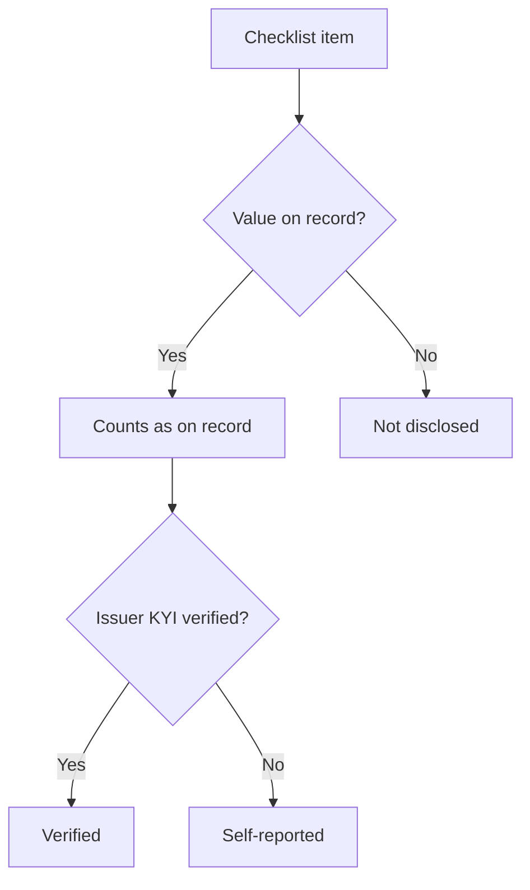

Every record in Compliance Explorer carries a disclosure checklist and a set of status tags. The checklist shows how much of a fixed list of facts is on record. The tags show the subject's verification and screening state at a glance. Read them together before you decide how much weight to put on a record.

## Key concepts

| Term | Meaning |
| --- | --- |
| Checklist item | One fact the registry tracks, such as **Redemption right** or **Who can pause the protocol**. |
| Family | A group of related items. Each family shows items on record out of its total, such as `3 / 19`. |
| On record | The registry holds a value for the item, backed by a source. |
| Not disclosed | The registry looked for the item and holds no evidenced value. It is never filled with a guess. |
| Still missing | The items that are not on record, listed under the checklist. |
| Registry average | The mean checklist score across the registry. The hero says how far above or below it a record sits. |
| Status tag | A short label on a record, such as **Not KYI verified** or **Sanctions clear**. |

## How the checklist is scored

- The score is items on record divided by the total. For an asset that is out of 48.
- An item counts only when the registry holds a value for it with a source. Missing data shows as missing, never as a score.
- On an issuer that hasn't verified through [KYI](/tools/kyi), items on record read **Self-reported**: the source is public, but the issuer hasn't confirmed it.
- The score measures disclosure, not risk. A high score means the facts are on record, not that they are favourable.

## Read the checklist and tags

<Steps>
  <Step title="Read the score in the hero">
    On an asset page, the checklist card (4) shows the score, items on record out of 48, and how far the asset is from the registry average. The tags (2) and the title line (1) show the classification and issuer state.

    <Frame caption="The disclosure checklist card and status tags in the asset hero.">
      
    </Frame>
  </Step>
  <Step title="Read the checklist by family">
    On **Overview**, the **Disclosure checklist** card (5) breaks the score into families and lists what is **Still missing**. Each value that is on record has a **Source:** link on the tab where it appears.

    <Frame caption="The disclosure checklist on the Overview tab.">
      
    </Frame>
  </Step>
  <Step title="Read item states on an issuer">
    On an issuer page, the checklist (7) shows each weighted item with its state: **Self-reported**, **Not disclosed**, **Awaiting issuer** or a count on record. The compliance profile (5) shows field states for sanctions, KYI, enforcement, licensing, filings and wallet provenance.

    <Frame caption="Item states on an issuer's checklist and compliance profile.">
      
    </Frame>
  </Step>
  <Step title="Claim the profile">
    If you are the issuer, click **Claim this profile** (1). It appears on the checklist card, the claim banner and directory rows. The claim panel opens on the page (2) and shows the three stages (3): **Create your issuer account**, **Verify a control wallet** and **Continue in Bluprynt Passport**. **What is KYI?** explains the verification first. The full flow is in [Claim this profile](/sdk/example-explorer-claim).

    <Frame caption="The claim panel opened from Claim this profile.">
      
    </Frame>
  </Step>
</Steps>

## Reference

### Asset checklist families

| Family | Items |
| --- | --- |
| Holder claim & collateral | 19 |
| Structure, offering & venue | 11 |
| Redemption & economics | 8 |
| Evidence quality | 10 |
| **Total** | **48** |

Issuer and protocol checklists are described on [Issuer, regulator and protocol pages](/tools/explorer/profiles).

### Status tags

| Tag | Where | Meaning |
| --- | --- | --- |
| **Issuer not disclosed** | Asset title line | No issuer is linked to the asset. |
| **✓ KYI verified** | Issuer | The issuer verified its identity through [KYI](/tools/kyi). |
| **⚠ Not KYI verified** | Issuer | The issuer hasn't verified through KYI. Values are inferred from public sources. |
| **No issuer on platform** | Issuer, asset banner | The issuer hasn't claimed its profile. |
| **Identity unresolved** | Issuer | The registry couldn't resolve the legal entity. |
| **Issuer (inferred)** | Issuer subtitle | The entity was linked to its assets from public evidence. |
| **Sanctions clear** | Issuer | Screened against sanctions lists with no match. |
| **Sanctions match** | Issuer | Screening returned a match. |
| **Screening inconclusive** | Issuer | Screening returned an indeterminate result. |
| **Sanctions not screened** | Issuer | No screening result is on record. |
| **On-chain reserve account** | Asset | A reserve account for the asset is mapped on-chain. |
| **Self-reported** | Checklist, attestation line | From the issuer's own publication, not verified by Bluprynt. |
| **Not disclosed** | Checklist, any field | No evidenced value is on record. |
| **Authorised** / **Licensed** | Regulator entities, issuer licensing | The status the register publishes. |
| **Not yet assessed** | Protocol | No disclosure record exists yet, so it isn't scored. |

### Field states

| Badge | Meaning |
| --- | --- |
| **Verified** | Confirmed for a verified issuer. |
| **Awaiting issuer** | A value or check is pending the issuer's confirmation. |
| **Indeterminate** | The registry looked and holds no value. |
| **Nothing yet** | The issuer couldn't be resolved, so nothing has been checked. |

## Worked example: read a low score

USDT0 shows **15%** with 7 of 48 items on record.

1. The hero says the asset is 35 points below the registry average.
2. The title line reads **Issuer not disclosed** and the claim banner says no issuer is on the platform.
3. On **Overview**, the checklist lists what is still missing, such as redemption terms.
4. The evidence strip says the 7 items on record are each backed by a source document.

You can rely on those 7 facts and their sources. Everything else is unknown, not negative. Ask the issuer for the missing items, or watch the asset with [Disclosure Monitoring](/tools/disclosure-monitoring) to see when they appear.

## Troubleshooting

| Problem | What to do |
| --- | --- |
| A fact you know is public reads **Not disclosed** | The registry hasn't found a source for it yet. The issuer can claim the profile and publish it. |
| Items read **Self-reported** | The issuer hasn't verified through KYI. The values still come from public sources. |
| Score differs between asset and issuer | An issuer's score counts items across all deployments of all its assets. |

## FAQ

<AccordionGroup>
  <Accordion title="Does 'Not disclosed' mean the issuer is hiding something?">
    No. It means the registry holds no evidenced value. The issuer may publish it somewhere the registry hasn't read yet.
  </Accordion>
  <Accordion title="Can Bluprynt fill a missing item with an estimate?">
    No. Items count only when a source supports them. Missing items stay missing.
  </Accordion>
  <Accordion title="What happens after an issuer claims its profile?">
    It creates an issuer account, verifies a control wallet and continues in [Bluprynt Passport](/passport/overview), where it completes [KYI](/tools/kyi) and publishes disclosures. The record then shows **KYI verified**.
  </Accordion>
</AccordionGroup>

## Related pages

<CardGroup cols={2}>
  <Card title="Claim this profile" icon="badge-check" href="/sdk/example-explorer-claim">The claim flow end to end.</Card>
  <Card title="Access, freshness and provenance" icon="lock-open" href="/tools/explorer/access-and-provenance">What is open and how current it is.</Card>
</CardGroup>
