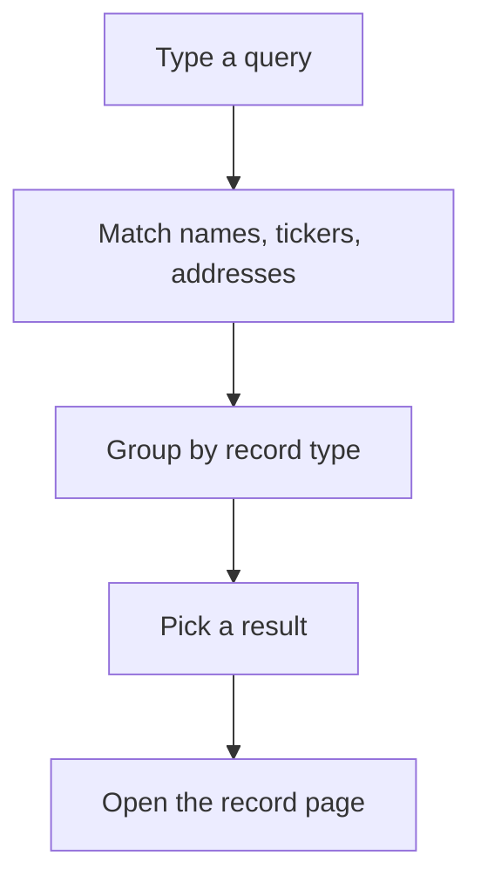

The Explorer home page and the header search are the fastest way into the registry. Type a name, a ticker or a contract address and jump straight to the record. Anyone can search; you don't need an account.

## Key concepts

| Term | Meaning |
| --- | --- |
| Home search | The large search field on [explorer.bluprynt.com](https://explorer.bluprynt.com). |
| Header search | The **Search…** button in the top bar of every Explorer page. It opens the same search as a dialog. Press `⌘K` (or `Ctrl+K`) to open it from the keyboard. |
| Result group | Results are grouped by record type, such as **Assets** and **Issuers**. |
| Disclosure chip | The percentage next to an asset result. It is the share of the asset's 48-item disclosure checklist that is on record. |

## How search works

Search matches what you type against asset names and tickers, issuer legal names, protocol names and contract addresses. Results open the record's own page, so the URL you land on is the one you can share.

## Search the registry

<Steps>
  <Step title="Start from the home page">
    Open [explorer.bluprynt.com](https://explorer.bluprynt.com). Type into the search field (1), or click one of the suggested searches such as **USDC** or **Circle** (2). Click **Open the Explorer** (3) to browse the asset directory instead. The **Search…** button in the header (4) opens the same search from any page.

    <Frame caption="The Explorer home page with its search field and suggested searches.">
      
    </Frame>
  </Step>
  <Step title="Read the results">
    Type a query (1). Asset results (2) show the token name, ticker and disclosure chip (3). Issuer results (4) show the legal entity. Use the arrow keys to move and `Enter` to open a result; the keys are listed at the bottom of the dialog (5).

    <Frame caption="Search results for USDC, grouped into assets and issuers.">
      
    </Frame>
  </Step>
</Steps>

## What you can search for

| You type | You find | Example |
| --- | --- | --- |
| Asset name | The asset page | `USD Coin` |
| Ticker | Every asset with that ticker | `USDC`, `BUIDL` |
| Issuer name | The issuer page | `Circle` |
| Protocol name | The protocol page | `USDT0` |
| Contract address | The asset deployed at that address | `0x…` |

## Worked example: find an asset by its contract address

You have a token contract address from a counterparty and want to know what the registry holds for it.

1. Press `⌘K` on any Explorer page.
2. Paste the full contract address.
3. Open the asset result. The asset page shows the issuer, the disclosure checklist score and every chain the asset is deployed on.
4. On the **Overview** tab, check **Evidence & Verification**. The **Token contract** row shows the contract the record is anchored to, so you can confirm it matches yours.

## Troubleshooting

| Problem | What to do |
| --- | --- |
| No results | Try the ticker instead of the full name, or the issuer's legal name. Not every token is on record yet. |
| Several assets share a ticker | Tickers are not unique. Check the issuer, classification and chain on each result before you open it. |
| An address returns nothing | The address may be a wallet, not a token contract, or a deployment the registry doesn't cover yet. |

## FAQ

<AccordionGroup>
  <Accordion title="Do I need an account to search?">
    No. Search and every public record field are open to anyone.
  </Accordion>
  <Accordion title="Why does an asset show a low disclosure percentage?">
    The percentage counts how many of the 48 checklist items are on record. A low figure means the registry holds little evidenced information, not that the asset is unsafe. See [Status tags and the disclosure checklist](/tools/explorer/disclosure-checklist).
  </Accordion>
  <Accordion title="Can I search from my own systems?">
    Yes. The [Explorer API](/api/explorer/overview) exposes the same registry records.
  </Accordion>
</AccordionGroup>

## Related pages

<CardGroup cols={2}>
  <Card title="Directories" icon="list" href="/tools/explorer/directories">Browse and filter every record type.</Card>
  <Card title="The asset page" icon="coins" href="/tools/explorer/asset-page">Read an asset record tab by tab.</Card>
</CardGroup>
