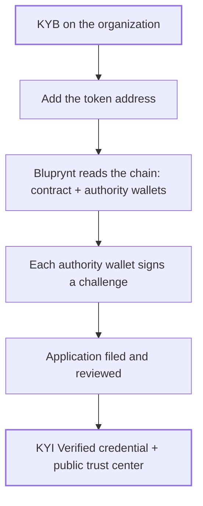

Know Your Issuer (KYI) ties a token to the verified organization that issued it. It answers two questions every exchange, custodian and wallet asks before listing or holding a token: who is behind it, and do they really control it?

<Frame>
  
</Frame>

## Who it's for

| You are | You use KYI to |
|---|---|
| **An issuer** | Prove your organization stands behind your token, once, and reuse that proof everywhere. Verify in [Bluprynt Passport](/passport/verify-asset). |
| **A platform** (exchange, launchpad, wallet, data site) | Let issuers verify inside your product with the [KYI Widget SDK](/sdk/overview), and check status with the [Public API](/api/public/overview). |
| **A verifier or supervisor** | Check an asset's verified issuer on [Compliance Explorer](/explorer/overview) or in [Bluprynt Proof](/proof/registry). |

## Key concepts

| Term | Meaning |
|---|---|
| **KYB** | Know Your Business: verifying the organization (legal entity, documents, associated parties). Done once per organization. |
| **Authority wallet** | A wallet the token contract gives control to, such as owner, admin, minter, upgrade admin, or mint and freeze authority on Solana. |
| **Declared / attested** | An authority read from the chain is *declared*. Once its wallet signs, it's *attested*. |
| **KYI Verified** | The credential an asset gets when its organization passed KYB and its authority wallets are attested. |
| **Trust center** | The asset's public page, which shows the verified issuer and its credentials. |

## How it works

1. **KYB.** The organization is verified once, with forms provided by Sumsub, and matched against GLEIF where possible.
2. **Asset.** A member pastes the token address. Bluprynt detects the chain and reads the token's metadata.
3. **Authorities.** Bluprynt reads which wallets control the token on-chain.
4. **Signatures.** A member signs a one-time challenge with each authority wallet. Most methods are off-chain: no funds move, no gas. See [Wallet verification](/sdk/wallet-verification).
5. **Decision.** The application is filed and reviewed. Once approved, the asset is **KYI Verified** and its public record shows the verified issuer.

Every screen of this process, with screenshots, is in [Verification flow](/sdk/flow).

## What it protects against

- **Impersonation.** A look-alike token claiming a real issuer has no attested authority from that issuer.
- **Counterfeit assets.** A token with no verified organization behind it stays unverified.
- **Sanctions risk.** KYI supports screening of the organization behind each asset.

## What KYI doesn't cover

- It verifies identity and control, not reserves. For backing, see [Proof of Collateral](/tools/proof-of-collateral).
- It doesn't rate a token's risk or quality.
- A signature attests to control of an address only, not to any other field on the asset.

## Where KYI appears

| Surface | What you see |
|---|---|
| [Bluprynt Passport](/passport/verify-asset) | The issuer's own verification flow and asset status. |
| [KYI widget](/sdk/overview) | The same flow, embedded in a partner's product. |
| [Public API](/api/public/overview) | `business_details.business_verified` and each authority's `verified` flag. |
| [KYI badge](/api/public/badge-recipe) | A live SVG/PNG/WebP badge for an asset. |
| [Compliance Explorer](/explorer/overview) | The asset page's issuer and verification status. |

## FAQ

<AccordionGroup>
  <Accordion title="How long does KYI take?">
    The member's part takes about five minutes once KYB documents are at hand. KYB review and the final decision take longer, and the member can leave and come back.
  </Accordion>
  <Accordion title="Do I verify again for every token?">
    No. KYB is once per organization. Each new token needs its authority wallets signed, and a wallet that already signed covers every token it controls.
  </Accordion>
</AccordionGroup>

<Columns cols={3}>
  <Card title="Verify your token" icon="fingerprint-pattern" href="/passport/verify-asset">In Bluprynt Passport.</Card>
  <Card title="Embed the widget" icon="code" href="/sdk/overview">Run KYI in your own app.</Card>
  <Card title="Read it by API" icon="plug" href="/api/public/overview">Check an asset's issuer.</Card>
</Columns>

## Related pages

<CardGroup cols={3}>
  <Card title="Verify an asset in Passport" icon="badge-check" href="/passport/verify-asset">The issuer steps, screen by screen.</Card>
  <Card title="KYI Widget SDK" icon="app-window" href="/sdk/overview">Embed the same flow in your platform.</Card>
  <Card title="Token KYI lookup" icon="plug" href="/api/public/token-lookup">Read KYI status by API.</Card>
</CardGroup>
