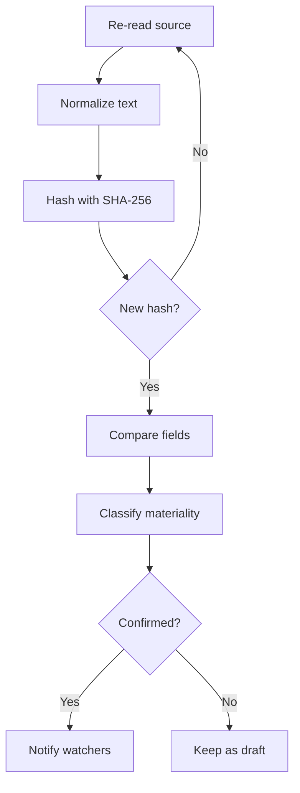

Disclosure Monitoring treats a change as a difference between two versions it actually held. It re-reads each tracked source on a cadence, keeps every version with its hash, and classifies each difference so you only get paged for what matters. This page explains each step and the rules it holds itself to.

## Key concepts

| Term | Meaning |
| --- | --- |
| Tracked source | An issuer page, terms, attestation, filing or register that the registry already holds for the asset |
| Re-read | One fetch of a tracked source on its cadence |
| Version | One held copy of a source, identified by the SHA-256 hash of its normalized text |
| Change | A difference between two held versions in a disclosed field, register status, sanctions result, named party or collateral link |
| Materiality | The class a change is given: **Material**, **Clarification**, **Editorial**, **Needs review** or **Unclassified** |
| Draft | A change whose old or new wording couldn't be held, or whose materiality is still under review. Drafts are never notified. |
| Evidence-gated removal | A field that vanishes is re-read several times before it counts as removed. |

## How it works

1. **Re-read.** Every tracked source is fetched again on a schedule. Register, sanctions, named-party and collateral monitors run on their own cadence.
2. **Normalize and hash.** The text is normalized before it is hashed with SHA-256, so a re-rendered page or reflowed PDF stays one version.
3. **Compare.** Only text that was actually read on both sides becomes a change. A different value, a removed statement or two sources that disagree is a change. Reflowed layout or a renamed heading is not.
4. **Classify.** Each change is classified for materiality.
5. **Confirm.** A confirmed change is notified. A draft waits and doesn't count until it is confirmed.

## Follow a field through four re-reads

<Steps>
  <Step title="First reading">
    The first time a source is read, the value is recorded as the **first reading** (1). Here the `reserve_custodian` field reads **BNY Mellon**.

    <Frame caption="One field, one source, four re-reads. The values are illustrative.">
      
    </Frame>
  </Step>
  <Step title="Editorial re-read">
    In March the PDF is re-rendered. The value is the same, so the change is **Editorial · reflowed PDF** (2) and is folded away.
  </Step>
  <Step title="Clarification">
    In May the document names **The Bank of New York Mellon**. It is the same party with a better name, so the change is a **Clarification · same party** (3). It stays on the timeline without paging anyone.
  </Step>
  <Step title="Material change">
    In August the custodian becomes **State Street Bank**. A new custodian is **Material** (4). It is the event a compliance desk sees first, with before, after and the quote.
  </Step>
  <Step title="Know the rules">
    A field that vanishes is re-read several times before it counts as removed (1). Monitoring doesn't alert on every byte that moves, doesn't pick a winner when two sources disagree and doesn't treat a failed fetch as a withdrawn disclosure (2).

    <Frame caption="The rules Disclosure Monitoring holds itself to, and what it won't do.">
      
    </Frame>
  </Step>
</Steps>

## Reference

### Materiality classes

| Class | Label | Meaning | Notified? |
| --- | --- | --- | --- |
| `material` | **Material** | A disclosed fact changed | Yes |
| `clarification` | **Clarification** | Same fact, more precise | If you chose **Material + clarifications** or **Everything** |
| `editorial` | **Editorial** | Wording only, folded away | If you chose **Everything** |
| `review` | **Needs review** | Needs an analyst | — |
| `unclassified` | **Unclassified** | Not yet classified | — |

### Confirmation states

| State | Meaning |
| --- | --- |
| **Confirmed** | The change is confirmed and counts. |
| **Candidate · not confirmed** | The change was detected but isn't confirmed yet. |
| **Draft · awaiting classification** | The change is waiting for its materiality. It is shown dashed and isn't notified. |

### Change headlines

| Headline | When |
| --- | --- |
| **Newly disclosed** | A field had no value and now has one |
| **Disclosure changed** | A field's value changed |
| **Disclosure withdrawn** | A field's value was removed, after the evidence gate |
| **Sources disagree** | Two sources state different values for the same field |
| **Source document changed** | A tracked document changed in substance |
| **Licence or register status changed** | A register entry changed |
| **Sanctions screening match** | Screening returned a match |
| **Named party changed** | A named party changed |
| **Collateral linked** | A collateral ISIN was linked |

### Cadence and freshness

| Item | Value |
| --- | --- |
| Default re-read cadence | Daily (`P1D`) |
| Due | A source is due once 36 hours pass without a check |
| Monitor run | **Current**, **Stale** or **No run recorded** |
| Source read state | **Read**, **Pending** or **Unreadable** |

### Rules

| Rule | What it means for you |
| --- | --- |
| Same source, same field | Two sources disagreeing is a finding, not a change. Both values are recorded and flagged. |
| Removal is evidence-gated | A field that vanishes is re-read several times before it counts as removed. A failed fetch is never a withdrawal. |
| History is immutable | Every value ever read stays retrievable with the document that produced it. |
| Noise is folded, not dropped | Editorial revisions collapse in the timeline, so they never hide a material one. |
| What can't be read is said, not scored | An unreadable or paywalled source is listed as unreadable. |

## Worked example: a reserve attestation changes firm

An issuer's monthly attestation used to say "Monthly attestation by Firm A LLP". The next re-read finds "Monthly attestation by Firm B LLP".

1. The new text hashes differently, so it is a new version.
2. The attester field changed value, so it is a **Disclosure changed** event.
3. A different firm is a different fact, so it is **Material**.
4. Once confirmed, everyone watching the asset gets a notification, whatever their preference.
5. The change detail shows both quotes, the source, both SHA-256 hashes and the change ID.

## Errors and limits

| Situation | What happens |
| --- | --- |
| A source can't be fetched | The source is marked unreadable. Nothing is treated as withdrawn. |
| A source is paywalled | It is listed as unreadable rather than scored. |
| No sources are tracked for an asset | Coverage reads **No sources**. A quiet feed doesn't mean nothing changed. |
| Wording couldn't be held on one side | The change stays a draft and isn't notified. |

## FAQ

<AccordionGroup>
  <Accordion title="Why didn't I get notified when the issuer reformatted its PDF?">
    Text is normalized before it is hashed, so a reflowed PDF stays one version. If the wording changed but the meaning didn't, the change is **Editorial** and folded away.
  </Accordion>
  <Accordion title="What happens when two sources disagree?">
    Monitoring records both values and flags the disagreement. It doesn't pick a winner.
  </Accordion>
  <Accordion title="Can a disclosure disappear because a website was down?">
    No. A failed fetch is never treated as a withdrawn disclosure, and a removal needs several re-reads first.
  </Accordion>
</AccordionGroup>

## Related pages

<CardGroup cols={2}>
  <Card title="Notifications and change detail" icon="bell" href="/tools/monitoring/notifications">Read a change with its proof.</Card>
  <Card title="Watchlist" icon="eye" href="/tools/monitoring/watchlist">Choose what to be notified about.</Card>
</CardGroup>
