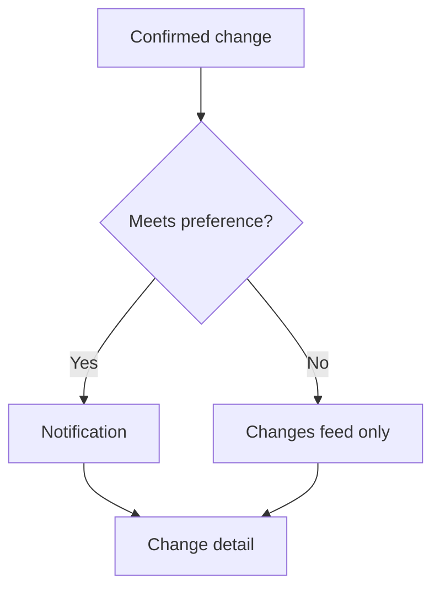

When a confirmed change meets your notification preference, Disclosure Monitoring notifies you in the Explorer. Every notification opens the change detail, which shows what changed, why it matters and the proof. This page covers the notification bell, the **Changes** feed and the change detail view.

## Key concepts

| Term | Meaning |
| --- | --- |
| Notification | An in-app notice about a watched asset, shown under the bell |
| Changes feed | Every recorded change for your watched assets, newest first |
| Low-signal revision | A document revision with no substantive change. It isn't notified and is hidden unless you include it. |
| Change detail | One change with its before and after, quotes, sources, hashes and timeline |
| Proof | The held versions and hashes that back a change |

## How it works

## Read a change

<Steps>
  <Step title="Open the Changes tab">
    Go to [explorer.bluprynt.com/monitoring](https://explorer.bluprynt.com/monitoring) and click **Changes** (1). Without Explorer Pro you see the gate (2).

    <Frame caption="The Changes tab sits next to Monitored assets.">
      
    </Frame>
  </Step>
  <Step title="Filter the feed">
    Narrow the feed with **Assets**, **Monitors**, **Materiality** and **Window**. Turn on **New only** to see changes since your last visit. Turn on **Include low-signal document revisions** to see revisions that are hidden by default.
  </Step>
  <Step title="Read the materiality">
    Each change carries its class (1–5): **Material**, **Clarification**, **Editorial**, **Needs review** or **Unclassified**. Drafts are shown dashed and don't count until confirmed.

    <Frame caption="The five materiality classes.">
      
    </Frame>
  </Step>
  <Step title="Open the change">
    Click a change to open its detail. Read the headline, then **What it means** and **Why this matters**. **Passage in context** shows the quote inside the surrounding text.
  </Step>
  <Step title="Check the proof">
    Under **Proof**, compare **Previous value** and **Current value**, or **Earlier version** and **Current version** for a document. Each side names its **Source** and the SHA-256 hash of the version read. **More technical details** shows the **Monitor**, **Topic**, **Change kind** and **Change id**.
  </Step>
  <Step title="Clear notifications">
    Click the bell to open **Notifications**. Click **Mark all read** once you've reviewed them.
  </Step>
</Steps>

<Note>
The populated feed, change detail and notifications need an Explorer Pro account with watched assets, so steps 2, 4, 5 and 6 have no screenshot. The labels come from the Explorer source.
</Note>

## Reference

### Notification types

| Notification | Sent when |
| --- | --- |
| **Monitoring started** | An asset you added is ready and monitored |
| **Monitoring started · partial** | An asset you added is monitored, but only some sources could be read |
| **Could not add asset** | A token you added couldn't be resolved |
| **Disclosure changed** | A disclosed field changed |
| **Register status changed** | A licence or register status changed |
| **Named party changed** | A named party changed |

### Changes feed filters

| Filter | What it does |
| --- | --- |
| **Assets** | Limit to some watched assets. Use **Search watched assets** to find one. |
| **Monitors** | Limit to some monitors, such as **Licence / register** |
| **Materiality** | Limit to some materiality classes |
| **Window** | Limit to a time window |
| **New only** | Show only changes since your last visit |
| **Include low-signal document revisions** | Show revisions hidden by default |

### Change detail fields

| Field | Meaning |
| --- | --- |
| Headline | What happened, such as **Newly disclosed** or **Sources disagree** |
| Materiality | The change's class |
| Confirmation | **Confirmed**, **Candidate · not confirmed** or **Draft · awaiting classification** |
| **What it means** | A plain-language explanation of the change |
| **Why this matters** | Why the change matters to a holder |
| **Passage in context** | The quote in its surrounding text |
| **Previous value** / **Current value** | The field before and after |
| **Earlier version** / **Current version** | The document before and after |
| **Source** / **Previous source** | Where each side was read |
| **SHA-256 of version read** | The hash of the current version |
| **Previous version SHA-256** | The hash of the earlier version |
| **Change id** | The change's identifier |
| **Monitor**, **Topic**, **Change kind** | Which monitor recorded it and what kind of change it is |

## Worked example: a new custodian

1. You watch a stablecoin with **Material changes only**.
2. The issuer names a new reserve custodian. The bell shows a **Disclosure changed** notification.
3. You open it. The headline reads **Disclosure changed** and the class is **Material**.
4. Under **Proof**, **Previous value** names the old custodian and **Current value** the new one, each with its quote and source.
5. You copy the **Change id** and both SHA-256 hashes into your review file.

## Troubleshooting

| Problem | What to do |
| --- | --- |
| **Nothing yet. Changes to assets you watch appear here.** | No notifications have been sent yet. Check your preference and watchlist. |
| You expected a change but see none | Check the asset's coverage. A **Partially readable** or **No sources** asset can miss changes. |
| A change is dashed | It is a draft. It isn't notified until confirmed. |
| A document revision is missing | Turn on **Include low-signal document revisions**. |

## FAQ

<AccordionGroup>
  <Accordion title="Do you send email notifications?">
    Disclosure Monitoring sends in-app notifications in the Explorer.
  </Accordion>
  <Accordion title="Can I fetch changes from code?">
    Yes. The [Explorer API](/api/explorer/overview) serves your monitoring changes and notifications.
  </Accordion>
  <Accordion title="Why is a change marked Needs review?">
    Its materiality needs an analyst. It is shown, but isn't notified until classified and confirmed.
  </Accordion>
</AccordionGroup>

## Related pages

<CardGroup cols={2}>
  <Card title="How change detection works" icon="code-compare" href="/tools/monitoring/change-detection">Cadence, versioning and classes.</Card>
  <Card title="Explorer API" icon="code" href="/api/explorer/overview">Watchlist and changes from code.</Card>
</CardGroup>
