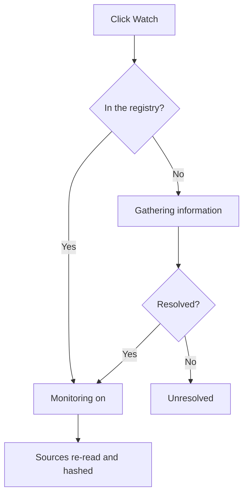

Your watchlist is the set of assets Disclosure Monitoring watches for you. For each asset it shows which sources are readable, when they were last checked and what changed in the last 30 days. You need Explorer Pro to keep a watchlist.

## Key concepts

| Term | Meaning |
| --- | --- |
| Watched asset | An asset on your watchlist. You can watch up to 5 assets. |
| Gathering | Bluprynt is building the record for a token it didn't hold yet. Monitoring starts when the record is ready. |
| Coverage | Whether the asset's tracked sources could be read on the last check |
| Paused | You turned monitoring off for the asset. No notifications are sent. |
| Notification preference | The lowest materiality that notifies you: **Material changes only**, **Material + clarifications** or **Everything** |

## How it works

When you add an asset the registry already holds, monitoring starts at once. When you add an unknown token, Bluprynt gathers it first. You get a **Monitoring started** notification when it's ready, **Monitoring started · partial** if only some sources could be read, or **Could not add asset** if the token couldn't be resolved.

## Use your watchlist

<Steps>
  <Step title="Open Disclosure Monitoring">
    Go to [explorer.bluprynt.com/monitoring](https://explorer.bluprynt.com/monitoring). The page has two tabs (1): **Monitored assets** and **Changes**. Without Explorer Pro you see the gate (2), which says you can watch up to 5 assets and get in-app notices when their disclosures, licences, sanctions screening, named parties or collateral change. Use **Create a free account**, **Book a demo** or **Sign in** (3).

    <Frame caption="Disclosure Monitoring without Explorer Pro.">
      
    </Frame>
  </Step>
  <Step title="Add an asset">
    With Explorer Pro, click **Watch** on any asset page. The button changes to **Watching**. On an empty watchlist, you can also search the registry by name, or pick a network and paste a contract address.
  </Step>
  <Step title="Read each asset's status">
    On **Monitored assets**, each asset shows its status, its sources (**Read**, **Pending** or **Unreadable**), its checklist, **Changes · 30d** and its **Latest change**. Click **Open the proof** to go to the change. Sort and filter the list with **Sort**, **Status**, **Network** and **Issuer**.
  </Step>
  <Step title="Check what needs attention">
    **What the monitors could not do** lists sources that couldn't be read or weren't re-read on schedule. Click **Show sources** or **Show findings** for details.
  </Step>
  <Step title="Choose your notification preference">
    Pick **Material changes only**, **Material + clarifications** or **Everything**. The preference applies to your whole watchlist. You see **Saved.** when it's stored.
  </Step>
  <Step title="Remove an asset">
    Click **Remove** to stop watching an asset and free a slot.
  </Step>
</Steps>

<Note>
The populated watchlist needs an Explorer Pro account, so steps 2–6 have no screenshot. The labels come from the Explorer source.
</Note>

## Reference

### Asset status

| Status | Meaning |
| --- | --- |
| **Monitoring on** | The asset is monitored. |
| **Paused** | You paused monitoring. No notifications are sent. |
| **Gathering information** | Bluprynt is gathering the asset's record. Monitoring starts when it's ready. |
| **Unresolved** | Bluprynt couldn't resolve the token into a registry record, so it isn't monitored. |

### Coverage

| Coverage | Meaning |
| --- | --- |
| **Monitored** | Every tracked source was readable on the last check. |
| **Partially readable** | Some tracked sources couldn't be read on the last check. Changes there would be missed. |
| **Unreadable** | No tracked source could be read on the last check, so changes can't be detected. |
| **No sources** | No disclosure source is tracked yet, so a quiet feed doesn't mean nothing changed. |
| **Paused** | You paused monitoring for this asset. |

### Notification preferences

| Preference | Notifies you about |
| --- | --- |
| **Material changes only** | Changes that alter what a disclosure commits to |
| **Material + clarifications** | Also wording that clarifies a commitment |
| **Everything** | Also editorial edits such as formatting and typos |

### Limits

| Limit | Value |
| --- | --- |
| Watched assets in the Explorer UI | 5 |
| Access | Explorer Pro |

## Worked example: watch a stablecoin

1. Open the asset page for a stablecoin and click **Watch**.
2. On **Monitored assets** the asset shows **Monitoring on** and coverage **Monitored**.
3. You set **Material changes only**.
4. A week later the issuer reformats its terms page. The change is **Editorial**, so you aren't notified.
5. A month later the issuer names a new custodian. The change is **Material** and you get a notification with the proof.

## Troubleshooting

| Message or state | What to do |
| --- | --- |
| **Your watchlist is full. Remove an asset first.** | You already watch 5 assets. Remove one, then add the new one. |
| **Could not update your watchlist** | The change didn't save. Try again. |
| **Could not save — try again.** | Your notification preference didn't save. Pick it again. |
| **Some sources have not been re-read on schedule** | A check is overdue. Read **What the monitors could not do** for the source. |
| **Unresolved** | The token couldn't be matched to a registry record. Check the network and contract address. |

## FAQ

<AccordionGroup>
  <Accordion title="Can I watch an asset that isn't in the registry?">
    Yes. Paste its contract address. Bluprynt gathers the record first, then starts monitoring.
  </Accordion>
  <Accordion title="Does pausing delete history?">
    No. Pausing stops new checks and notifications for that asset. History is immutable.
  </Accordion>
  <Accordion title="Can I manage the watchlist from code?">
    Yes. Use the [Explorer API](/api/explorer/overview) watchlist routes.
  </Accordion>
</AccordionGroup>

## Related pages

<CardGroup cols={2}>
  <Card title="How change detection works" icon="git-compare" href="/tools/monitoring/change-detection">What counts as a change.</Card>
  <Card title="Notifications and change detail" icon="bell" href="/tools/monitoring/notifications">Read a change with its proof.</Card>
</CardGroup>
